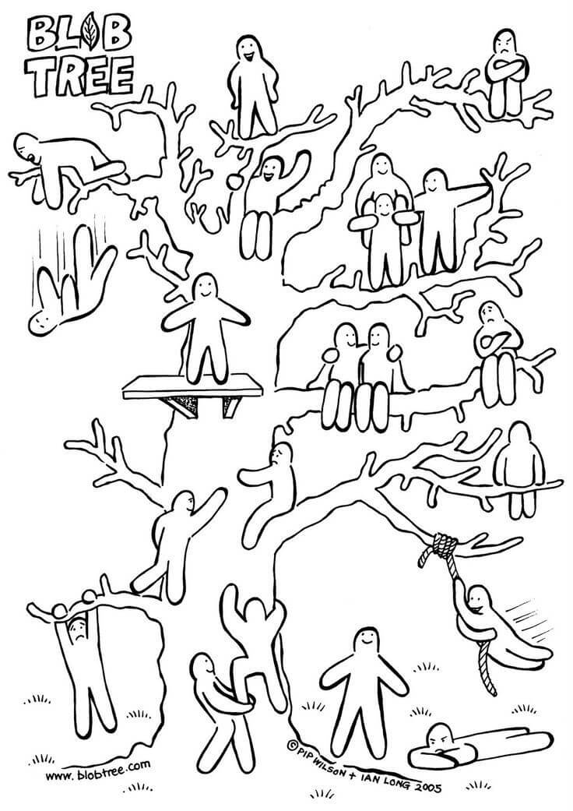

I bet everyone of you was at least at one workshop or at least meeting where you felt like you did nothing all day and the workshop was just a waste of time. My last week was spent at an EVS training to have a better understanding of my project, how the EVS works and get to know other people in Catalonia/Aragon.

## 1\. "This workshop is unique"

When you enter a new workshop, you know you are going to learn something, but you still don’t need to be reminded about that in the beginning. Why else would I be here if it wasn’t for learning unique and new skills?

## 2\. Long introductions what you are about to see

Don’t get me wrong, having a brief explanation what you are going to do in a workshop can be helpful for keeping an overview of what your goals are. But do we really need to have an introduction for each day and every workshop? Time here could be spent much more wisely.

## 3\. New/Experimental techniques and methods they try to use

I really don’t have a problem with that point. I enjoy testing new methods myself and I think everyone is allowed to do it himself, but if you join a new workshop and one of the first things you hear is“I am trying something new today” you get an uncomfortable feeling because you can’t tell at first if you are going to waste the time with this workshop.

## 4\. YOU decide because YOU are part of it

“Power to the People”, “We are the people” and several other posters are often brought to workshops to empower the voice of overview of a human being. If we really would be the voice, then nothing would move forward during this time because you can’t possibly make everyone happy. Every proposed idea would immediately have an enemy which would destroy the purpose of workshops.

## 5\. Icebreakers/introductory games

I am fine with Icebreakers, but if one workshop trainer starts a workshop with “Tell three fun facts about yourself but include one lie” again I’m going to scream. Not only do you have to think about two facts about yourself and one lie that won’t leave yourself standing there like an idiot, but you also must somehow summarize all your lifelong experience into three single bullet points.

One of the guys at my workshop summarized the point of this activity the best. “_We only walk around the room, looking at each other’s chest_ (because we pinned the answers on our chest) _pointing at the thing we think is wrong and then walk up to the next person._”

## 6\. Buzzwords

I am just going to present you the most popular buzzwords I stumbled upon so far and because this text is already pretty long I keep myself down to the Top 3 buzzwords used in a workshop.

1. Communication
2. Context
3. Privilege

## 7\. Pointless Teambuilding activities

Up to last week, I thought there can’t be any pointless Teambuilding activities, but once again, the universe proved me wrong. So, we basically had to find 6 tangerines which were placed around the hostel. Whilst being blindfolded we had to locate every tangerine and bring them back to put them in a basket. Sounds like a pretty easy task, doesn’t it? Maybe because it WAS easy but still we had to reflect double the amount of time we needed to find the tangerines about what we could have improved and how we felt being blindfolded. Why? We did our task in a fair amount of time, why do we need to discuss possible improvements and how we feel? What is the point of this thing?

## 8\. Get out of your comfort zone

Oh, how often I’ve heard this shitty sentence over the chorus of my whole life. Of course, you can’t possibly learn without stepping out of your comfort zone. It ONLY works like that…

Jokes aside, WHY do I HAVE TO step out of my comfort zone to learn something? Remember school? Did we ever have to step out of our comfort zone to learn basic maths? Usually, the most silent ones in class ended up with the best grades because they were more comfortable not talking and focussing on the lesson.

## 9\. Boosting Individuality whilst still insisting on acting as a team

"You are all individuals and we can't get really deep into every topic." Using the individuality of someone to excuse a lack of deeper knowledge about a certain topic is the new way of denying knowledge from others.

Whilst they say that you are so individual and different from each other, trainers still insist on you sticking together without any arguments or discussions whatsoever. Teambuilding is being praised to the heaven by them.

## 10\. ENERGIZERS

Of course, all of us get tired and/or bored sometimes but is there really a need to energize every two hours? Especially if you are doing some reaaaally strange stuff like screaming, dancing like an idiot or aggressive sharing of love (yes, this really happened).

Energy

## 11\. Trainers with no deeper knowledge about a topic

If you start a certain topic, please keep in mind that you might have to answer questions about that topic. Ignoring that fact does not only let you stand there like an idiot but also makes the person who asked a question, feel guilty to put you in such a situation.

## 12\. Little to no understanding of technic

Not every one of us must be the next Elon Musk or Bill Gates, but you could at least know how to start a presentation without the need of help from the crowd.

## 13\. Guest Speaker

Trainers usually know at about which point their participants will drift off and decide to stop paying attention. That’s the point in a week where you most likely will see a guest speaker who has little to no connection to the whole week but is used as a “refresher”. But unfortunately, most of the guest speakers are so boring that you almost fall asleep whilst sitting.

## 14\. Complaining about time

Isn’t it funny how complaining about the lack of time is actually a waste of time? At school teachers nearly always complain that they are lacking time to teach you all the subjects they should. But nobody recognises that just by complaining about the lack of time you lose more and more time because you immediately start complaining about other topics too.

## 15\. Evaluations and Feedback

At the end of the workshop, you can look back on the rough time you had and happily say that you survived it. But don't be fooled, you still have to give the trainers a feedback.

Blob Tree

At our workshop we had a thing called "Reflection of the day" where we had to answer 5 questions and draw ourselves on a "Blob Tree" depending on how we felt about the day. Probably a good way to get feedback, if you are working with five-year-olds. Seriously who had the idea to give this task to 18-30 year olds???

I really could reduce some of my anger that built up during the last week while I sat in a completely useless workshop. As a thank you for reading till the end I'll show you some beautiful pictures I took in Coma Ruga,  
I hope to see you soon! <3

- 
  Sunset on the beach
- 
  Coma Ruga Sunset
- 
  Beautiful Moonrise in Coma Ruga (full moon)
- 
  Coma Ruga Moonrise
- 
  Sunset in Coma Ruga
