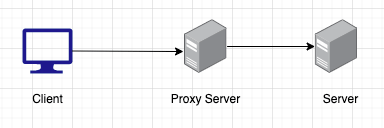

CORS issues are some of the most tedious and annoying issues you can run across as a web developer. Even I myself ran across it multiple times and it has already costed me several hours of my time to try and fix those issues. Simply because they sometimes just show up in the worst moments possible.

https://twitter.com/tlakomy/status/1247140571631812608?s=20

## What is CORS?

CORS stands for Cross-Origin Resource Sharing and is an additional header you can add to your HTTP request. Browsers that respect the Same-Origin Policy (every major one) automatically sends an Origin-Header with every request that says where the request is coming from.

Your browser checks the sent HTTP request and only allows you to retrieve data it if the Access-Control-Allow-Origin header in the response contains and or matches your Origin header

### Fine... but how do I benefit from CORS?

As a regular user of the internet you get lots of benefits from having CORS implemented in the browser natively. Through CORS a CSRF (Cross-Site Request Forgery) attack can be prevented.

### How does THAT prevent a CSRF attack?

A CSRF attack is where a malicious website or script is trying to access your data on other sites by stealing your identity

https://www.youtube.com/watch?v=MBOMBZS2u-I

This video explains fairly well what a CSRF attack is and why you should be scared about it. Regular user or developers equally.

So by having an Access-Control-Allow-Origin header set on your server you can actually prevent spam to be sent to your servers.

## Solution #1 - fresh start

Clear your cache, try a different browser and finally try to restart your PC. Maybe your machine has been running non stop for a couple hours and cache can be a real bitch so giving your PC a fresh start whilst you grab yourself a coffee and take a short break can solve most of your problems.


## Solution #2 - implement CORS headers

If you have the ability to access the server you're trying to fetch data from you will be best off to just add the CORS headers yourself.

A few examples for some frameworks:

### Laravel

Laravel v7 ships with native CORS solutions implemented. The allow-everything regardless what option that works 100% off the time would be the following:

```
// config/cors.php

<?php

return [

    // which paths does this policy affect?
    'paths' => ['api/*'],

    // which methods are allowed ?
    'allowed_methods' => ['*'],

    // which origins are allowed?
    'allowed_origins' => ['*'],

    // more complex way to allow requests from different origins
    'allowed_origins_patterns' => [],

    // which headers are allowed to be sent
    'allowed_headers' => ['*'],
];
```

For people stuck on pre Laravel 7 times I recommend either updating or using [spatie/laravel-cors](https://github.com/spatie/laravel-cors).

### Nodejs - Express

Express JS does not come with a built-in solution. The fastest way to set everything up was with the cors package from npm.

Install the package using `npm install cors` or `yarn add cors`.

The simplest setup I could find was the following:

```
var express = require('express')
var cors = require('cors')
var app = express()

app.use(cors())

app.get('/products/:id', function (req, res, next) {
  res.json({msg: 'This is CORS-enabled for all origins!'})
})

app.listen(80, function () {
  console.log('CORS-enabled web server listening on port 80')
})
```

This config allows requests from everywhere and is the thing to just keep you going!

### Solution #3 - spin up a proxy server

This should be your last approach but this one will work all the time.

Since your server does not necessarily send an Origin header you can safely assume that if you have the necessary authorization you can access the resource by passing the data to your own server, which in return makes a request to the requested resource.



Here you can see the architectural structure for this solution

Keep in mind that this way you add some extra time your user has to wait and that you are essentially just bypassing the CORS policy.

## Conclusion

CORS errors can be the curse of every developer. However, once you understand the underlying policy, with the same source as the source of the error, and how it combats the malicious CSRF attack, it becomes a little more bearable.

Thank you for reading through all this and I hope I could help you with your CORS problems. If I could not help you feel free to drop me a tweet @G4bsi.

I hope to see you in my next post <3

**Additional Resources:**

- [https://developer.mozilla.org/de/docs/Web/HTTP/CORS](https://developer.mozilla.org/de/docs/Web/HTTP/CORS)
- [https://laravel.com/docs/7.x/routing#cors](https://laravel.com/docs/7.x/routing#cors)
- [https://expressjs.com/en/resources/middleware/cors.html](https://expressjs.com/en/resources/middleware/cors.html)
