Been a long time, hasn't it? I've been busy programming some stuff, enjoying the sun, dying of the heat... Spanish stuff. Blog posts follow. But for now, enjoy Prague from my view!

As a Christmas present, I invited my girlfriend to a concert by Ghibli Studios famous composer Joe Hisaishi. During the weekend we got to see some of Prague and enjoy a great concert!

## Saturday

As with any other trip from Manresa I had to get up early. 6:30 AM early. By now you probably know that it takes me roughly two hours to reach Barcelona, another 30 minutes to get to the airport.

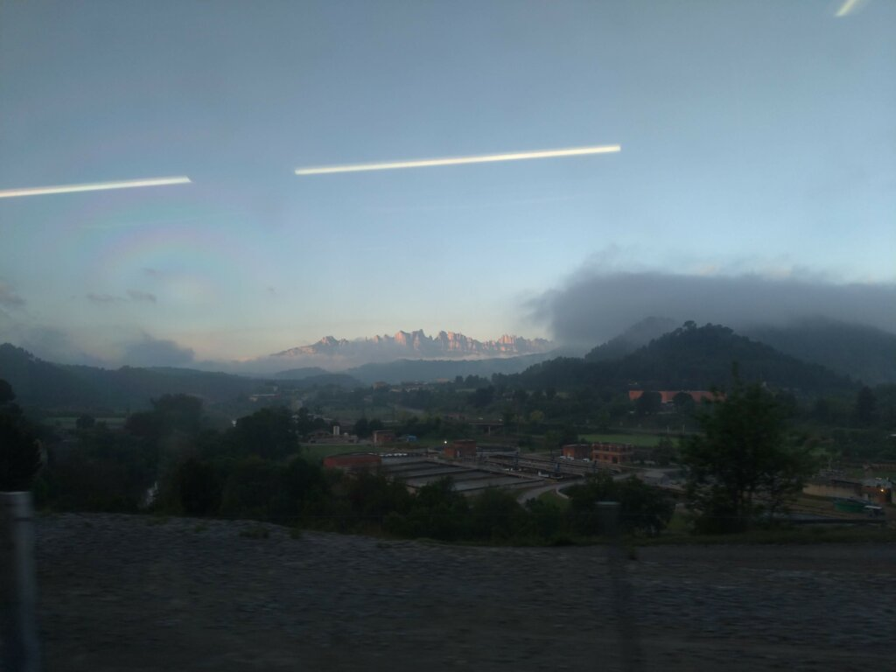

A view only people who get up early get to see

By the time I sat in the aeroplane I was already tired again. As someone who got used to waking up at 11 AM every day waking up that early could easily be described as a pain.

At the airport, I was greeted by being called trash in Spanish

I was able to sleep a bit on the plane but still ended up landing completely exhausted in Prague where my girlfriend was already waiting for me. After exchanging some money we searched for the fastest way to our Airbnb to rest a while.

We were hosted by Marty, a Czech guy who thankfully was able to speak some German and even was in Bregenz some weeks before we arrived. We had a private room in his apartment and were really happy with it.

Check out [Marty's Airbnb](https://www.airbnb.com/rooms/17398524?s=67&shared_item_type=1&virality_entry_point=1&sharer_id=189703239)

After some rest, we decided to get some dinner in the city centre. After trying to discuss what to eat and not coming to an agreement we decided to just head out and find the next best thing. Fortunately, Prague has one of the famous Hard Rock Cafe's that we both like.

## Sunday

Sunday we got up rather early (for us) and made our way to the castle to get a nice view of the city. Worked like a charm!

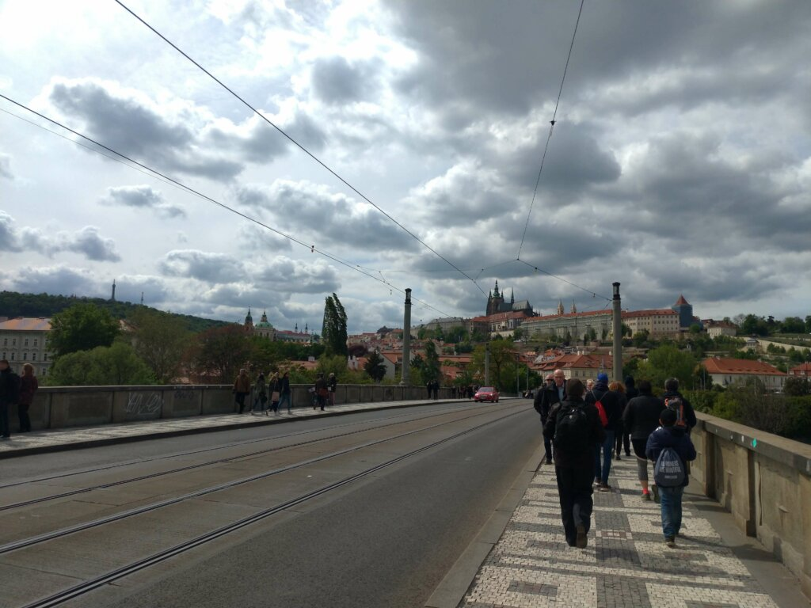

Castle on the hill

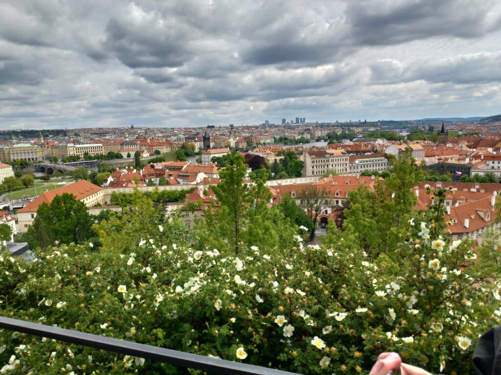

On the hill 1/2

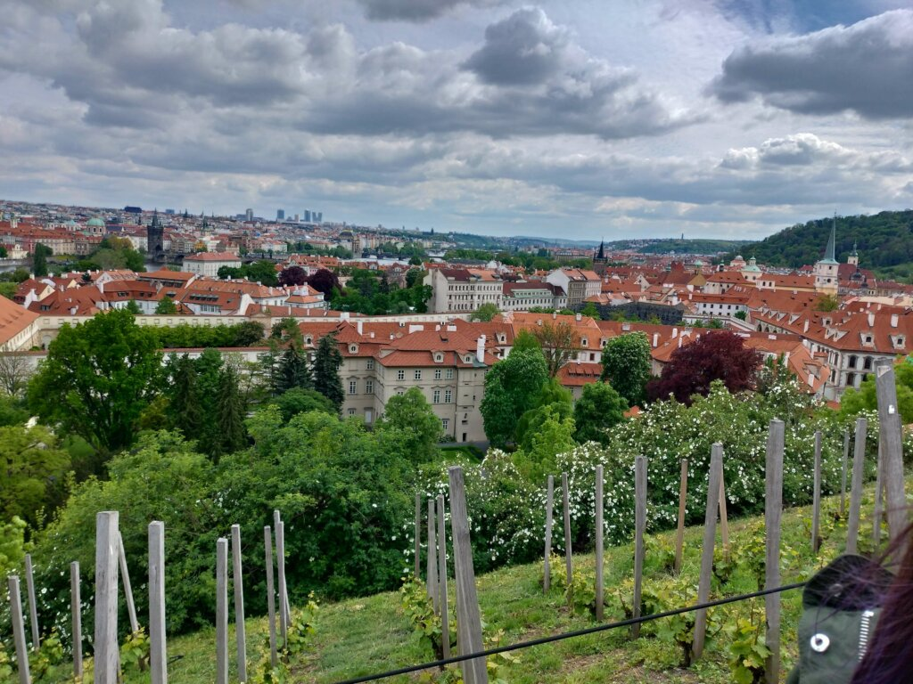

On the hill 2/2

After hiking up the hill to the castle we decided not to go inside (queue times and stuff) and went to the zoo instead.

The zoo in Prague is a really good deal, almost a steal for the amount of value you get from it. Many different species, themed exhibitions and even more or less exotic animals.

- 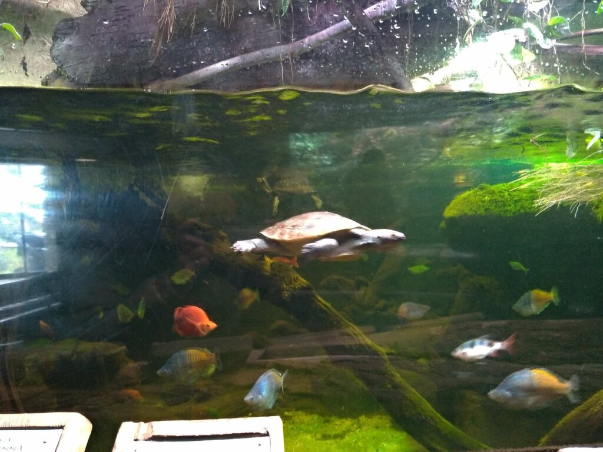
  have you ever seen a turtle swimming??? Think about it.
- 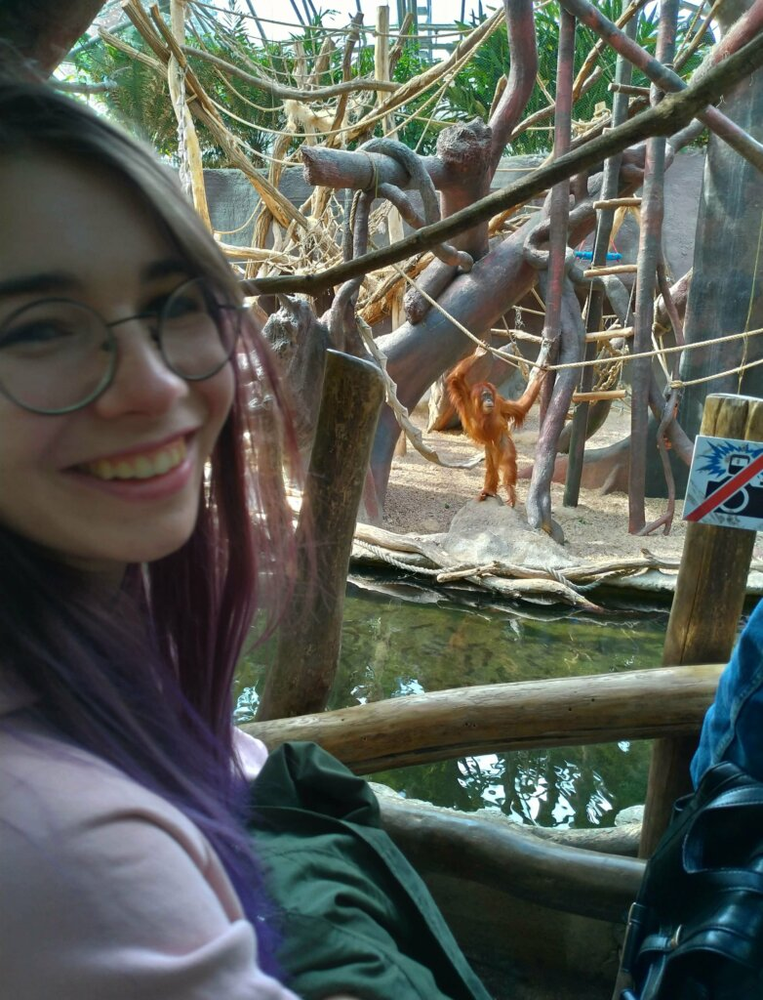
  two monkeys
- 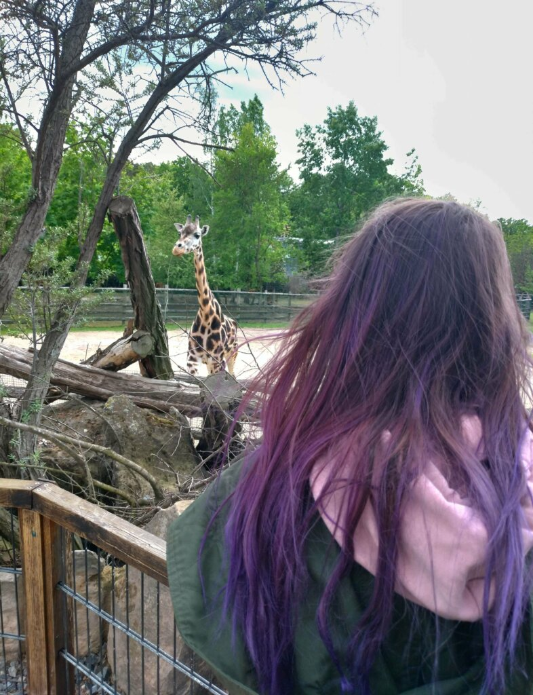
  two giraffes
- 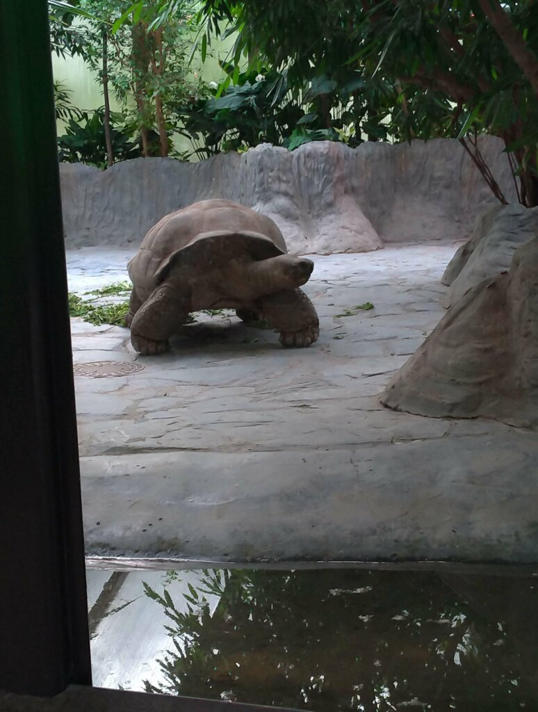
  an old turtle
- 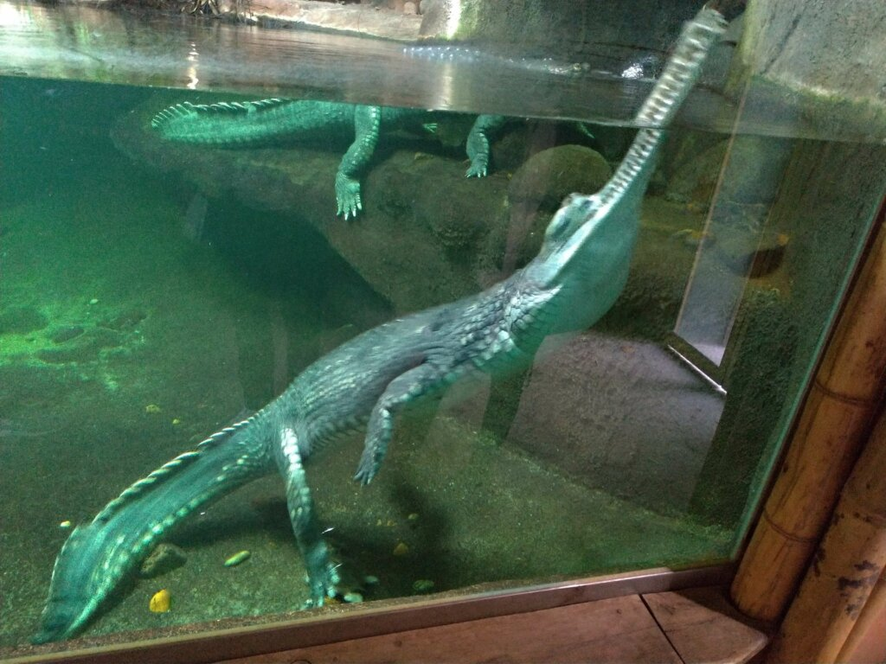
  I was not sure if that was real or fake but CROCODILE
- 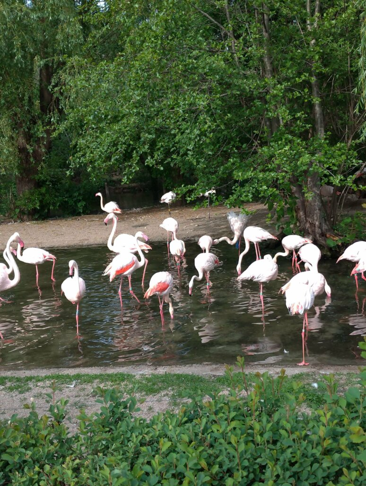
  flamingos

After approx. two and a half hours in the zoo it was time to leave. Although we just roughly managed to see half of the zoo we had to go home to get ready for the concert.

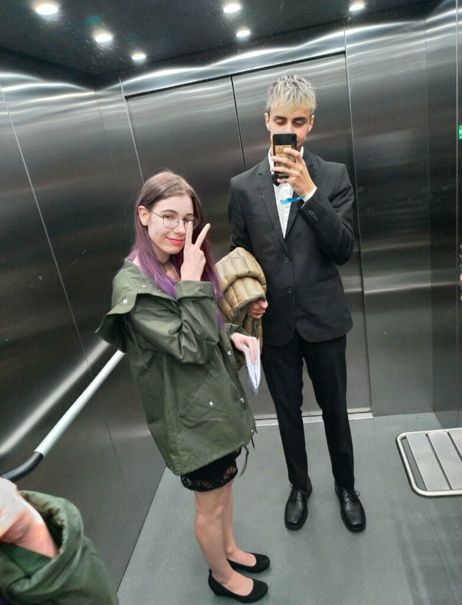

Pre Concert

mid concert

The concert was absolutely awesome and coming in with almost no expectations I can say that it was worth every single euro I invested in it. The live orchestra, operated by Joe Hisaishi himself, who even joined them playing the violin and piano at some point, was accompanied by beautiful movie snippets. A total must have seen if you're a fan of Studio Ghibli's music or even just their movies.

## Monday

Monday consisted mostly of walking around in the city and seeing the old city centre.

I took some videos and one of my friends is currently looking through it to cut me a nice video, but since I didn't post for a long time I decided to publish this blog entry now and upload the video once I have it. So stayed tuned!

Well, this marks the end of my short but long-awaited blog post about Prague. I hope you enjoyed reading it.  
See you in my next post! <3
