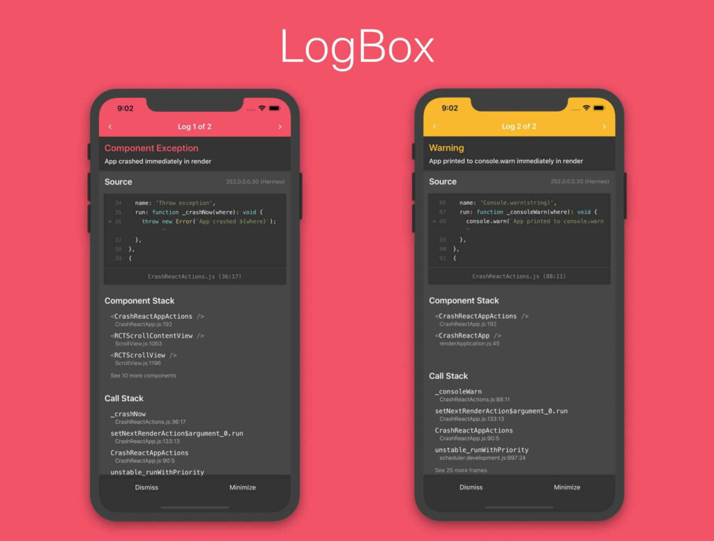
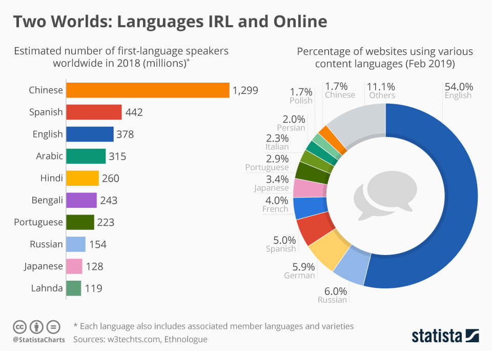
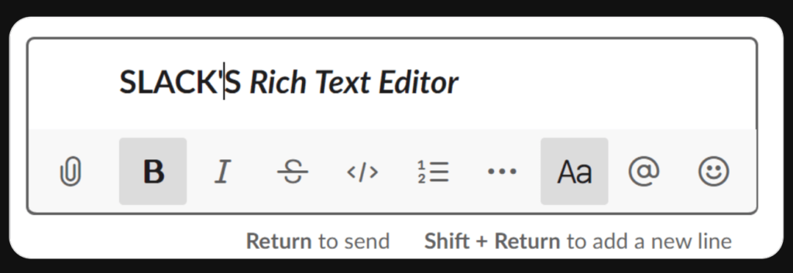
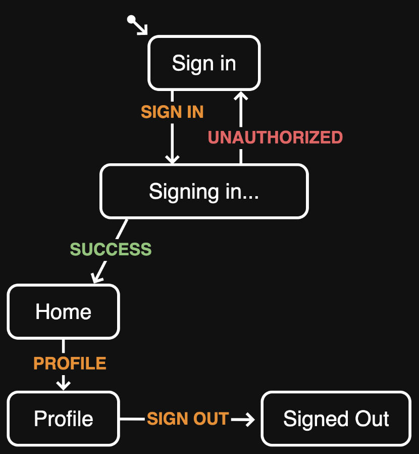
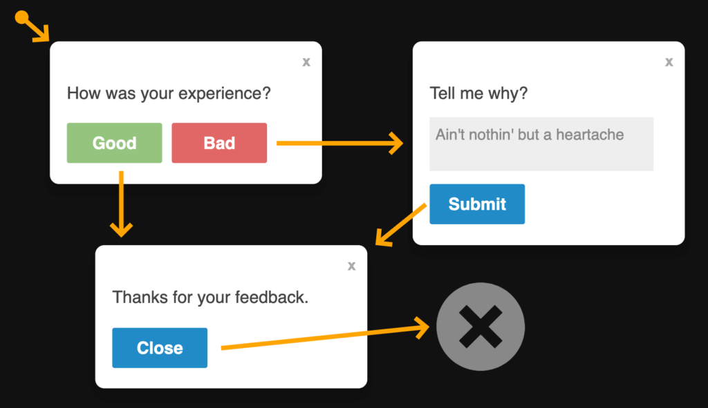
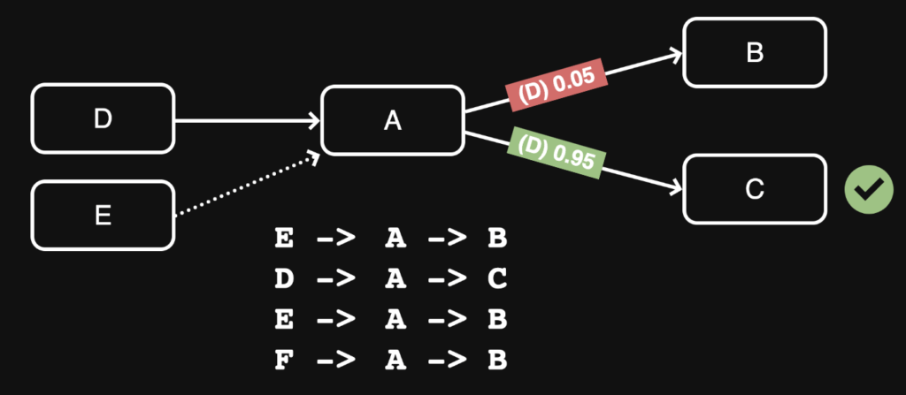
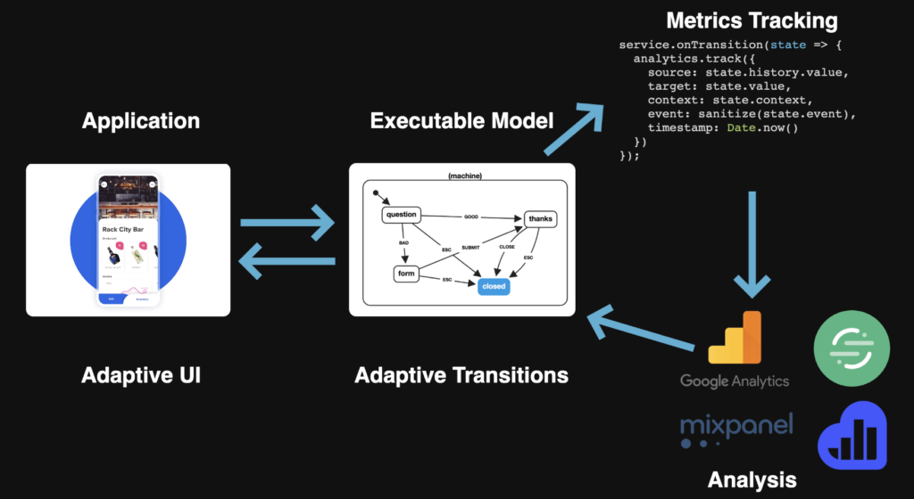

AgentConf is where experts and practitioners discuss the future of frontend. Two days of talks in Dornbirn and two days skiing in Lech, Austria. And I gladly had the opportunity to not only be part of this event but also learn a lot about the current state of frontend development! Since I heard about so much stuff I'll split this post into the two days of the conference.

## Day 1

Day 1 started with me being slightly tired since the event supposedly started at 8am so I had to get up at 7am and for someone who usually does not even try to stand up before 8am that was hell. Thank god the event offered a breakfast to cheer me up.

### The web's missing Forms API

The event was opened with the first talk by [Jared Palmer @jaredpalmer](https://twitter.com/jaredpalmer), who talked about forms. Everybody has seen them, everybody in web development has worked with them and we all know that they can be a real pain in the ass sometimes.

What Jared mostly talked about was [Formik](https://jaredpalmer.com/formik) - his startup that focusses on making the development process of forms not only easier for developers, but make it so easy, that even marketing could pick it up!

Formik itself is probably known as an [npm package for developing forms](https://github.com/jaredpalmer/formik). And although he plans on releasing a thing called "Formik Cloud", that will be a paid service for easily accessible forms, he still wants to keep the Formik library itself free and open source.  
Said service will include:

- an easy single table overview of all data that can be exported to a CSV ("submissions")
- immediate actions that are easy to set up and will automatically do whatever you programmed them to do, e.g. send a mail after signing up to a newsletter
- loads of integrations, e.g. Slack, Zapier, etc.
- an analytics tab to understand the data and behavior of your users
- and a lot more stuff that he probably had no time to present.

Although I was a bit bummed out that the first talk was basically a product announcement, I still enjoyed seeing how much thought and passion he put in his product and the entrepreneurial drive that was behind all of that.

### The New New React Native Redbox

The next talk was by [Rick Hanlon II @rickhanlonii](https://twitter.com/rickhanlonii) a developer from Facebook who is currently working at the React Native Core team. The thing he wanted to present us was how they redesigned the hideous and [scary Redbox](https://github.com/react-native-community/discussions-and-proposals/issues/42) to an updated and much better version of it.  
You can see the results below:

Old LogBox - scary, ugly and unreadable

New LogBox - nice on the eye, easy to debug and looks 🔥

Overall the new design looks way better and is much easier on the eye, you can quickly see what you did wrong and even directly open the line of code in the IDE (by tapping on the code box). Big kudos to the React Native Core team for stepping up their game!

### What is the deal with internationalization?

After a short coffee break, I had the chance to listen to a talk about internationalization by [Eli Schutze Ramirez @elibelly](https://twitter.com/elibelly).

Eli started her talk with this amazing infographic that just blew my mind:

©[statista.com](https://www.statista.com/chart/14900/two-worlds_-languages-irl-and-online/)

This essentially means that a huge part of the internet is just not accessible to users from non-English speakers. But internationalization is not only just about language. You have to account for a lot of stuff!

#### Some Facts:

- writing systems and their line breaks
  - languages like Thai don't have clear rules on when or where to break lines
- formatting date / time / currency
  - the best example of this is: 07/03/20 ask different people which date this is and you'll get a different result depending on the country the person is from
- writing direction
  - in the west, we are used to reading from left-to-right but other countries have different writing and reading directions e.g. Arabic is read from right-to-left
  - a solution for this could be
    - HTML attribute `dir`
    - CSS property `unicode-bidi`
    - HTML tags `<bdo>` and `<bdi>`
    - CSS pseudo selector `:lang`
- ordering pluralization (one, few, many)
  - languages like Russian, for example, have different words for numbers that end in say 2-4
  - \--> Write full sentences when possible
  - more can be read here: [http://www.russianlessons.net/lessons/lesson11_main.php](http://www.russianlessons.net/lessons/lesson11_main.php)
- grammar and sentence structure
- relative time (x days ago)
- BONUS: color theory and responsive design
  - colors may have a different meaning in different cultures

These are all things that can not be accounted for by just parsing text through placeholders from a (JSON) resource file. Since the EcmaScript Intl API is not fully supported yet, you can use [FormatJS](https://formatjs.io/), a library that can solve a lot of those problems out-of-the-box. A good language resource for localization is [CLDR (Common Language Data Repository)](http://cldr.unicode.org/) with every piece of data for locale-specific stuff.

#### Unicode

A big player in localization is a small organization you've probably never heard of. Unicode. They are in charge of developing, extending and promoting the use of the Unicode Standard (e.g. UTF-8 or UTF-16) and related globalization standards. 🤘Whereas all of them have a unique number, which makes it rather simple for developers to display the right character.

Most of you have heard of [locale's](https://tools.ietf.org/html/bcp47) haven't you? If not, they are those language identifiers most of you know such as de-AT, en-UK or zh-CN. They stand for the language and are followed by the respective country (in most cases languages differ between countries, e.g. UK and US English). The most important lesson you should take out of this short explanation about locales is that you, as a developer, should ALWAYS let the user choose their own locale because you can't assume if they are actually living there or are just traveling.

#### I18n has a logistics problem!

Build app -> get strings (translate id) —> deploy > add feature —> get strings translated again —> some languages ready but others not ??? Add feature from others ???!??!? Logistics is damn hard….

The solution for this could be [Continuous Localization](https://belazy.cat/what-is-continuous-localization/). Which can be solved by many SaaS providers.

Lastly, the talk ended with a very funny and interesting fact:

Always test your apps with german first because it will a 100% break the stuff (German has really long words)

### Mind-reading with adaptive UIs

The last talk before lunch and I was already hyped for it, just because of the title this had to already be my favorite talk. [David Khourshid @davidkpalmer](https://twitter.com/DavidKPiano) took his time to talk about the magic behind adaptive User Interfaces.

Most of you have heard of and/or used Slack and therefore have in some way gotten in touch with Slacks Rich Text Editor. Well... it sucks. It is neither adaptable (you can't turn it off in the settings) nor is it adaptive (all users have to use it).

Up until some time, there were no settings to enable/disable the Rich Text Editor in Slack.

Another example of bad UX through non-adaptive UIs would be this:

https://twitter.com/KylePlantEmoji/status/1219763872753545217

#### A/B Testing

If you want to change something about your UI or do little checks to increase your conversions the current best practice is to do A/B tests firsts. In these tests, you split your users randomly into two groups and change one single variable which you will test upon. For example:

Let's say you are a seller of climbing gear and want to see how you can increase your sales. After some research, you notice that the CTR (click-through rate) of your main CTA (call-to-action) button is way lower than anticipated. You decide to start an A/B test to see which setup increases your sales.

- For group A you are going to place the CTA in the navigation bar of your website
- For group B you are going to place the CTA in the hero section of your website

Now you use tools such as [Google Optimize](https://optimize.google.com/optimize/home/) to randomly split your users and give them the UI for either group A or group B. After some time you check back in to check the results and discover that sales for group B went 10% up whilst group A only sold 2% more! Now the logical consequence of this would be to ditch the design of group A's website and go with the one you made for group B.

But what about the 2% you sold more with group A? Maybe you will completely lose them with the new design. This is not an inclusive but an exclusive choice meaning that you will exclude the people that bought more when they had the group A design. The same thing goes for flow charts of sites.

#### Adaptiveness - AUIs

Prefetching your routes is a way of improving loading times between sites and if you make wrong assumptions about the way your user navigates through your site you end up with the same result as if you would've never prefetched the next page in the first place.

You may expect every user to take the same route to do whatever you want them to do on your website but especially in large-scale applications that may not be the cause and you might lose them across the way because of that.

One library to solve that issue is [GuessJS](https://github.com/guess-js/guess). It uses Google Analytics data to create a weighted model using machine learning of where the user might navigate next to and prefetches the URL based on that. This not only makes it way easier for developers to integrate prefetching but also decreases loading times between pages by a lot.

Another way of improving your users' experience on the website would be by using the standards that Google Chrome has as built-in called [adaptive-loading](https://github.com/GoogleChromeLabs/adaptive-loading) _([react-adaptive-hooks](https://github.com/GoogleChromeLabs/react-adaptive-hooks) for a library)_. In this GitHub repository, you can see how to use built-in browser APIs, like your current CPU/RAM usage or your network speed, to create a remarkably better user experience.

The thing behind adaptive user interfaces is that it does not only account for responsive websites (which should be a standard by 2020) but also for interfaces that react to the users' needs or in other terms:

> _“Intelligent user interfaces (IUIs) are human-machine interfaces that aim to improve the **efficiency**, **effectiveness**, and **naturalness** of **human-machine interaction** by representing, reasoning, and acting on models of the user, domain, task, discourse, and media (e.g., graphics, natural language, gesture)”_
>
> Mark Maybury - Readings in Intelligent User Interfaces, 1999

One really cool example of AUIs (adaptive user interfaces) is Google Mail with its automatic suggestions:

Source: [https://www.blog.google/products/gmail/subject-write-emails-faster-smart-compose-gmail/](https://www.blog.google/products/gmail/subject-write-emails-faster-smart-compose-gmail/)

The good thing of AUIs is that they have the possibility of distinguishing power users, that just want to get shit done, from new users that are just getting started and need a little help navigating around. All your application needs to achieve this is data... and a state machine!

#### State machines

State machines are used to display systems with a limited number of modes (behavior model). They have an initial state, a finite number of states and events, mapping of states by transitions of events and a finite number of final states. With them, you can map out the easiest machines up to entire space shuttles.

A simple example of a state machine from David Khourshid

Now we can make use of all of this knowledge we acquired during the last few paragraphs and sketch out a small feedback modal that adapts to our users. If the user decides not to give feedback we want to show him a modal and ask him why. The statechart looks like this:

https://codepen.io/davidkpiano/pen/dc81af7260581c1fbbf5b5154caa2228

#### Game Plan

That only was a very low-level approach to solving this issue. If we want to step up we need a game plan:

- Abstract **model**
- Transition **analytics**
- Identify adaptive **paths**
- Use analysis for **adaption**

And the result of that is **weighted graphs**. Weighted graphs are oftentimes used in machine learning and this is exactly what we are going for. We want to use basic machine learning to create an abstract model of our site and therefore adapt to our users' needs.

Through weighted graphs, we'll be able to get the most likely route for the user to take in our apps. They can be easily implemented using guessJS, or similar libraries. An important side note here is that we shall not forget to use the full site map with all our routes so that the machine learning algorithm can fully comprehend what the user wants and needs.

Taking snippets from the middle of the flow may seem right but...

...it is important to understand where your users are coming from. (Higher-order Markov models)

The whole process can further be improved by using deep reinforcement learning. Deep Reinforcement models learn by feedback, meaning that if the model predicts something wrong, it will all consider not showing this option the next time the user does something. For example:

User A wants to navigate from our landing page to our shop page. Our analytics show that the typical user wants to access the blog as our second page, therefore, our Machine learning algorithm thinks it would be more suitable for us to loads a blog page first. If the user will do something that the model does not predict we will tell the model that its prediction was off and give him the new value (shopping page) as input for the next time. And through this automated process, the machine learning algorithm will improve itself.

So, all in all, we come out with the following image as our process of an Adaptive UI:

This is the most generalized model I found about adaptive UIs.

By implementing this process we can not only improve our users' experience but also improve our sales click through rates and more.

### Intro to ReactNative and Expo

After a pulled pork burger for lunch, I was ready for an introduction to React Native by one of the folks from Expo themselves, [Brent Vatne @notbrent](https://twitter.com/notbrent).

It was a really basic live-coding talk where Brent went through the expo.io tutorial on creating your first app live on stage. For any of you that don't know what React Native is or does:

> React Native combines the best parts of native development with React, a best-in-class JavaScript library for building user interfaces.
>
> React primitives render to native platform UI, meaning your app uses the same native platform APIs other apps do.
>
> Create platform-specific versions of components so a single codebase can share code across platforms. With React Native, one team can maintain two platforms and share a common technology—React.
>
> ReactNative ([https://facebook.github.io/react-native/](https://facebook.github.io/react-native/))

What this essentially means is, React Native lets you develop React apps for Web, iOS and Android with just one codebase. Which could improve your development velocity by a huge factor.

### Rethinking SPAs: web-native apps

How would you go about refactoring 10.000 React components? Maybe [David Leitner @duffleit](https://twitter.com/duffleit) has some interesting points to think about before tackling a refactor heads on.

For that, we have to go a bit back to the past and look at the history of frameworks. In the early 2000s, the first frameworks like jQuery were born to solve problems. jQuery, for example, solved the problem of javascript code being clunky, async calls nearly impossible to read and just brought a lot of cleaner looking code to us.

But the downside of jQuery was that it was directly manipulating the DOM and therefore inconsistencies in terms of state management occurred often and were a pain in the ass to handle.

After some time the browsers native APIs caught up and we got new standards like ES6, CSS3, WebAudio and so on. Native JavaScript was not only faster than jQuery but offered many better solutions to the problems that jQuery fixed. The **gap between the framework** and the **WebStandard** was simply **too huge**. And jQuery slowly became a legacy framework.

But how come React, a framework that was published in 2013 could survive that long? It just stuck really close to the fundamentals of Javascript.

So back to our main problem... we have a component library of 10k components and want to update from React v15 to React v16. Which by the way is a lot harder than it sounds - I spent nearly 2 afternoons rewriting the nearly 70 components [spoti-vote.com](https://spoti-vote.com) is built on. How do we go on about this? David's solution to this was to just not use frameworks at all. But hold up, what about all the joy and ease frameworks bring upon us?

#### #frameworkIndependent

For the project he worked on, he did not really scrap everything at once. He approached the problem in a different way. By building his own "framework". I put this in quotes because he didn't want to call it a framework rather a library. Whereas the only difference between a library and a framework is the chain of command. Frameworks tell you what to do, but you tell libraries what to do. It anyways sounded to me like it clearly was some sort of abstraction of a framework. He split the core components of a framework like this:

- State Management (RxJS)
- Dependency Injection
- Routing (Vaadin Router)
- CLI (Schematics)
- Component System (Svelte)

And strictly went against using WebComponents by referring to [Rich Harris' dev.to post called 'Why I don't use WebComponents'](https://dev.to/richharris/why-i-don-t-use-web-components-2cia). Which I think is a good call for now but [WebComponents](https://www.webcomponents.org/) will clearly grow a lot more momentum in the future once browser support is good enough. Although I can't agree with his theory I still was fascinated to see how other people's opinions are on that topic. What this talk sadly was lacking was a bit of practicality. He, later on, explained about all these different libraries and packages that he used but he did not go that much into detail how he built his own 'framework' of micro-frontends and glued it all together.

### Building reusable UI libraries with React

[Cassidy Williams @cassidoo](https://twitter.com/cassidoo) from the ReactTraining Team flew all the way from the USA just to teach us how to build better UI libraries.

The problem with many component libraries is that they don't offer much more than a single point of data that you have to pass into the component via props. The problem with that is that they are not making use of built-in features such as `children` to split up their code even more.

Compound components are perfect for these problems because they aim to use as few props as possible. They consist of a set of more variable components and delegate rendering control across child elements while they also manage an implicit state as a whole. In simple terms: "Two or more components that work together to accomplish a task".

While this explanation seems kind of advanced and difficult, we all have used such components before. Native dropdowns use it all the time. `<select>` and it's child element `<option>`.

By building such Components you give the user a lot more control over the way he wants to use and style your library.

If you're interested in an example, Cassidy has a GitHub repository just for you! [cassidoo/accordion](https://github.com/cassidoo/accordion)

That pretty much sums up this gigantic post of the first day at AgentConf 2020. Thanks to everyone who stuck until the end! I hope to see you in the second part!

Kudos to you! <3
