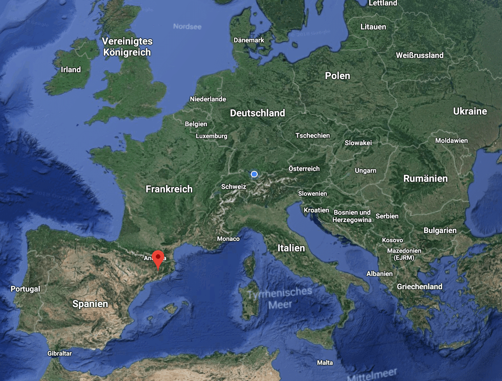

19 years, 2 months and 9 days. That's the time I spent living in Austria. Most of the time I hated living here and I really just wanted to let everything behind me and leave this place. I really developed a kind of **love-hate relationship** with Austria and I only figured out how much I love this place now that I'm leaving.

The last year was probably the best year I had in my entire life. I met all those new people, I loved, I laughed... I simply had the best time of my life. Over the chorus of the last year, I really felt completely alive. I for the first time in my life felt like I had real friends I could count on once I needed them.

But how did I get from the best year of my life to a whole new adventure in Spain???

## EVS

I applied for an [EVS](https://europeanvoluntaryservice.org/) in December 2017. At that time I really knew that I would never want to fulfil my civic duty as a soldier nor would I stay in Austria and wipe asses for old people or work 60h/week as a paramedic.  
_(Don't get me wrong, those jobs are really needed and the society depends on them. It's just that I could never do something in my life, I still respect the people who earn their money with that.)_  
So the only other choice I had left was to leave Austria (with their [antiquated compulsory military service](https://www.help.gv.at/Portal.Node/hlpd/public/content/14/Seite.140117.html)) and work in a foreign country.

### Alternatives to the Army

So after some research, I stumbled upon a program called EVS which stands for European Voluntary Service. The whole program is promoted and sponsored by the European Union to enable teenagers to learn more about other cultures and travel Europe, whilst still helping other people. A win/win situation for both parties.

Around February an organisation finally accepted my application. [Consell Comarcal del Bages](http://www.ccbages.cat/) in Manresa, Spain. I will work there as some kind of midday carer for children in schools. I really liked that job offer, because I wanted to work with children and visit a Mediterranean country (although France was my first choice).

Manresa, Spain (red dot)

Today is the day. I'm leaving my love-hated home for 10 months to work and live in Spain. I am very very sad that I will not be able to see any of my friends or family for the next 10 months, but I am very excited how Spain will be.

So to all my friends and family reading this. Please notice that I am still alive, I am just about **1600 kilometres** away from you. Please **text me** as much as you can and annoy me as much as you'd like to! Lots of love to you!

**See you in 10 months. <3**
