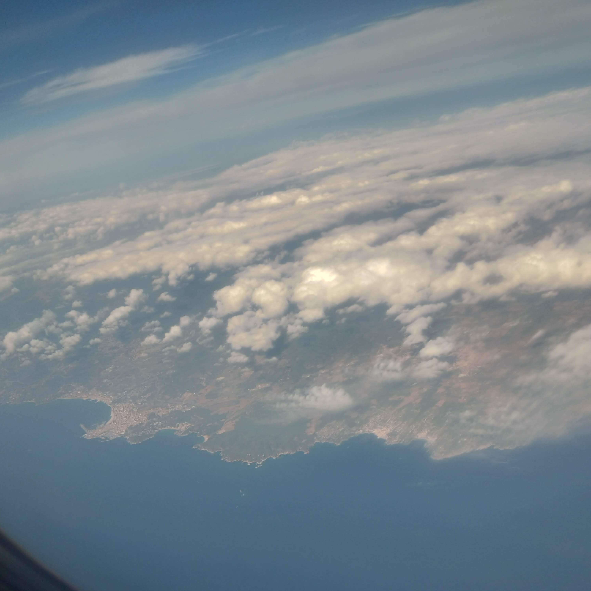
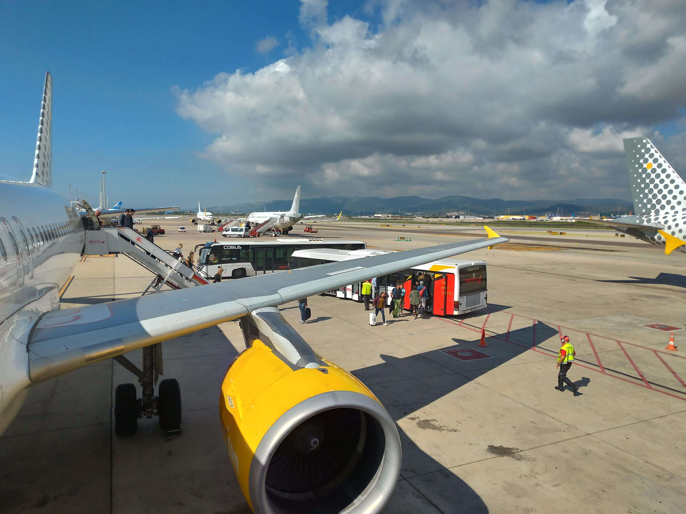
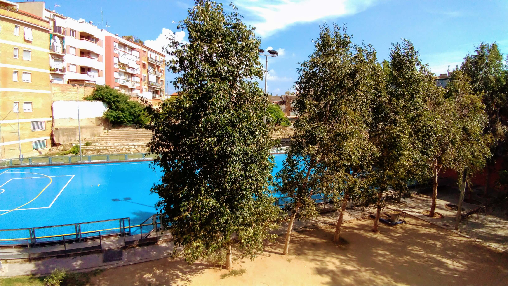
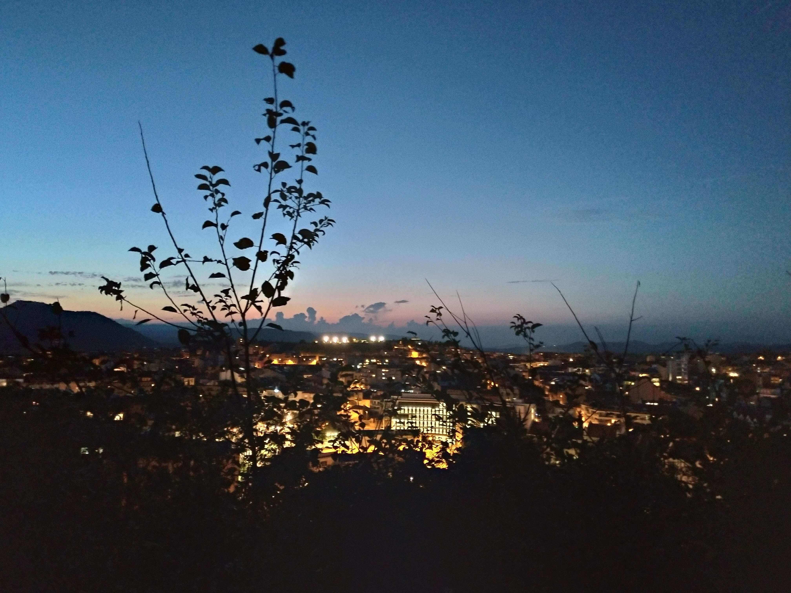
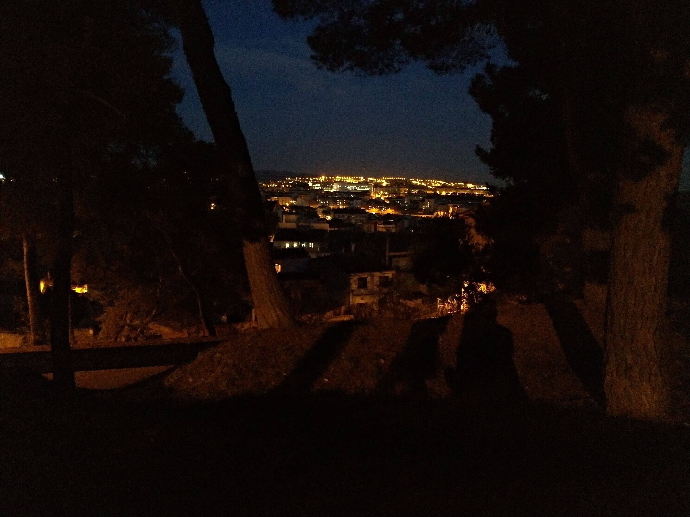
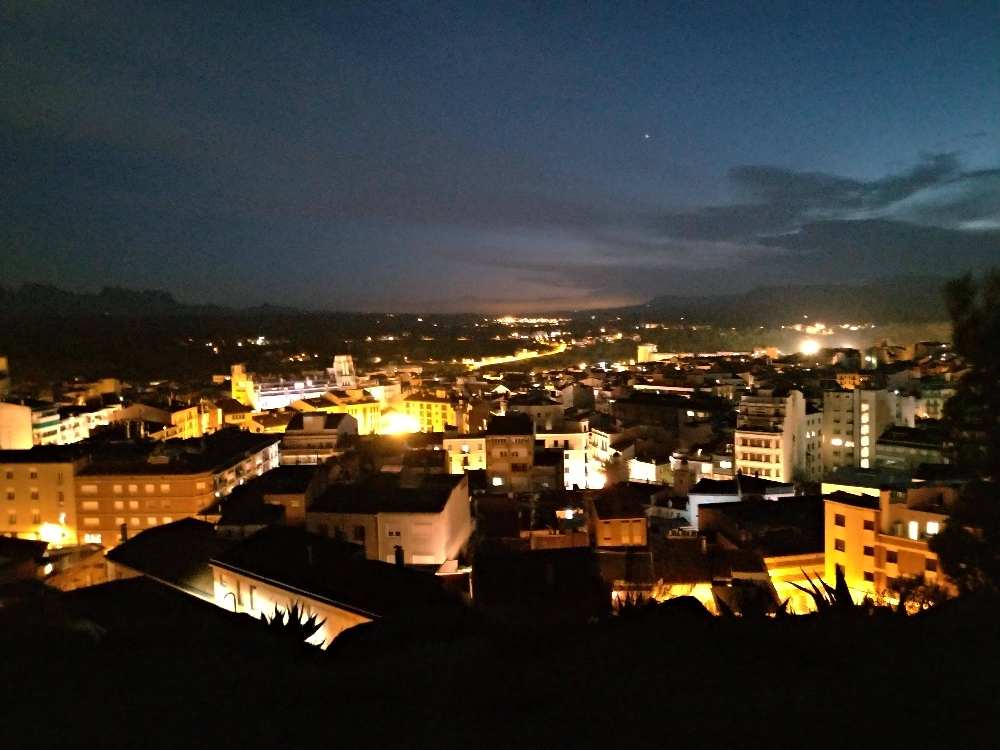

Although I realized at the last evening that I really didn't want to leave I still had to and only in doing so I could admire the beauty of Catalonia. Read the following paragraphs for my first day abroad!

## Morning

I woke up at 4 AM making my last preparations for the flight, telling my family my last goodbyes and walking through the house for the last time in 10 months.

My train from Bregenz to St.Magrethen departed at 5:17 AM. I then had to change the train in St.Magrethen and in St.Gallen to get to the airport in Zurich. During my train ride to Zurich airport, I could even witness the sun rising.

I arrived at 7 AM and headed straight to the baggage check-in because I didn't want to walk around with a 21kg heavy luggage. After that, I went through the security check where I got (as always) into a bomb testing. Trust me, you should definitely shave before you enter an airport.

The flight was scheduled for 9:35 AM but due to bad weather conditions (it was really foggy that day) the flight was around 20 minutes delayed. As I then finally entered the plane and sat down in my seat I immediately fell asleep. Waking up just 20 minutes before arriving right over the French coast.

The french coast as seen from my plane.

## Noon

After a two hours flight, I finally arrived at around 11:50 in Barcelona. It took me about 5 minutes to get from the landing field to baggage reclaim where I had to walk through the airports own mall and then wait around 20 minutes to get my baggage back.

My first steps in Spain, straight out the plane.

As soon as I got my baggage I got to the arrival area where I met my mentor Alba for the first time, accompanied by my flatmate Anna (she's also from Austria). Right after I that we got to Alba's car in the car park (man are they huge in Spain. I mean it had like 5 floors full of cars) and drove to Manresa. On the way to Manresa, we saw a lot of the Catalonian landscape. We drove past a mountain called [Montserrat](https://www.montserratvisita.com/), it is a beautiful mountain that parts Manresa from Barcelona. On the mountain is a monastery that contains a regionally famous boy choir boarding school. Montserrat is on average around 1100m high (which is about as high as the Pfänder in Bregenz). We arrived at the flat in Manresa at around 13 o'clock.

The view from my balcony. The local rollhockey team trains on there, but there are also football goals and baskets to play different sports.

First thing I did as I arrive was to unpack my things and then eat some rice Anna made for me. Later that afternoon we then walked a bit around the town and looked for a supermarket so I could buy the things I need. After that, we waited for Joe to arrive at the flat because we planned on going to the park.

## Evening

Joe arrived around 8 PM after he unpacked his things we then went to Parc de Puigterra which is located on the highest hill in Manresa right in the city centre. From up there you could see most the surrounding areas of Manresa and because it was night time we could capture some cool shots.

Manresa's city centre and the [Serra de Castelltallat](https://www.google.es/maps/place/Castelltallat+range/@41.7916652,1.6158234,14z/data=!3m1!4b1!4m5!3m4!1s0x12a44efe8bf58c4d:0x52717f13542f4070!8m2!3d41.791667!4d1.633333)

View on [Mura](https://www.google.com/maps/place/08278+Mura,+Provinz+Barcelona/@41.700302,1.9771127,17z/data=!3m1!4b1!4m5!3m4!1s0x12a4f1cdbe2d2315:0x9d7fc0c4a59f1918!8m2!3d41.6998359!4d1.9768377?hl=de)

Road to [Igualada](https://www.google.es/maps/place/Igualada,+Provinz+Barcelona/data=!4m2!3m1!1s0x12a469e3371b0c5d:0x400fae021a40860?sa=X&ved=2ahUKEwiu7p--pMndAhUSxxoKHW0DCh0Q8gEwEXoECAoQCw)

After that, we had to climb down from the approximately 280m high hill. As we got back home Flavio got back from work. We then talked a little bit and I decided to get to bed at around midnight.

All in all my first day was really good and I really like my new flatmates. I hope that we will experience many adventures together.   
And from you, I hope that I'll see you in my next post! <3
