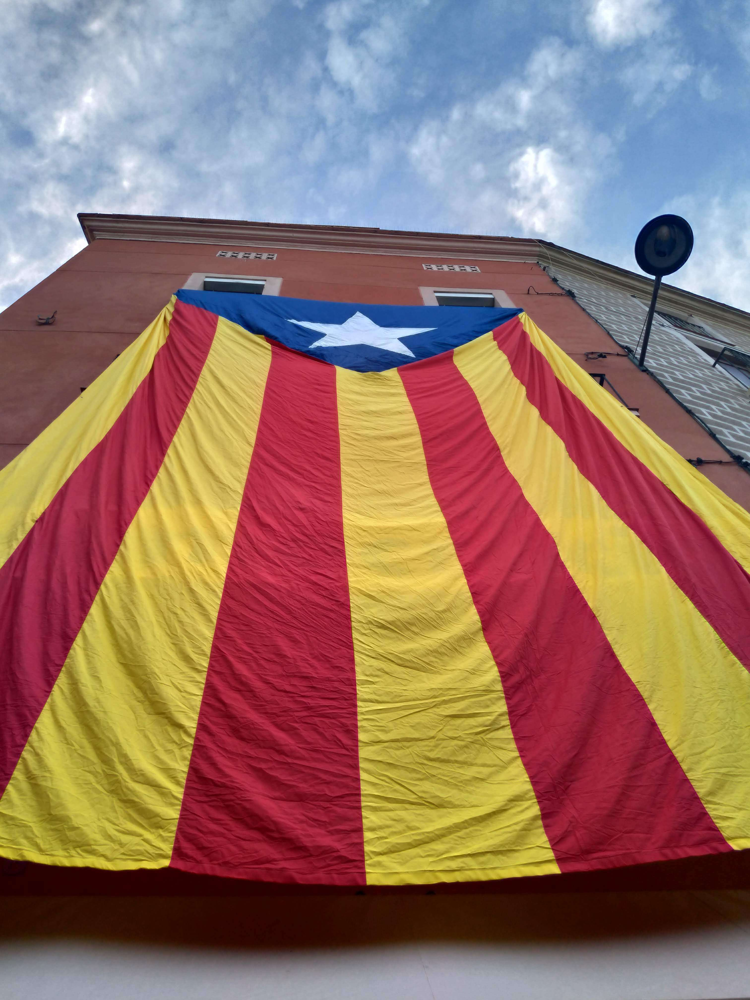

This is my second week in Manresa now and due to my project's organisation changing their organisation structure and getting a new head of staffs. So I couldn't work and therefore had much free time. Here are my main activities I did during this free time.

## Learning Catalan

Flag of Catalonia

Being in a foreign country without any prior knowledge of the language(s) can be really hard sometimes. Most Spanish people don't really speak English at all, so you have to use your hand and feet to explain to them what you want.

I worked as a bus monitor for one evening to check on the children on the bus if they were strapped in and sat on their seat quietly (did not work out that well) and since they were age between 3-8 almost nobody spoke English.

This was the point where I realized that I may need to step up my Catalan game and do more in my free time than just the 4h/week that I attend the language school. You might ask yourself why I don't learn the traditional Spanish (Castillian) and there are many reasons for that.

### Catalan is easier 

Well, many people are going to be strictly against this, but let me tell you why I think so.

In primary school I had the opportunity to join a french class for 2 years. I took the class because my father is from Tunisia and French is the second capital language there. But what does French have to do with Catalan?

Catalan could be described as a mix between French and Spanish and because I have prior knowledge in French I feel very comfortable in speaking Catalan since most words are pronounced similar or can even directly be taken from French. For example:

<table class="wp-block-table"><tbody><tr><td><strong>English</strong></td><td><strong>French</strong></td><td><strong>Catalan</strong></td></tr><tr><td>to arrive </td><td>arriver</td><td>arribar </td></tr><tr><td>to ask</td><td>demander</td><td>demandar</td></tr><tr><td>to say</td><td>dire</td><td>dir</td></tr><tr><td>to give</td><td>donner</td><td>donar</td></tr><tr><td>to eat</td><td>manger</td><td>menjar</td></tr><tr><td>to talk</td><td>parler</td><td>parlar</td></tr><tr><td>to pass</td><td>passer</td><td>passar</td></tr><tr><td>to carry/bring</td><td>porter</td><td>portar</td></tr></tbody></table>

### Everyone speaks Catalan here

The Catalans are very proud people. This does not only include their heritage, no, they are also proud of their culture, traditions and most importantly their language.

Since the 18th Century, where the Spanish Kingdom conquered Catalonia in a fight, Catalans felt suppressed and wanted to stay as independent as they could be.

So as part of their revolution and seperation they almost only speak Catalan here.

### I have to take a test in Catalan

The Centre de Normalització Lingüística Montserrat is my language school for Catalan here in Manresa. On my second day here, I had to do a classification test to see in which course I would belong. Turns out I am on the Language Level A2 and should visit the second highest course (Bàsic 2) and to be allowed to do the Basic 3 exam and get a certificate for the A1 level, I have to get more than 75% in both the oral and written exam.

So back to learning Catalan. I am mostly using a website called [parla.cat](http://www.parla.cat/pres_catalaenlinia/AppPHP/login/index.php). It is probably the only good website I use for learning because it has an interactive program where you are engaged in participating in the activities of the site.

## Program

Some might notice one or two tweaks I made at the design, e.g. text size, blog post size, etc. But those were only minor changes, most of the time I spent was for logic reasons.

You can now search through all my posts by tags (EVS, Programming, ...) and only the ones related to that tag. Meaning my filtering algorithm was improved and updated. Now you can narrow down the number of posts you want to read through.

## Watch series and movies

Bojack Horseman is one of my favourite series out there. The way they add comedy to a rather sad series which focusses on the life of an old famous star and his many problems in life is really interesting to see. It reminds me a little of the adventures of Rick and Morty because Rick is also a really sad and broken man but the show itself always gets a laugh out of me.

Silicon Valley, not only Americas biggest Tech Industry District, but also a really great show. I can recommend it to anyone who is a little geeky and/or nerdy and wants to see a series about the real life of a software developer and through which obstacles one needs to go if he wants to create his own startup. Silicon Valley was a really inspiring series that got me back into programming and problem-solving.

## Check on my friends

1000km away from home, 1000km away from my friends and family. I think most of my free time was spent on texting my friends back at home to check how they are doing, what they are up to or just having some small talk. I think it's really important to maintain your relationships even if you're far from home.

## Reading

I am trying to read at least one chapter a day because I brought like 5 books from Austria with me. I am currently reading the first adventure of Sherlock Holmes translated to German (Eine Studie in Scharlachrot).

## Sports

Since I am here I wanted to spend most of my time getting in shape, but due to the fact that I got injured after just 2 weeks here - I probably just bruised my knee - I can't really focus on that. My plan is to start again as soon as I feel like my knee is fully functional again.

For now, I just try and go out for a walk every time I can. You can read [here](https://gabsii.com/blog/small-tour-around-manresa) about the cool images I took whilst I used my free time to check my city and the surroundings a little.

## Producing

I am by no means a genius at making music (if you want to see a real magician, check out my cousin's [SoundCloud](https://soundcloud.com/wuslator)). But since I am here with waaay too much free time, I thought I could spend it on doing something that sounds fun to me.

Some days ago I asked you on Instagram if you had any good suggestions for series, movies or animes. One of my friends jokingly recommended me some Spanish lessons with him.

Spanish lessons with el proffessore lucá

So I hooked him up (although I know he speaks little to no Spanish) and listened to him trying to read texts from Google Translator to me. I had a really fun time there and decided to use some of the recordings he sent me to sample him to some jump up. Because Luka has his own [SoundCloud](https://soundcloud.com/luka-trailovic) I jokingly used my time to make a rather 'cussing' and crappy track. If you want to listen to it, check it out here:

https://soundcloud.com/luka-trailovic/el-professore-luuca-djgabsii-remix

Please don't be offended or anything, this is should rather be seen as satire

Well this pretty much sums up my basic activities during a day, I hope you could learn a little bit more about what I do here and maybe even get some ideas yourself what you can do in your free time.
