Since 2018 now came to an end I want to start in 2019 with a look back on the experiences I could make last year. I try to keep myself short and just write a bit about the most notable events.

## January

I started last year in Vienna. My last hours of 2017 were thinking about what I should do with who and where. Fortunately for me, my friend from the [START-Stipendium](https://www.start-stipendium.at/) Mugtaba texted me and asked if I wanted to join them for their New Year's Eve.

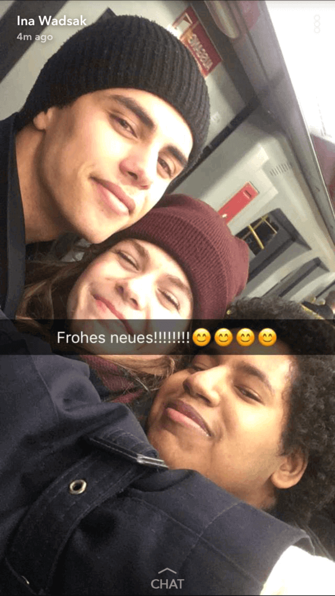

Me, Ina and Mugtaba

During my stay in Vienna, my friend Filip allowed me to use his flat. Huge shoutout to him for that. After a couple of days he then also came back to Vienna and we had a funny time doing quizzes, taking pictures or locking ourselves out of the flat.

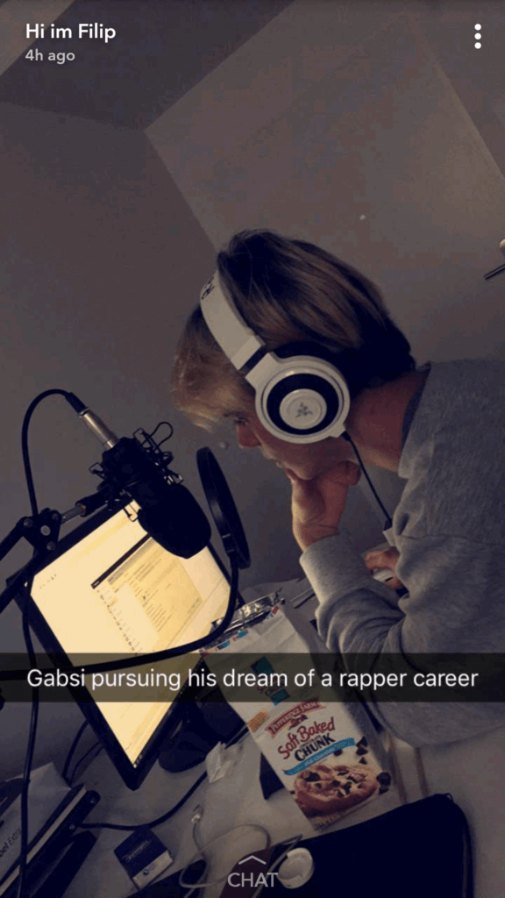

Fixing Filips Mic

Back in Vorarlberg I had to plan the choreography for our stage show at my prom. Half of the class danced dressed up as women to the 1920's themed song "Forty Days and Forty Nights".

We celebrated Chris' birthday on the 11th and everyone who knows Chris, also knows that his parties are ones of the best.

The days to my prom became less and less. In school we started to go to classes less regularly because we always found an excuse to do something else if we mentioned to the teacher that we had to plan something for the prom.

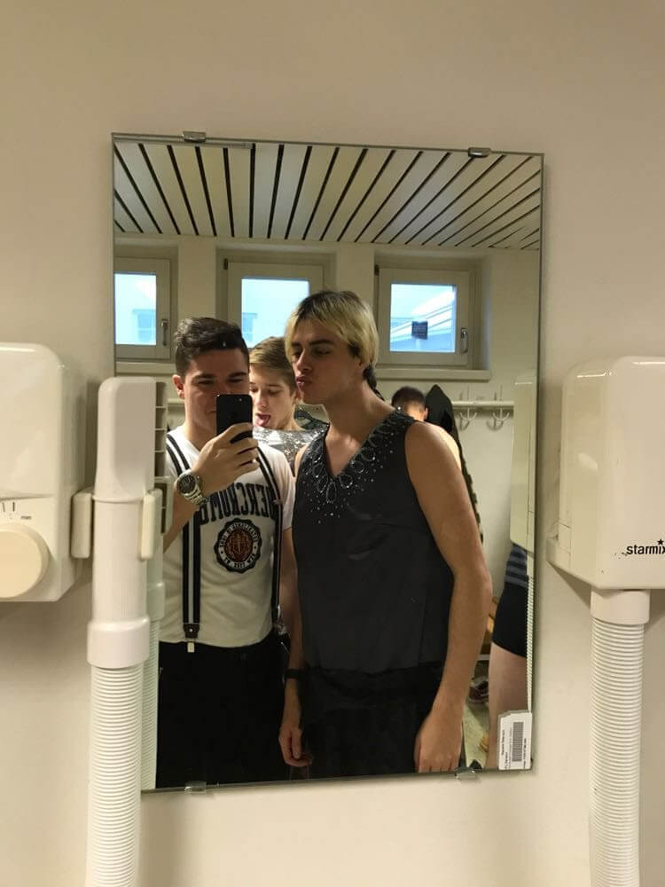

Rehearsal for the prom

And then the day came. January 19th 2018. We finally got to celebrate our last year in school at the prom and had a great time doing the choreography (I hope the crowd liked it as much as we did). After the official part finished I joined my friends for the Afterparty at Conrad Sohm where we had a hell of a good time.

One piece of work I can be proud of was my Business Plan for an artificial company we had to plan for our Entrepreneurship classes. You can check it out [here](https://docs.google.com/document/d/1OjToLTVCtDopzaAX9M07q68SjwG9cTSmGqAk7_7Txew/edit?usp=sharing).

After we had our prom school started to get a bit more chilly and we were a bit less stressed. After all, we had our semester break soon. So school started to get less productive and more about just spending time. And we gladly killed that time with playing A LOT of Tetris. And if I say A LOT, I mean A LOT. I can proudly say that I played Tetris almost every lesson and looking at my progress I am pretty happy with what I achieved.

## February

With February came the semester break and I finally had some time to work on my diploma thesis again. By that time I already worked a solid 280h on the project and I started to fancy programming more and more.

The semester break started with the BORG Dornbirn Schoren Ball. One of the only proms where most of my squad (Stefan, Chino, Edo and Nonye) went to. We there met up with Eyüp, Melisa, Tugce and Samet who we met at Eyüps birthday party the month before.

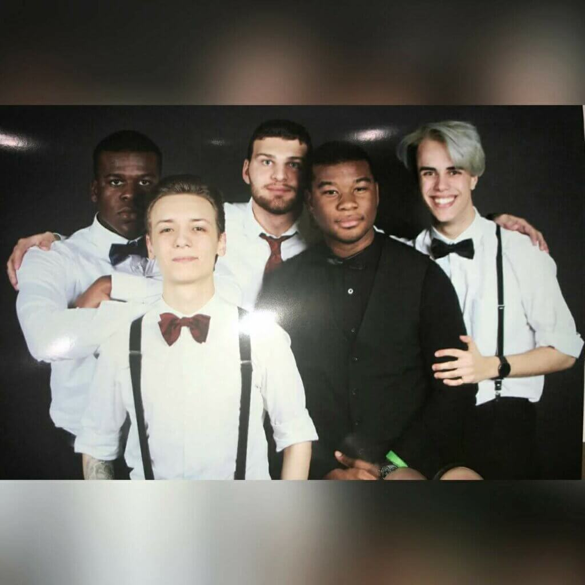

Nonye, Stefan, Edo, Chino, me (LTR) at the BORG Schoren Ball

Because the annual [START Wien Ball](https://www.start-stipendium.at/start-wien-ball-2018-ein-bericht/) was in February, Chris and I volunteered to plan a choreography for the people from Vorarlberg (Cansu said we have to). And because we got chosen to that job we pulled Chino in to help us.

The START Wien Ball was really funny and the weekend in Vienna was quite enjoyable because it was one of the last opportunities to see some of my friends from START.

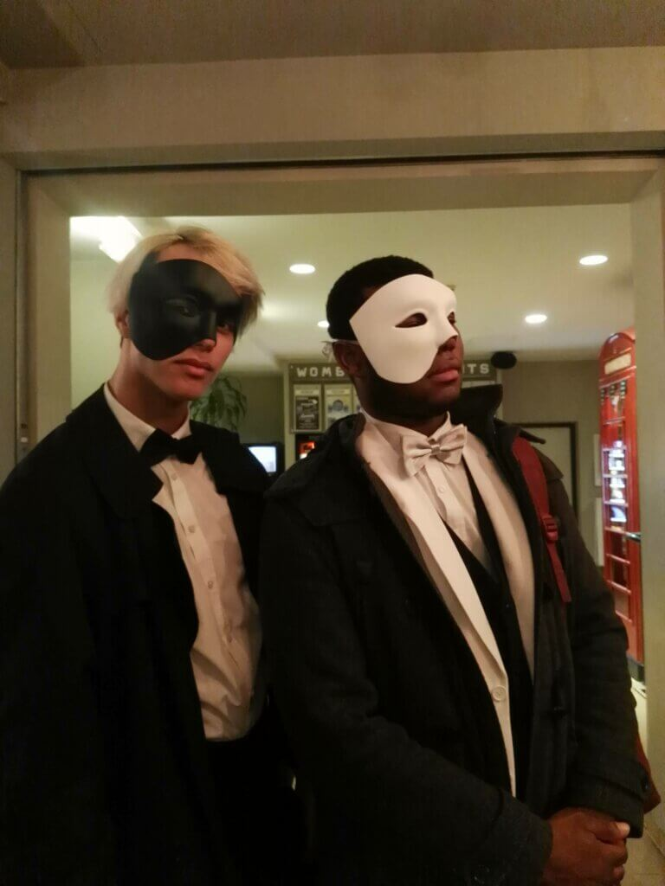

Chino and me at with our masks for the masked ball

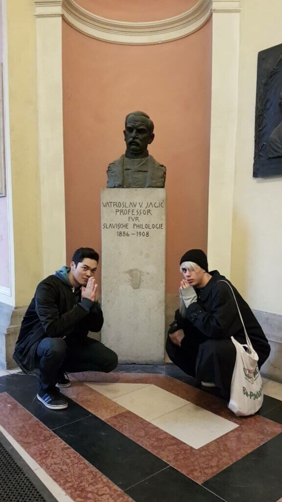

Chris, me and a professor for slavic philology

After a memorable weekend in Vienna, I had to move on and prepare myself for the school's job fair where the graduates had to present their work in front of students and employers. Like most of the events planned for the final thesis I just sat around and played Tetris (told you I played it A LOT).

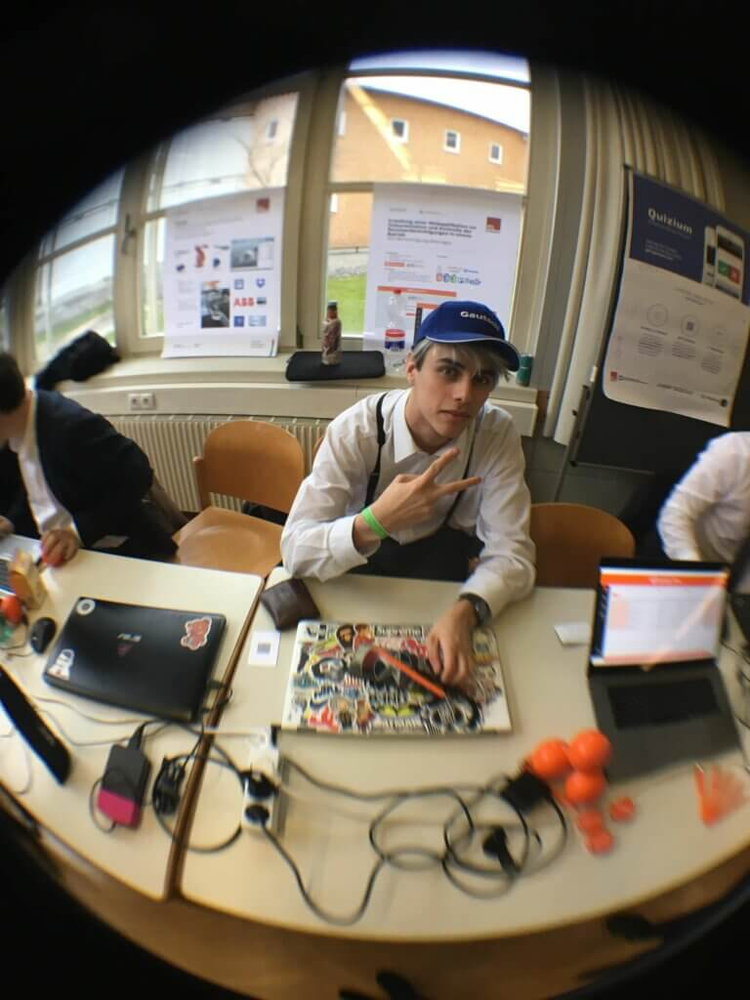

Me at the job fairs stand

February was full of events but the most memorable one was my final workshop with START. The last time I would see some of my friends from all over Austria and talk with them about all sorts of things. I only knew most of them for one or two years and didn't see them more than 4 times a year but I knew that they were some sort of family to me. And because of that Philip and I planned one of the evenings with one of the most time-consuming presentations I ever made. Beforehands we asked our fellow friends to send some of the images they took during the last three years that they want to see and by that we designed the evening. We had a total of 600 images and around 20 different categories to fill. The whole thing took us about 2 hours to present and we were really exhausted afterwards.

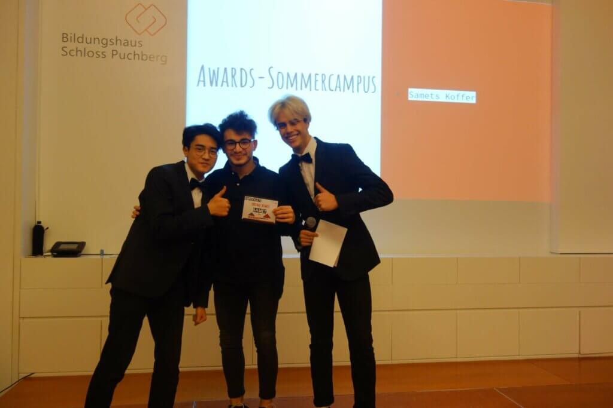

We even made custom awards

Although the presentation stressed me a bit I really liked doing it and felt like I could make some people remember some of the funny times we had. The workshop was kinda shitty and mostly useless but it was still funny because Samet decided to just not go to his one and accompany us with his jokes and presence.

## March

Because I had planned something for every weekend in February I had no time to see Black Panther. So the first thing I did in March was to see the movie in our cinema. Before we entered the movies we played some basketball at one of those arcade machines and managed to get the Highscore for one of them. Definitely one of the best moments in 2018.

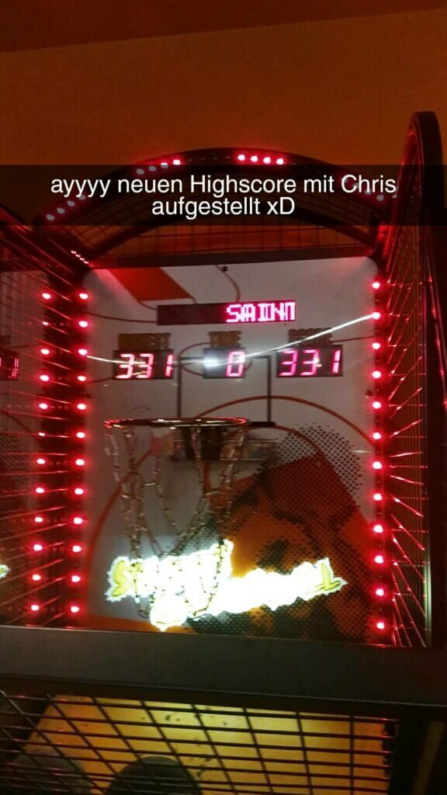

Thanks to the regional planning from START (I feel like a sellout promoting START all the time, I'm sorry) I got the chance to go skiing in Brandnertal. Unfortunately the weather was not that good but we still had a stunning view.

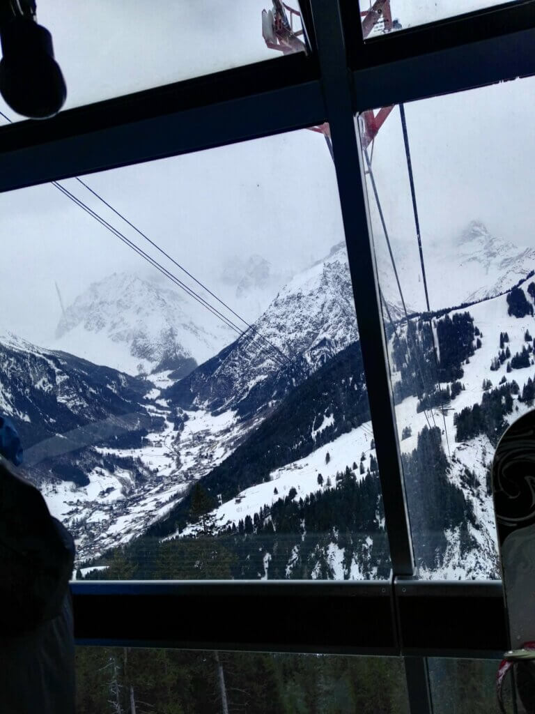

Brandnertal

Even if the Brandnertal had snow to go skiing, back in my place the sun was shining and it was hot enough to go back to one of my favourite hobbies. Pennyboarding. So I took Chino out and we drove from Dornbirn to Lustenau to Hard which translates to roughly 12km. It took us about 5 hours and I got a huge bladder but it was definitely worth it because we had a hell of a time.

https://www.instagram.com/p/BguHfSRgFQC/

The next day Stefan then hooked us up to check out his flat in Imst and visit Innsbruck afterwards. The combination of Stefan, Chino and an almost 3 hours trip was definitely a really funny time for Chris and me and I can't wait to drive around more with them.

With the End of March, one of my biggest self-managed programming projects started. [Spoti-Vote](https://spoti-vote.com). Because my part of the diploma project was finished and I really enjoyed programming by then I wanted to program something different. Close to the end of the month, I managed to get a first small prototype running. But you already know [the story of Spoti-Vote](https://gabsii.com/blog/spoti-vote/).

## April

School started to get more serious because our semester finished at the end of April so we had most of our tests in late March/early April, which pressured me a bit and because I didn't feel so well anyways I decided to step down from Social Media for some days which brought my friends and me the insider #SocialMediaBreak. Even if it was more of joking thing it helped me advance in life because I cut away some toxic people from my life and reconnected with some of my best and oldest friends by then. My #SocialMediaBreak was (now in hindsight) the most stress-free time I had during my finals.

I also had to submit my final diploma thesis and finish the project to it, but because one guy in my group refused to do his part I had to sit down a whole weekend and nonstop program his stuff. I never had to program this much in such a short time and I think this is what a job as a Software Engineer looks like. But for 10% of this bonus from the company for our software, I was totally fine with it.

Other than that there was not much going on in April. The semester finished after 3 weeks and rest of the time was just a free attendence thing so sometimes people wouldn't even show up.

## May

May was the month of my written finals. German, Technical theory (SAP, Databases, Informatics and Industrial Engineering) and Maths. Because of the standardized finals system in Austria I was not that afraid of the written exams because I felt well prepared.

We also got our final school report (not the final results) and my GPA was 1.5 (pretty damn solid in Austria, best would be 1.0)

Rest of the month was off so we could learn for our oral exams. I for my part used the time to do nothing all day and enjoy my free time, but after some time I got quite annoyed of that and progressed at [Spoti-Vote](https://spoti-vote.com), stood up really early and go for a morning walk at the lake or I did one of my crazy Pennyboard trips again.

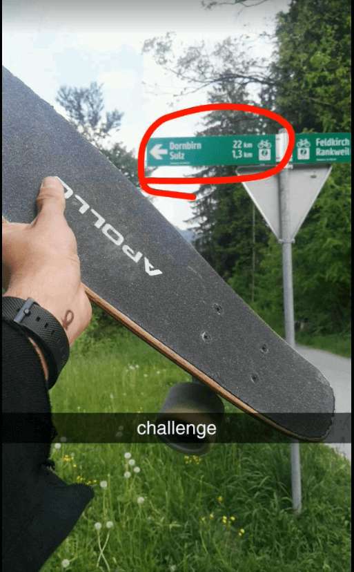

This time: Rankweil to Dornbirn (22km in one afternoon)

Also my friend Philip visited us from Vienna so me and my squad showed him around a bit. Phil smoked his first shisha, visited the art museum with us and destroyed Chino in a basketball 1 vs. 1. To celebrate Phil's victory we then went to Chino and showed Phil what "schüttööö" means.

Chinos devestating loss

To end the school year for graduates we had the schools annual football cup where students play against the teachers. Sadly my class didn't manage to get enough players so we had to join the parallel class because they were also lacking players. Surprisingly our teams synergized really well together so we managed to win every game and reach the first place.

## June

Time for my oral exams. Diploma thesis, Automation technology, Networking and Embedded Systems and English were my subjects and I did quite okay, except for the Networking part.

My finals results are:

- German - 3
- Technical theory - 1
- Maths - 2
- Diploma thesis - 1
- Automation technology - 2
- Networking and Embedded Systems - 4
- English - 1

So my GPA is 2.0.

As an Austrian tradition, all graduates go for a vacation after their finals. I and my friends didn't want to go to the X-Jam event because we didn't think it would be worth our money, so we agreed on going to Lisbon for two weeks.

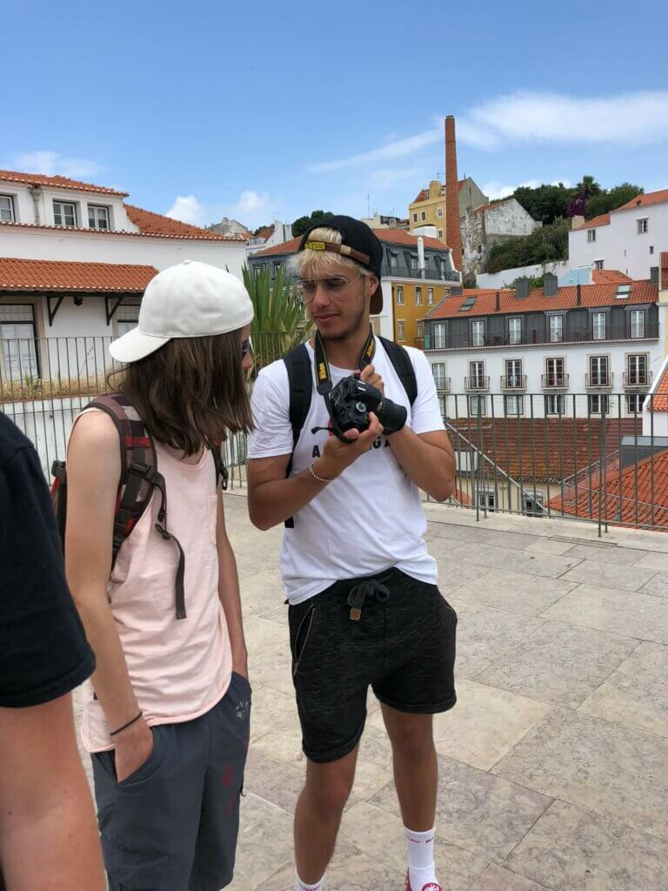

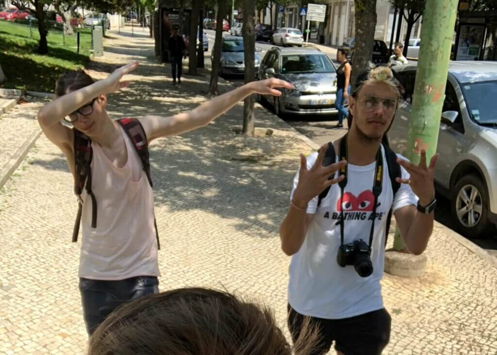

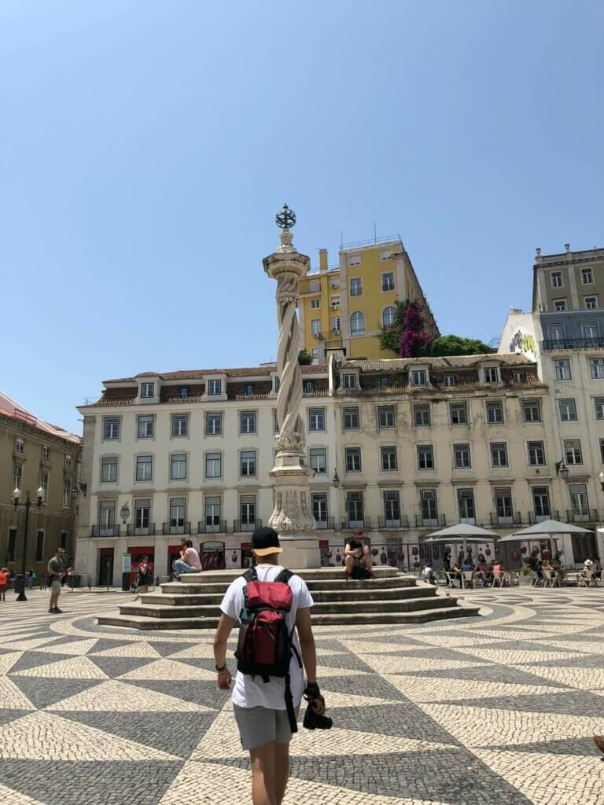

## July

I returned from Portugal after my 2 weeks of break and immediately started working for my regional electronic supplier in the IT department. My job was boring but I had the opportunity to chat with a friend of mine all the time so I got around with doing stupid stuff.

One thing that was really cool about July is the super blood moon that you could see. So, Chris, Stefan and me packed our things and decided to go hiking to our local mountain (Pfänder) to see the super blood moon but because I didn't hike up there for a long time we chose the wrong path by accident and ended up in the middle of nothing. Because we were already out of breath, we then decided to just go to the next hill (Gebhardsberg) and see the moon from up there. We also had a great view over the "Drei-Länder-Eck".

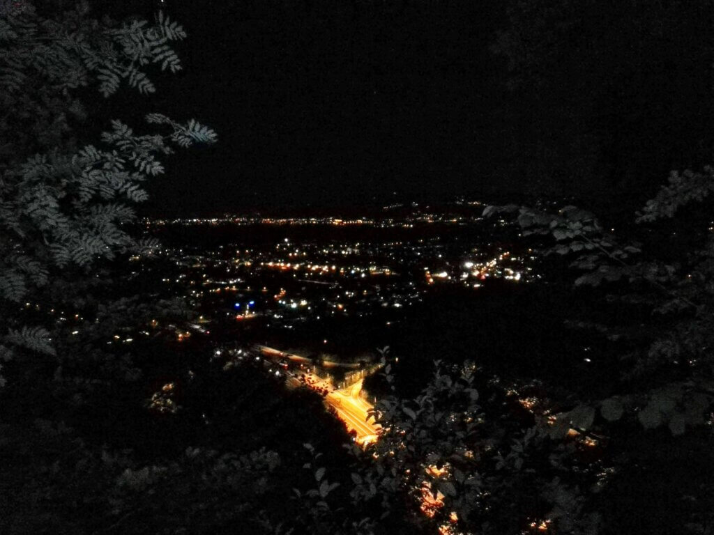

Drei-Länder-Eck

## August

In August I slowly started to realise that I am soon going to leave so I used most of my time to see my friends and mess about.

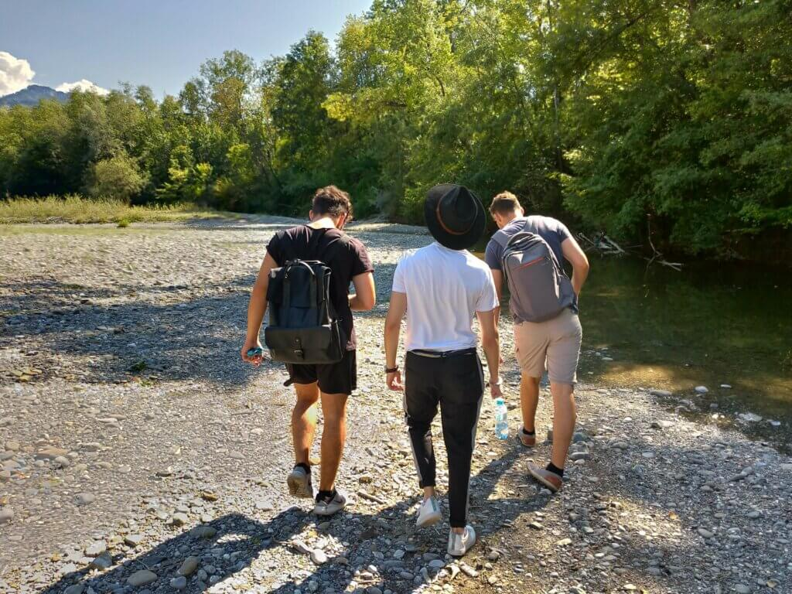

Samet, Stefan and Edo

I also realised that I am quite a big fan of hiking and therefore tried to see as many cool things around my place as I could.

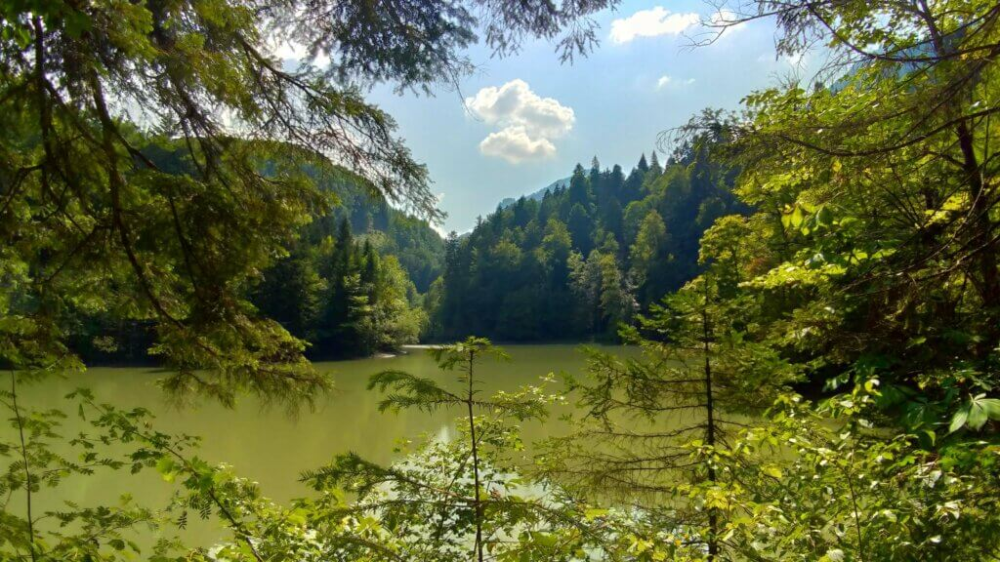

Rappenlochsee

At the end of August, my friend Chris randomly texted me and told me that he is in St. Pölten and has a bed free so I didn't hesitate so much and jumped on the next train to visit my friends at the other side of Austria.

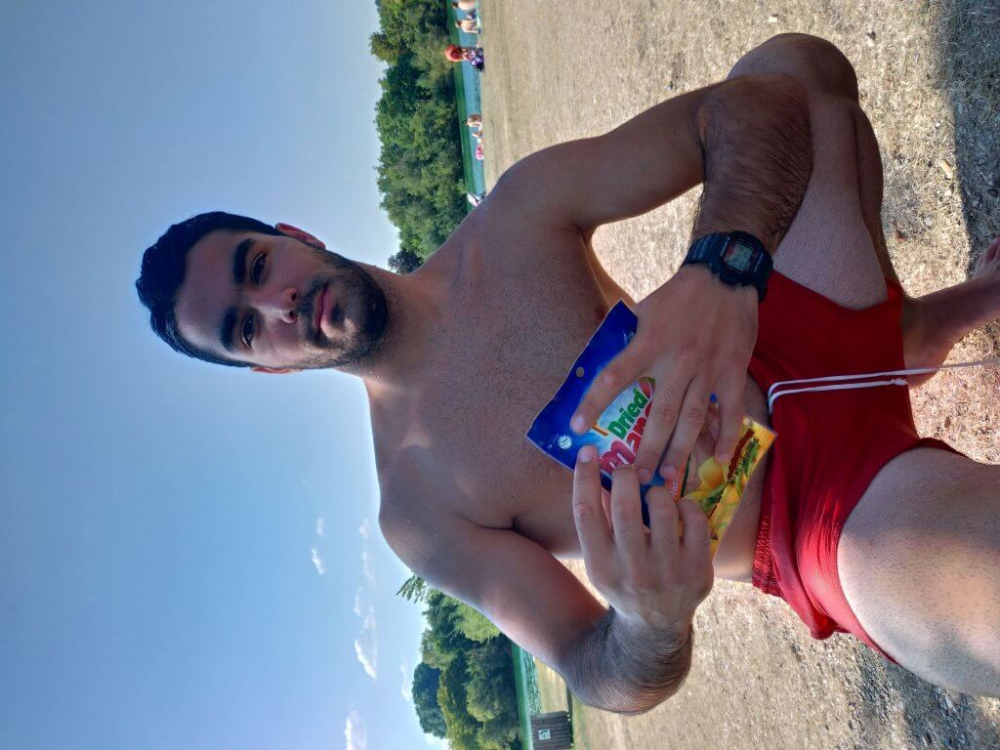

FSK 18 Abdul

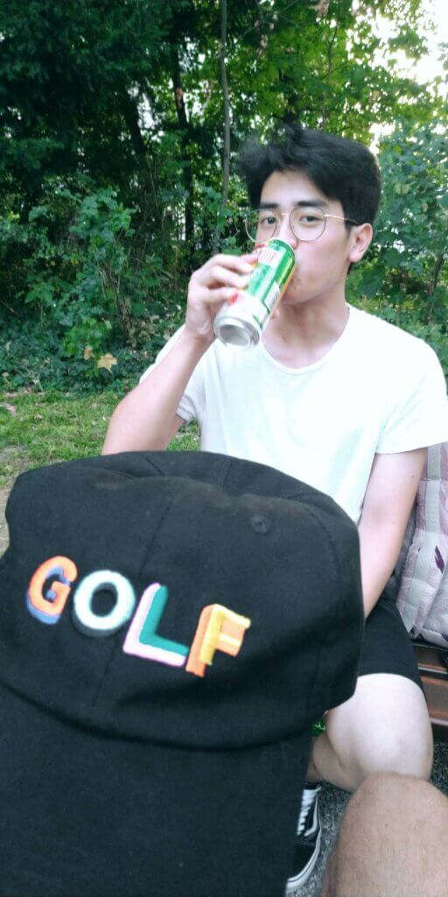

Alki Phil

Part of my journey also lead me to Bratislava...

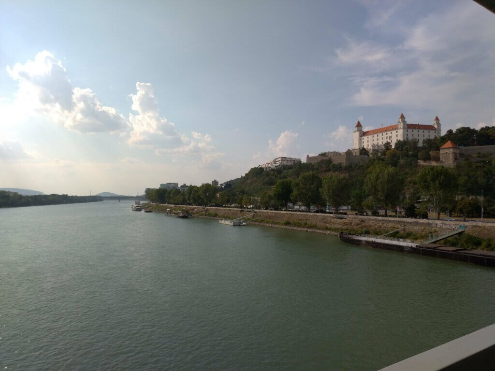

Somewhere in Slovakia

## September-November

I summed up most of my time in Spain in my previous blog posts, just check out [Farewell Austria](https://gabsii.com/blog/farewell-austria/), [First day abroad](https://gabsii.com/blog/first-day-abroad/), [Small tour around Manresa](https://gabsii.com/blog/small-tour-around-manresa/), [How I spend my free time during my EVS](https://gabsii.com/blog/how-i-spend-my-free-time-during-my-evs/), [A weekend in Valencia](https://gabsii.com/blog/a-weekend-in-valencia/), [15 Reasons Workshops Fail](https://gabsii.com/blog/15-reasons-workshops-fail/) and [One Day in Terrassa](https://gabsii.com/blog/one-day-in-terrassa/).

I just want to make a quick addition to November because I felt really down during that time since I basically hate doing my job in Spain and the Austrian girl I live with turned out to be a total bitch (excuse my language, but hating her is part of my job). So I really want to thank my friends who stood by me during that time and reminded me that better times will come, especially Nati, thanks for everything. <3

## December

For December the same thing as for September - November applies. Please just read [Exploring Andorra](https://gabsii.com/blog/exploring-andorra/).

Today we have the 1st of January and I had a really great time so far back in Austria. The last week was really good and I enjoyed every second of it. Just seeing some people again made me realise how much I missed Austria and I can already tell that I will have a pretty hard time leaving on the 4th.

## 2018 Summary

All in all 2018 was a really good year. I think I lost some brain cells doing my diploma thesis and I definitely lost many more celebrating that I finished school. I felt real pain and love this year. After 3 months in Spain, I know who really wants to be my friend and checks up on me. And despite the fact that I had to do my finals this year I had more than enough time to relax and just lean back. I really appreciate the chill 2018 had for me.

## Resolution for 2019

I didn't set any high standards. For 2019 I just want to read one book a month and summarize it a bit on my blog. Starting this month with "The Secret" from Rhonda Byrne.

Alright, that marks the end of my post. I hope you had a good start in 2019 and that your 2018 was great! See you in my next post and hopefully in the new year! <3
