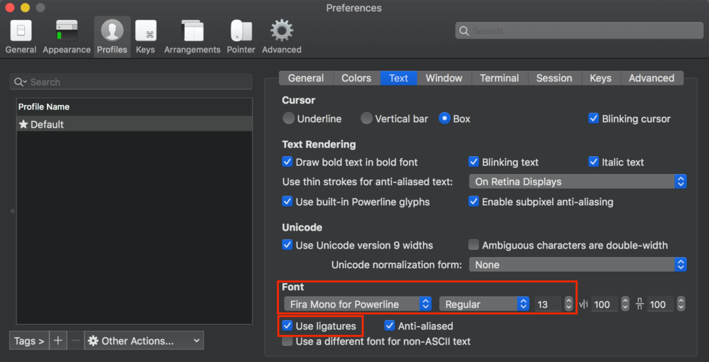
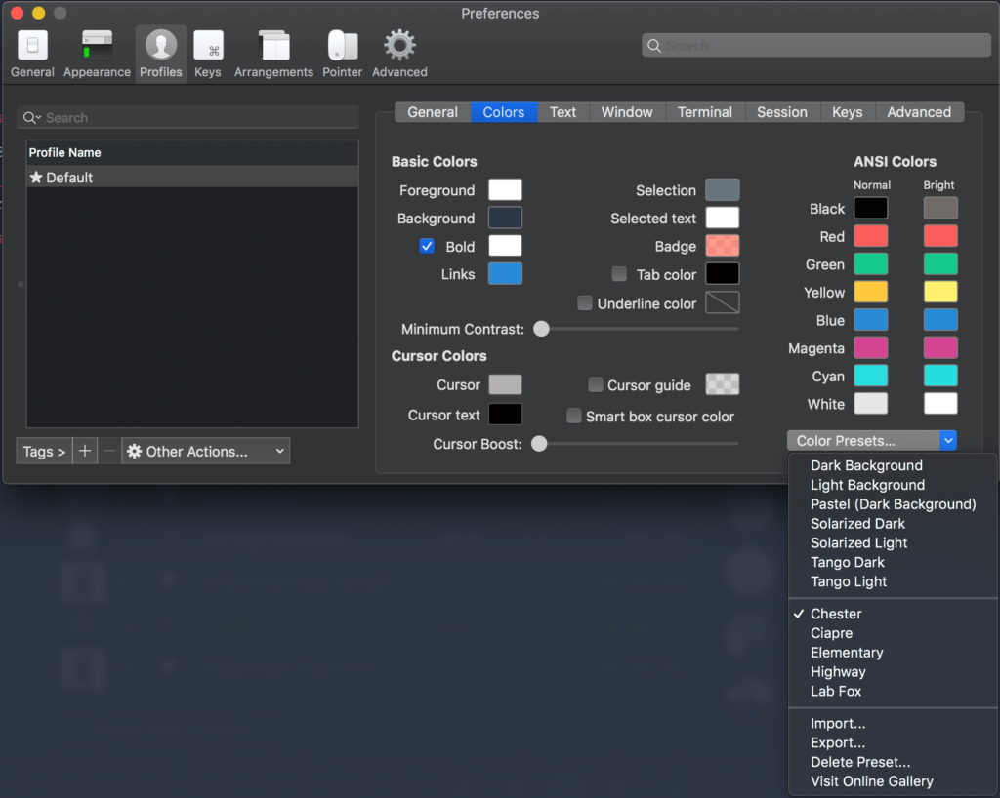
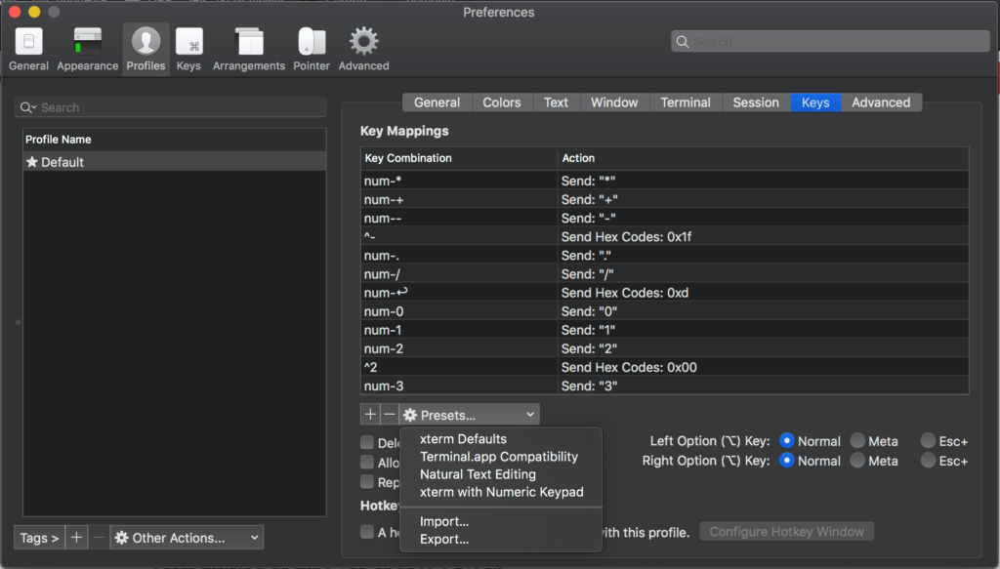
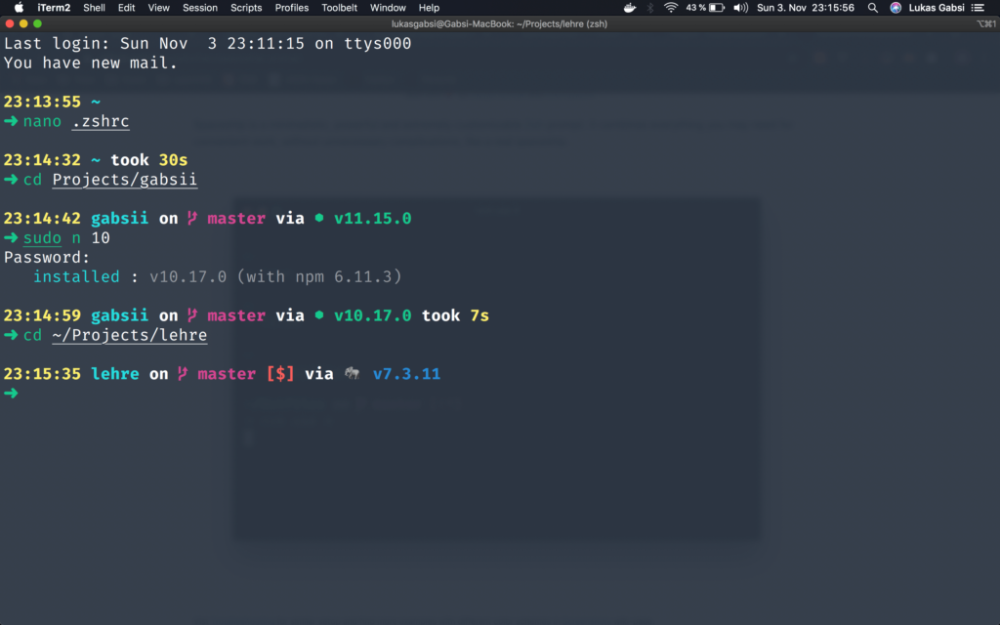

With a new job comes a new laptop. Part of my current working contract is that I get a company laptop which I am also allowed to use for personal purposes. Since now 2 months I have had more than enough time to develop a personal configuration that helps me work more efficiently.

## My (work) Laptop

Right after I had my trial day I got asked about my preferred environment for development. My choice was between a Windows laptop and a Macbook Pro and since the company standard kinda leans towards Macbooks and since I heard a lot of good stuff about programming on an OSX machine I quickly decided to give the Macbook a try.

So now here I am with a Macbook Pro (13-inch, 2019 edition) and I really enjoy working on it considering that a UNIX system offers a bit more customization compared to Microsofts Windows.

## Package Manager - homebrew

Anyone who worked with a Linux computer before knows and appreciates the pros of a package manager. `apt`, in my opinion, is a huge advantage of Linux as compared to Windows (although they unofficially have [Chocolatey](https://chocolatey.org/)).

Sadly homebrew isn't natively shipped with a Mac, but it is really simple and easy to install. Just open your Terminal and paste this:

```
/usr/bin/ruby -e "$(curl -fsSL https://raw.githubusercontent.com/Homebrew/install/master/install)"
```

This will automatically download and install the latest homebrew version from GitHub. After the installation is done you should get a success message confirming the successful installation. Good job, you're now able to use `brew`.

### `brew` concepts

Homebrew can be split into two different types of packages that can be downloaded. **Graphical Applications** (Chrome, Slack, Spotify, ...) and **Command-Line Applications** (zsh, php, mysql, ...). They also distinguish themselves in terms of **licensing**. Command-Line Applications are mostly distributed under an open-source license whereas Graphical Applications can run under any license including commercial ones.

But now you might ask yourself, why is this so important?  
Because they slightly differ in the way they are installed.

Command-Line Applications are installed using `brew install foo` while Graphical Applications are installed using `brew cask install bar`.

Packages can also be split into binary packages (bottles) and third-party packages (taps) but these aren't especially necessary for us now.

A list of all formulae (packages) can be found [on the official formulae website](https://formulae.brew.sh/).

## Terminal - iTerm2

So now let's put our newly acquired knowledge to good use! Open up your terminal and enter:

```
brew cask install iterm2
```

This should install the iTerm2 Terminal with which I usually work. It offers a lot more configuration and support out of the box than to the natively shipped Terminal.

Now let's get the configuration part starting!

### Fonts Configuration

The default font of iTerm is kinda lame and doesn't offer as much character support as we want to (e.g. ligatures, custom icons, etc.) so we'll switch it to a Powerline font which offers all of those cool features.

Thankfully there is already a whole repository of those fonts. Just go ahead and clone the [powerline fonts repository](https://github.com/powerline/fonts) and install the fonts.

```
git clone https://github.com/powerline/fonts.git
cd fonts
bash install.sh
```

_If your installation fails on the git part saying that the command wasn't found, simply install it through brew using `brew install git`._

Now that we have these fonts installed we need to configure our Terminal to use them. In your iTerm2 window navigate to `Preferences > Profiles > Text > Font` and select a powerline font (they end in `for Powerline`). I am using _Fira Mono for Powerline_ with a font size of 13px. Also, make sure to enable ligatures.



Make sure you check the '\_Use ligature_s' box

### Color Scheme Configuration

The next thing we tackle is iTerm2's default color scheme. The probably most important visual change we make.

Gladly some smart guys also made a repository for that called [mbadolato/iTerm2-Color-Schemes](https://github.com/mbadolato/iTerm2-Color-Schemes). You can view all themes on the website [iterm2colorschemes](https://iterm2colorschemes.com/). After choosing a theme we clone the repository.

```
git clone https://github.com/mbadolato/iTerm2-Color-Schemes.git
```

To use the color scheme in your terminal navigate to `Preferences > Profiles > Colors` and import them from your folder. I personally enjoy the colors the Chester theme offers.



Import your preferred color scheme

For the background, I also played around with the transparency and blur options located in the `Window` tab.

### Keys Configuration

Only a small but very important change to me. By default, the iTerm scheme won't let allow you to jump between your words as you expect it to. After some time I got used to pressing `⌥ (option) + arrow key` to easily fix wrong input.

The smart developers from iTerm2 quickly realized that the community wanted to use the natural keyboard functionality without much of a configuration and therefore added the Natural option by default.

Simply navigate to `Preferences > Profile > Keys` and select the _Natural Text Editing_ option.



choose 'Natural Text Editing'

Now your editor is already on a visually good path I would say. But functionality-wise there are still a lot of improvements. This leads me to the next topic...

## Z shell - zsh

Zsh is a replacement for our o-so-beloved bash with much, much more functionality out of the box. Here are some of the major ones:

- **Automatic cd:** Just type the name of the directory to change to it
- **Recursive path expansion:** For example “/u/lo/b” expands to “/usr/local/bin”
- **Spelling correction and approximate completion:** If you make a minor mistake typing a directory name, ZSH will fix it for you
- **Plugin and theme support:** ZSH includes many different plugin frameworks by default and offers you a lot of extensibility

Thanks to homebrew, the installation process is as easy as typing in:

```
brew install zsh
```

You can confirm that the installation ran successfully by typing `zsh --version`.

Looks like nothing changed, doesn't it? Well, that's because we also need a configuration manager to add themes and plugins. Let's get started with **Oh My Zsh**.

### Oh My Zsh

[Oh-My-Zsh](https://github.com/robbyrussell/oh-my-zsh) is the most popular configuration framework for ZSH, which also comes with many built-in plugins and themes. To install it we once again enter stuff in the terminal:

```
sh -c "$(curl -fsSL https://raw.githubusercontent.com/robbyrussell/oh-my-zsh/master/tools/install.sh)"
```

Oh My Zsh was installed without any problems? Nice. But... where are the changes? Don't worry, for the changes to take place we need to restart iTerm. After the restart, your iTerm should look a lot better already. Now for the cool part.

### Themes - spaceship

Here the fun begins. Themes. The ability of mankind to change the appearance of the terminal itself. I tried many different themes before I found a good configuration setup.

As already pointed out, Oh My Zsh comes with a lot of built-in themes. You can see all of them on the [Oh My Zsh Themes wiki](https://github.com/robbyrussell/oh-my-zsh/wiki/Themes).

Nevertheless, I think most of the preinstalled themes look really bad and don't offer a lot of useful information at first sight. That's where I made myself on a journey to find the best theme (_warning: personal opinion_).

[Spaceship](https://github.com/denysdovhan/spaceship-prompt) is a great theme. It offers you the technology and its version, the repository status, and ligature support at first sight. To install it we, for the last time, clone the repository and symlink it to our config.

```
git clone https://github.com/denysdovhan/spaceship-prompt.git "$ZSH_CUSTOM/themes/spaceship-prompt"
ln -s "$ZSH_CUSTOM/themes/spaceship-prompt/spaceship.zsh-theme" "$ZSH_CUSTOM/themes/spaceship.zsh-theme"
```

Finally, we want to edit our `.zshrc` located in `~` and set `ZSH_THEME="spaceship"` (Note: don't add this line, find it and overwrite it). After restarting you should now have the spaceship theme installed.

The theme also comes with a lot of configuration. You can read about it at the [themes documentation](https://denysdovhan.com/spaceship-prompt/). In my personal `.zshrc` configuration file I use the following lines:

```
# SPACESHIP THEME CONFIG

SPACESHIP_DIR_PREFIX='' # disable directory prefix, cause it's not the first section
SPACESHIP_DIR_TRUNC='1' # show only last directory

# Package
SPACESHIP_PACKAGE_SHOW=false

SPACESHIP_PROMPT_ADD_NEWLINE=true
SPACESHIP_TIME_SHOW=true
```

And in combination with all the (great) configurations we did earlier your terminal should look like this now:



Our beautiful terminal

### Plugins

Oh, baby, plugins will make your life so much easier, trust me. And adding them is even easier (thanks to Oh My Zsh). You can find a list of all pre-installed plugins on the [Oh My Zsh Plugins wiki](https://github.com/robbyrussell/oh-my-zsh/wiki/Plugins).

To add a plugin you simply edit the `.zshrc` file and search for the plugins line:

```
plugins=(git z zsh-syntax-highlighting zsh-autosuggestions lol thefuck)
```

**IMPORTANT:** zsh-syntax-highlighting and zsh-autosuggestions have to be installed separately, scroll down for the installation guides.

If you want to I can write a more in-depth post about what those plugins do but here is a short summary.

- **git**
  - Adds a lot of git aliases and functions for day-to-day git operations.
- **z**
  - Change directory based on history for example if you previously used
- **zsh-syntax-highlighting**
  - Highlights Syntax in the Terminal
  - [Installation Guide](https://github.com/zsh-users/zsh-syntax-highlighting/blob/master/INSTALL.md#oh-my-zsh)
- **zsh-autosuggestions**
  - Suggest commands based on your history and quickly access them
  - [Installation Guide](https://github.com/zsh-users/zsh-autosuggestions/blob/master/INSTALL.md#oh-my-zsh)
- **lol**
  - brings lulz to your zsh (based on lolbash)
- **thefuck**
  - magnificent app which corrects your previous console command.

With all of these plugins installed your productivity will increase and your workflow is a lot more optimized.

At this point, I want to thank you for sitting through and reading all of this post. I really hope I could help you with your configuration! :-)  
Right now I am thinking about making a second part about my personal setup, focused on my IDE setup. If you would like to read more about that, make sure to let me know in the comments down below!

I hope to see you in my next post! <3
