Last weekend I got tired of sitting at home and decided to start a one-day solo adventure out in the wild. And by wild I mean Terrassa, the 3rd biggest city in Catalonia.

I began my day at 10 AM with standing up and because it was the 1st of December I could finally shave again ([NoShaveNovember](https://no-shave.org/)). Here is my final result:

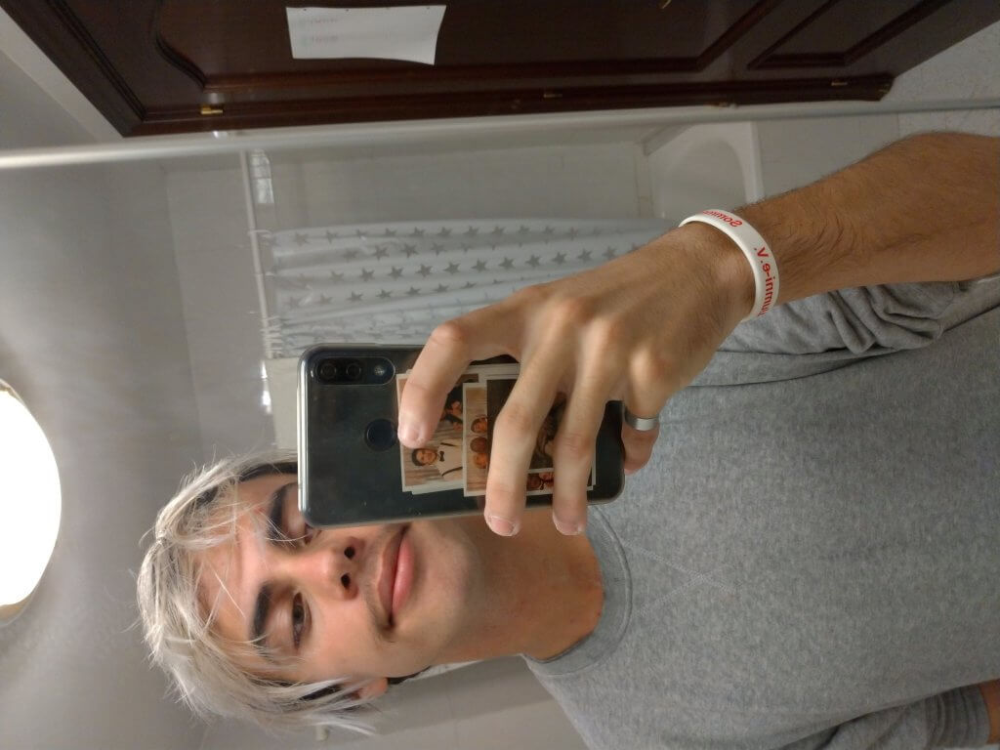

After some final tears for my fallen beard, I packed up some things and went to the train station to start my 1-hour journey to Terrassa, which is about 30km away. The ones who paid attention in Maths will now know what kind of shit travelling by Spanish public transport is.

## Parc de Vallparadís

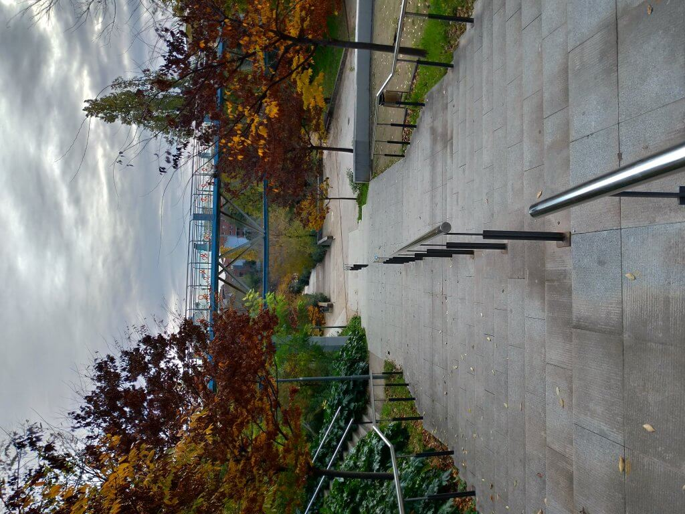

Entrance to Parc de Vallparadis

My first stop was the Parc de Vallparadis because since I was in [Valencia 2 months ago](https://gabsii.com/blog/a-weekend-in-valencia), I enjoy walking through parks way more than I imagined. Especially because this Parc reminded me of the one in Valencia. In Valencia, the park was built in an old disused river, but in Terrassa, the park exists in union with a small river.

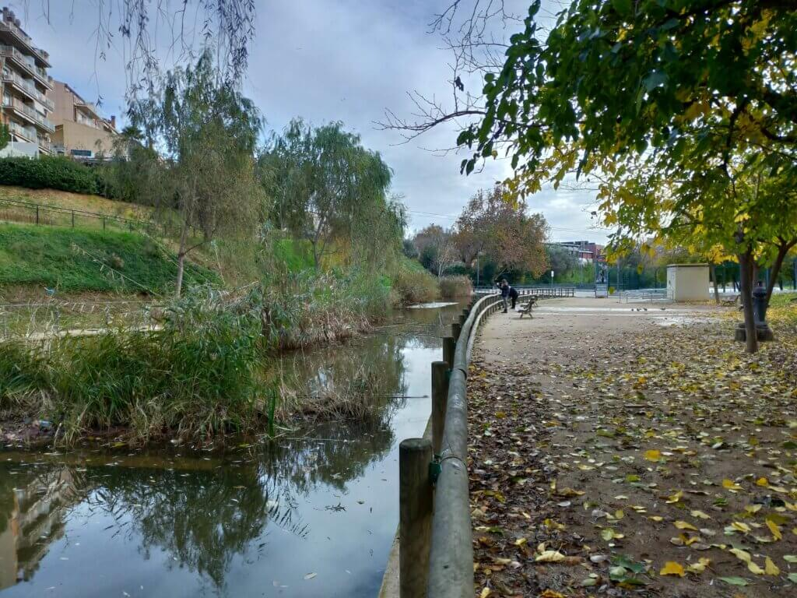

Parc de Vallparadis and the river

I walked there for about an hour through the 3.5km long park when I saw on Google Maps the I was slowly but surely leaving Terrassa if I continued walking that way. So I decided to just to walk around the outskirts of Terrassa where I ended up at my next stop.

## Parc de Sant Jordi

A nice and open Parc with many green places and a lot of seating options and beautiful gardens.

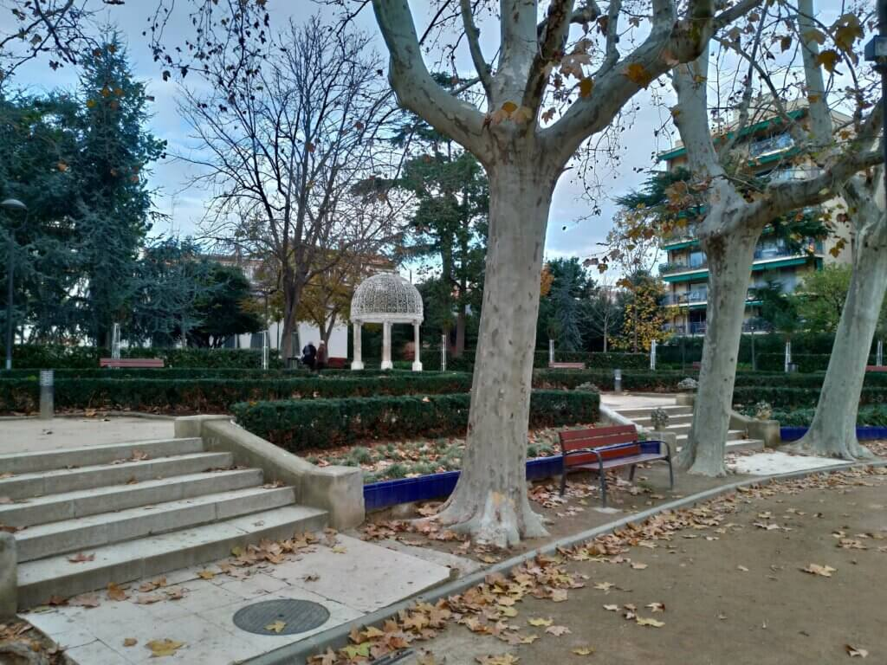

The garden was built with a touch of English architecture

There is not that much to say about the park, I just spent some time sitting there and resting. But what's inside might attract the attention of some of you.

### Masia Freixa

Originally used as an old textile factory, the old landlord wanted to redesign it to give it a more modern touch around the beginning of the 20th century. The architect (Lluís Muncunill) was highly inspired by Gaudí.

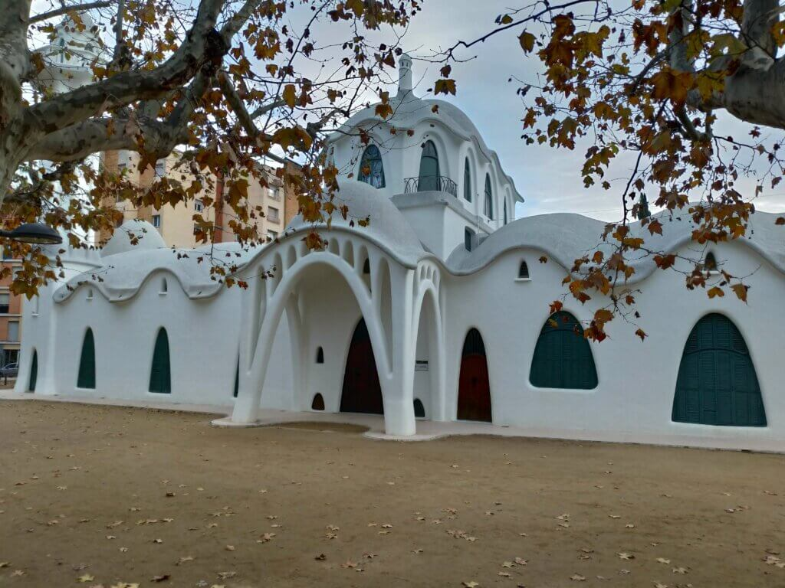

Masia Freixa

## Museu de la Ciència i de la Tècnica de Catalunya (mNACTEC)

After my short break, I decided to go to the technical museum in Terrassa. I arrived there a little early so I decided to go to the rooftop terrace to see the sun go down.

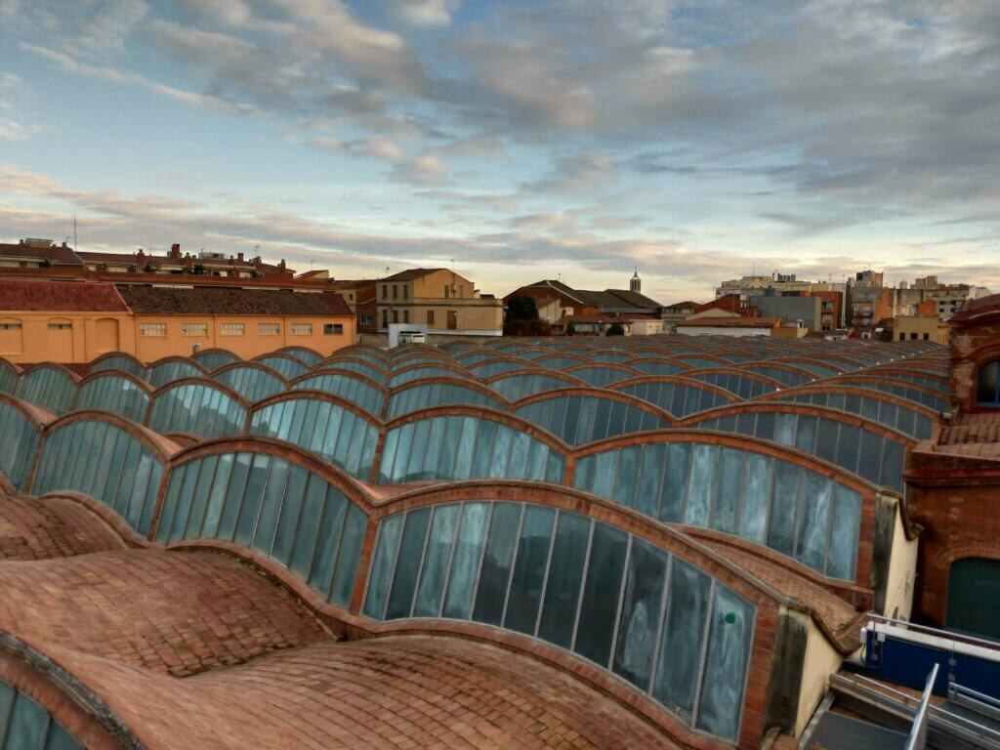

The roof of the musem

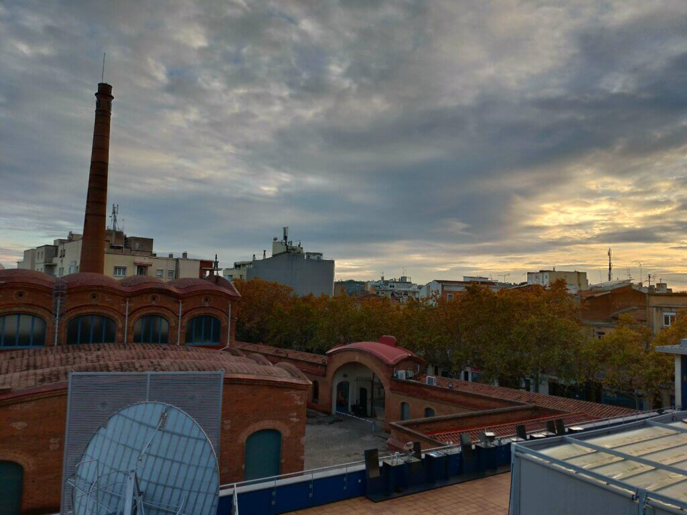

View on the old textile factory

After that, I went inside and saw interesting exhibitions about Energy, Car manufacturers, coal mining, the textile industry and the history of computers.

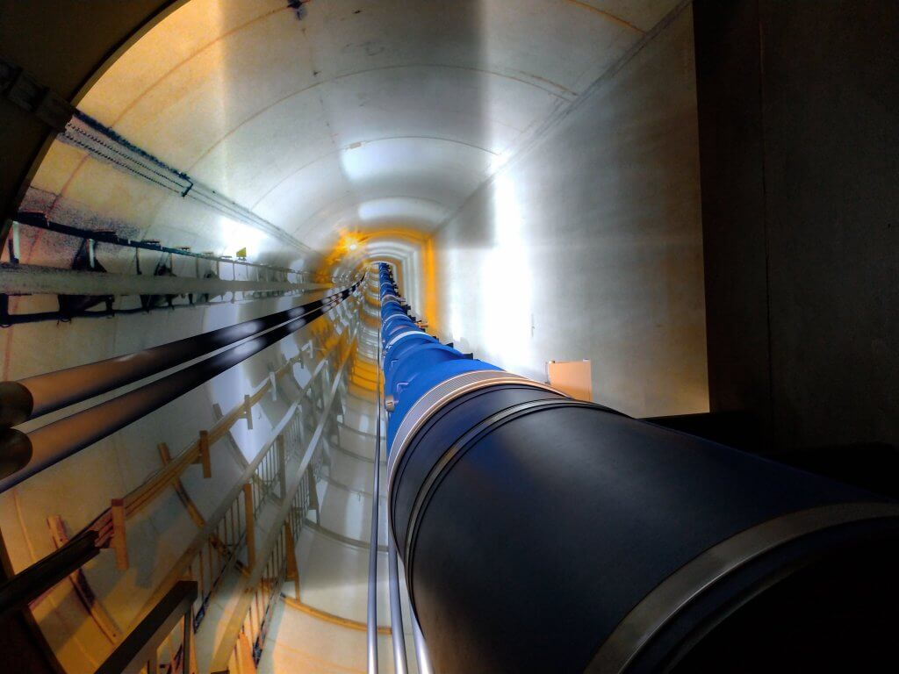

CERN in Geneva

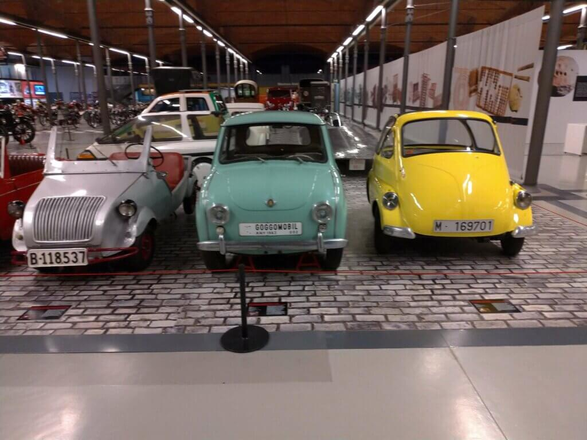

Catalunyas own car manufacturer

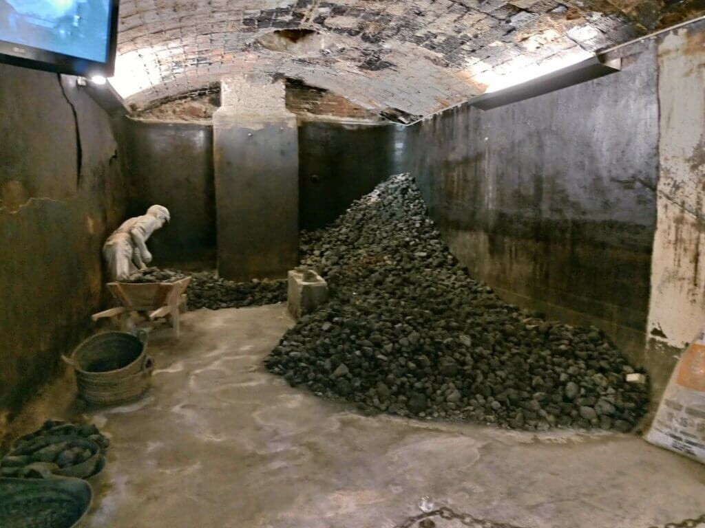

Mining

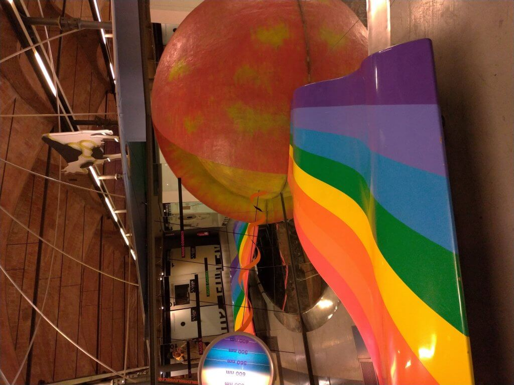

The universe and I

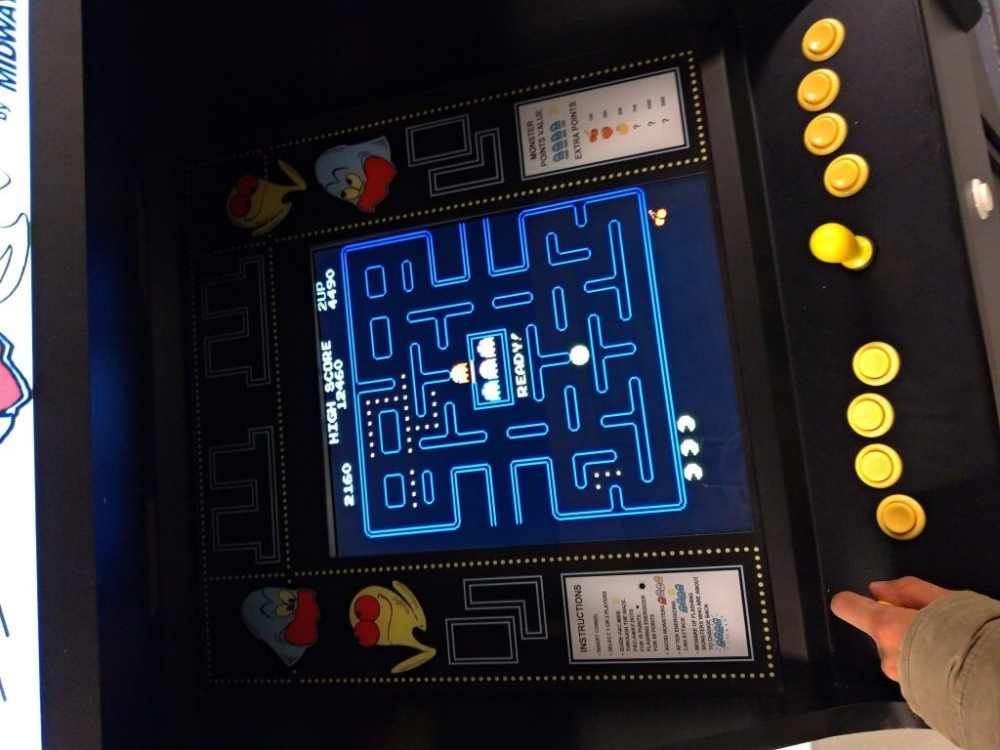

PACMAN - a childhood dream

## Nightwalk around Terrassa

On my way back I had the chance to see parts of Terrassa at the night time. Here are some impressions:

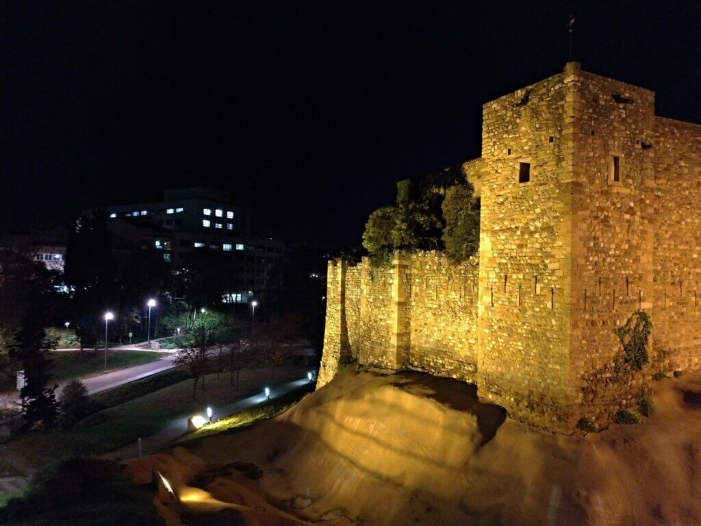

Castle by night

I hope to see you in my next blogpost! <3
