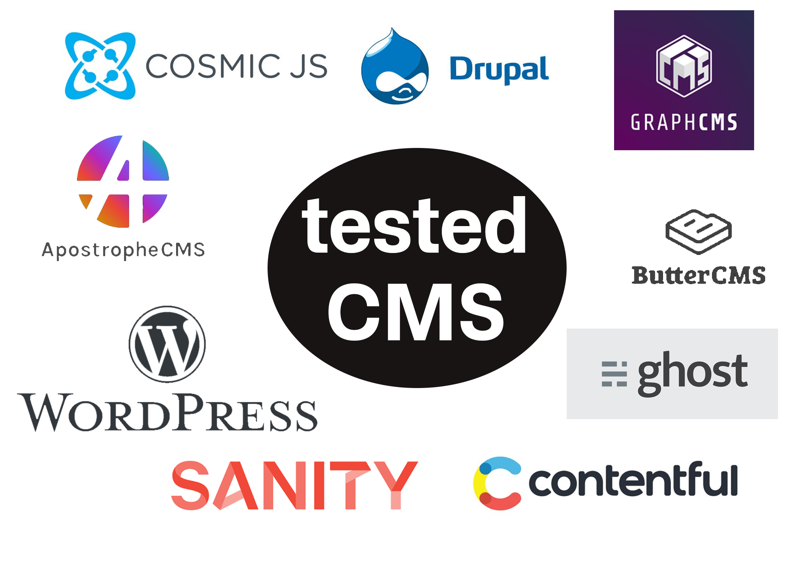
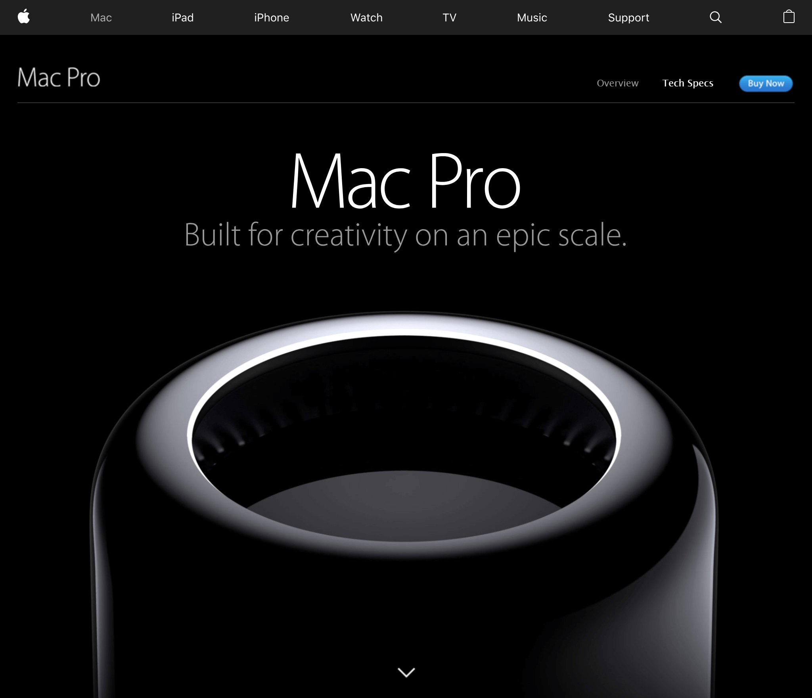

Three days after I started working on this blog I can finally talk about some progress. The Website now has a responsive Flex-Layout, which shows you three different versions depending on which device you open the page (Smartphone, Tablet/small Laptop, Desktop).

_**DISCLAIMER**: This is a very tech-heavy post that focusses on my current learning progress whilst building this blog._

## Problems I encountered so far

### 1\. Deciding on a framework

This was one of the most time-consuming points I faced. I love the process of evaluating which framework to use and I am really, really detailed when doing so. And this is my major problem.

#### Front-End:

I waste way too much time on deciding which framework to use and which tools would be helpful that I often completely forget the time. Considering this project I first wanted to make a portfolio from complete scratch, which means **no frameworks**, **no build tools** and **only using the code I wrote myself**. This worked fine up until the point where I wanted to extend my page with animations, transitions, complex state management, etc.  
After starting out with **ReactJS** as my first major framework I just couldn't go back to writing lame old HTML, CSS, and plain JS.

#### Back-End/CMS: 

For all the _Non-Techies_: a Headless CMS is a system that runs in your back-end (the 'logic' of the website) and provides your front-end (the visual part of the page) with the needed data.

Before this project, I never worked with any CMS before and I didn't really know what a CMS does so I started with a quick Google Search on `'cms for react'` and learned that **Headless CMS** is going to dominate the future.

Since I wanted to run my back-end with NodeJS I searched for multiple solutions that run with the help of NodeJS. Some examples for that would be ApostropheCMS, Ghost or GraphCMS. But the documentation on how to implement those CMS on your page was really poor and lacked further information and examples so I decided to go with the most popular one. WordPress.

### 2\. Setting up WordPress

I found one video on [How to setup WordPress as a Headless CMS](https://www.youtube.com/watch?v=FXJYwsJmOJQ) and that one on [How to connect WordPress with ReactJS](https://www.youtube.com/watch?v=fupZ5WTvkMo). Those videos were insanely helpful and I want to thank _Web Dev Profesh_ for making them.

For the current development process, I use XAMPP to run an Apache instance for local web hosting.

### 3\. Designing the blog layout

Since I developed my own first huge project, [Spoti Vote](https://spoti-vote.com/), I am wildly interested in how to design websites whilst still having a **unique** **look** **and feel** (in expert terms **UX** - User Experience).

For inspiration, I mostly used the [Awwwards](https://www.awwwards.com/) page since they feature very **creative** and **award-winning** websites. Some of the pages I 'stole' the design ideas from are:

- [Better Living Bureau](https://betttter.com/)
- [Jakub Paniaczyk's Portfolio](https://madeinc.co/)
- [Tao Tajima's Portfolio](http://taotajima.jp/works/)
- etc.

At this point, I want to give a special shoutout to **Aristide Benoist** whose portfolio made me build my own one. See his portfolio [here](https://aristidebenoist.com).

## Problems I still have to face:

Although I worked many hours on this project already - 13h **pure programming** (stats from WakaTime) - I still have to face many obstacles, some of which I already identified:

### 1. Wordpress Payload

The amount of data WordPress sends you about your posts is huge and really adds up to the loading times of my page. Since REST interfaces just send you everything you **COULD** need you also get things sent to you that you completely **DON'T** need.

For example: If I want to show all my posts on my front page I do get **ALL the information** about those posts. Meaning a normal user that just wants to read my most recent post, still has to download every content of the other posts. Yes, you read right, even the **CONTENT** is shipped with a normal request. meaning you could potentially display the whole article on the front already. Seeing that is not only a potential security risk to me but also a way to worsen the user experience on my page, because they always have to wait an eternity just to see what I posted. This also makes caching my contents a whole lot harder.

These are all the CMS I tested during my evaluation phase

#### Potential solution:

GraphQL. I didn't really dive that deep into that topic, but **querying a REST-Interface** sounds like it's exactly what I need.

### 2\. Designing a page for a blog post

Well, I feel like I am gonna waste most of my time with that point. Up to this point, I have no idea how to design a blog post. When pressed on a post on my `/blog` page you get redirected to the whole post with all its contents. How this should look and feel is one of my tasks to figure out for the next days.

### 3\. Fixing the scrolling issue + UX

I am trying to implement a Scroll Hijack for my landing page. Some of you might know it from [Apples Mac Pro Introduction](https://www.apple.com/mac-pro/). The problem with that is that it at **first** changes the way a normal user expects the page to behave when scrolling, which changes the user experience in my case. And **secondly,** the support for scrolljacking is not that high, because it's considered a bad habit for UX-designer.

Apple was one of the first and most popular to use scrolljacking

#### Potential Solution:

[_react-scroll-jacker_](https://github.com/horizon0708/react-scroll-jacker) I feel like this npm package could fix my problem but I first need to test how it behaves. I otherwise would like to use [ScrollMagic](http://scrollmagic.io).

## Conclusion

I thank everybody who inspired me to start my own blog and helped me to proceed with it. I also thank everybody who read through all of this text. Special kudos to my readers **<3**

See you in my next update!
