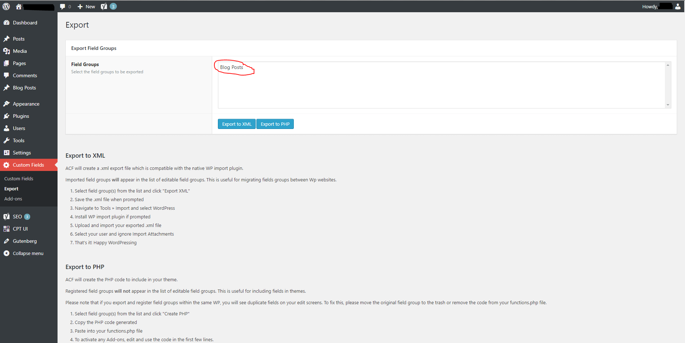
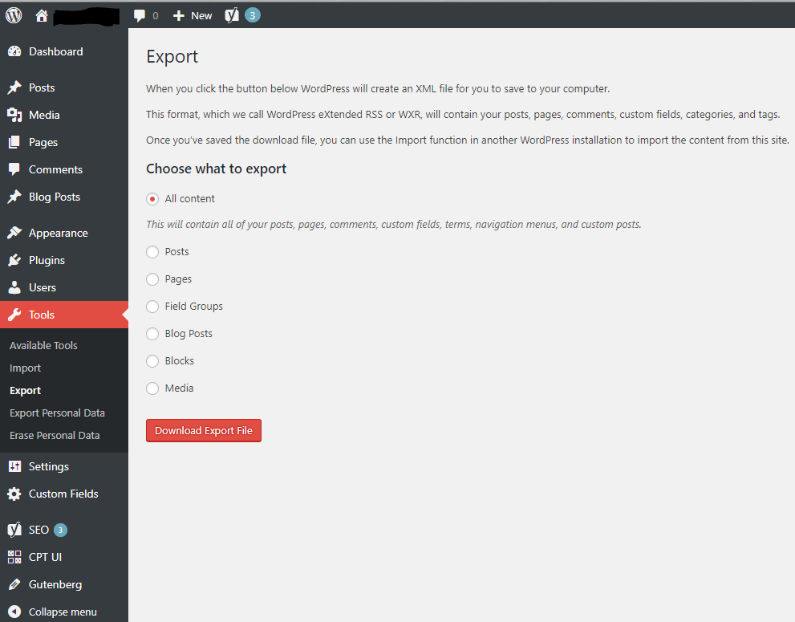

Moving from your local development environment to the world of production isn't always an easy step. Setting your baby free for the world outside just to spread its wings is a very beautiful moment to experience. But there is often a bigger difference between finishing development and going to production than you think. I had the same problem whilst deploying my WordPress Blog to [OVH.](http://ovh.de) This article should serve as a little documentation/tutorial for the fellow programmers who want to use WordPress as a blog and deploy to OVH.

## What about the Frontend? 

"But. Hey Gabsi, what if I use WordPress just as my Content Management System???" Alright, listen up, because I still got you covered. I build my Frontend to [Zeit (Now)](https://zeit.co/now) which allows me to deploy my static files with just one command (two if you bind your name). Zeit is a micro service which takes your static files, uploads them to their servers and serves them like a basic web server would do. And all of this for **free**.

## Where are you hosting your WordPress? 

Now to the more interesting part. WordPress. I bought the cheapest VPS you could get on OVH (3.49€/month), which is a great deal considering that you get a machine that lets you customize it just as you want with a static IPv4 and IPv6 address. I then chose their WordPress distribution as pre-install on my machine.  
It took them about 5 minutes to get everything set up and running, after that I received an email with all the information I needed for a machine with full root access.

First thing I did is to log in as an admin to check if the installation worked. I had no problem logging in so I went on and reinstalled the plugins I had on my local installation.

###  WordPress Plugins:

- **ACF to REST API** to expose my ACF data to the REST Interface WordPress provides.
- \***\*Advanced Custom Fields\*\*** to add more information to my blog posts, e.g. a map where I currently am whilst writing this article.
- **\*\***Better REST API Featured Images**\*\*** to expose my images to the REST Interface with different sizing options for image size.
- **\*\*\*\***Custom Post Type UI**\*\*\*\*** to create multiple types of posts, e.g. ones for my blog and ones for my projects in my portfolio.
- \***\*\*\*\*\***Gutenberg\***\*\*\*\*\***, because I enjoy the new block-oriented editor WordPress offers out of the box.
- \***\*\*\*\*\*\*\***Yoast SEO\***\*\*\*\*\*\*\*** to check how visible my blog posts are to search engines.

#### Ex-/Importing Custom Post Types:

First thing I did is importing the Custom Post Types, because they are the foundation of the whole. The CPT plugin offers a tool for quick and easy export and import. Just navigate on your side navigation to the CPT UI > Tools. Here you can copy the code from your old settings under 'Export Post Types' and then paste it into your new machine.


#### Ex-/Importing Advanced Custom Fields

Advanced Custom Fields also have a pretty easy solution to export the existing data. Again on the side navigation you go to Custom Fields > Export there you select the ACFs you want to export and press the 'Export to XML' button. It then generates a file that you can download which contains all the information about the selected ACFs.

After you downloaded the file you need to install **WordPress Importer,** the fastest way to do this is to go to Tools > Import and press 'Install Now' and then run it. You can then select the file you just downloaded and press on 'Upload file and import'.



#### Ex-/Importing existing Posts/Media/...

This one is a bit harder than the other two because you don't find the button that fast. But believe me, we can do this together.   
Navigate to Tools > Export and choose all the contents you'd like to have on your new WordPress Installation. It then generates a file you can again import.



Importing the existing Posts/Media/... works just like the ACFs. So feel free to read the section above again.

### Adding HTTPS to your OVH VPS

I want to host all my pages over HTTPS because it offers encryption and [Let's Encrypt](https://letsencrypt.org/getting-started/) offers a really easy tool called [CertBot](https://certbot.eff.org) that helps you to setup your own SSL Certificate for that. However, we first need to get onto our machine. So we open our Terminal (or Putty if you are on Windows) and connect to our machine using SSH and the credentials that we got in the email earlier.  The first thing that we enter is:

```
$ cat /etc/issues
```

With that command we get the current OS and the version, which is required for CertBot. In my case, that was Debian 8 (Jessie). Now you need to know if you have Apache, Ngnix or something else running. Providers tend to usually just install a basic apache version so we are gonna test if apache is installed with:

```
$ systemctl status apache2
```

If this outputs without any errors we know that we have Apache running on our server, so we can now go back to the CertBot website and select Apache as Software and Debian 8 as OS. CertBot then outputs a command to install CertBot and get everything running. But before we run that we need to make sure that we point a subdomain of our name servers to our VPS. Since we did set up our Frontend on Now, we do also have to change the settings at Now. Type the following into your Terminal to point to the IP of our VPS:

```
$ now dns add domain.com SUBDOMAIN_NAME A IP_TO_VPS
```

That enters a Type A DNS entry to the name servers at Zeit. Now we can install CertBot. Make sure you have the backports enabled before installing. If you want to know how to enable them [click here.](https://backports.debian.org/Instructions/)

```
$ sudo apt-get install python-certbot-apache -t jessie-backports
$ sudo certbot --authenticator webroot --installer apache
```

That's it. You should now have your own SSL Certificate for your VPS. If you don't run into other errors and everything worked fine you can basically end reading here.

If running those two commands doesn't automatically give you a SSL Certificate or any other errors are output I also got you covered. Just follow along.

```
$ sudo certbot certonly --cert-name domain.com -d sub.domain.com
```

Now CertBot will ask you some questions about how he should generate a certificate. You should choose ' 2: Place files in webroot directory (webroot)' at the first question.

```
How would you like to authenticate with the ACME CA?
-------------------------------------------------------------------------------
1: Apache Web Server plugin - Beta (apache)
2: Place files in webroot directory (webroot)
3: Spin up a temporary webserver (standalone)
-------------------------------------------------------------------------------
Select the webroot for sub.domain.com:
-------------------------------------------------------------------------------
1: Enter a new webroot
-------------------------------------------------------------------------------
Press 1 [enter] to confirm the selection (press 'c' to cancel): 1
Input the webroot for sub.domain.com: (Enter 'c' to cancel):/var/www/wordpress
```

If you did anything I told you until now right you should get a message that your certificate and chain have been saved. Let's Encrypt certificates usually expire after around 90 days so you should make sure that you refresh the certificates by then. Simply enter:

$ sudo certbot renew --dry-run

Now we need to tweak our Apache settings a bit. Navigate to your WordPress config for Apache ( /etc/apache2/sites-available/wordpress.conf ) and edit it with the editor of your trust.

```
### /etc/apache2/sites-available/wordpress.conf ###

<VirtualHost *:80>
        ServerAdmin webmaster@localhost

        DocumentRoot /var/www/wordpress
        <Directory />
                Options FollowSymLinks
                AllowOverride None
        </Directory>
        <Directory /var/www/wordpress>
                Options FollowSymLinks
                AllowOverride All
        </Directory>

        ScriptAlias /cgi-bin/ /usr/lib/cgi-bin/
        <Directory "/usr/lib/cgi-bin">
                AllowOverride None
                Options +ExecCGI -MultiViews +SymLinksIfOwnerMatch
                Order allow,deny
                Allow from all
        </Directory>

        ErrorLog ${APACHE_LOG_DIR}/error.log

        # Possible values include: debug, info, notice, warn, error, crit,
        # alert, emerg.
        LogLevel warn

        CustomLog ${APACHE_LOG_DIR}/access.log combined
</VirtualHost>
```

Now we change the settings for your HTTPS traffic (  
/etc/apache2/sites-available/default-ssl.conf). I won't give you the whole thing to copy paste, because it's a huge file with many comments. So you just get the essentials. Make sure you delete them after you pasted them.

```
### /etc/apache2/sites-available/default-ssl.conf ###

<IfModule mod_ssl.c>
        <VirtualHost _default_:443>
                ServerAdmin webmaster@localhost

                DocumentRoot /var/www/wordpress

                <Directory />
                Options FollowSymLinks
                AllowOverride None
                </Directory>
                <Directory /var/www/wordpress>
                    Options FollowSymLinks
                    AllowOverride All
                </Directory>

                ErrorLog ${APACHE_LOG_DIR}/error.log
                CustomLog ${APACHE_LOG_DIR}/access.log combined

                SSLEngine on

                SSLCertificateFile      /etc/letsencrypt/live/domain.com/fullchain.pem
                SSLCertificateKeyFile   /etc/letsencrypt/live/domain.com/privkey.pem
.
.
.
```

We just told Apache to use our just generated SSL certificates which should be in /etc/letsencrypt/live/domain.com/. Apache now also knows to apply that certificate to any traffic that comes to our WordPress page ( /var/www/wordpress). Now we simply need to refresh our SSL settings and restart Apache.

```
$ a2enmod ssl
$ service apache2 restart
```

Now we can check if we can connect to our domain with HTTPS without any errors or warnings. Just simply enter the URL into your browser.   
You might experience that you can still connect via HTTP although we want strict HTTPS traffic. To fix that we need to configure the .htaccess file located in /var/www/wordpress/.htaccess

```
### /var/www/wordpress/.htaccess ###

# BEGIN WordPress
<IfModule mod_rewrite.c>
    RewriteEngine On
    RewriteCond %{SERVER_PORT} !^443$
    RewriteRule (.*) https://%{HTTP_HOST}%{REQUEST_URI} [R=301,L]
    RewriteBase /
    RewriteRule ^index\.php$ - [L]
    RewriteCond %{REQUEST_FILENAME} !-f
    RewriteCond %{REQUEST_FILENAME} !-d
    RewriteRule . /index.php [L]
</IfModule>
# END WordPress
```

That should be it. All your traffic now runs over your valid SSL certificate and your connections are now securely encrypted. At this point, I want to thank my friend Andreas, who explained every step we needed to take to ensure HTTPS runs correctly and fixed all the errors we made on our way.  Also huge thanks to everyone who read to this point and now has a secure VPS with WordPress on OVH running.

See you in my next post! <3
