Over the chorus of the week, I got to see quite a lot of my new hometown.  I'm just gonna post some pictures of Manresa here and maybe add some historical background to it. On Wednesday Joe and I walked around the old part of Manresa for a bit. If anyone is interested in the route we walked, I got you covered:

Although Google Maps says it would take you about an hour to walk the route we did, it took us around 2 because it was a beautiful day and we stopped to take pictures and had some coffee and tapas later on.

## Wednesday

We started our walk around the city at our flat and then just headed to the city centre because we were familiar with that environment. We walked down the Passeig Pere III, named after King Peter III "the Ceremonious". Around the 2km long Passeig is the commercial area of Manresa.

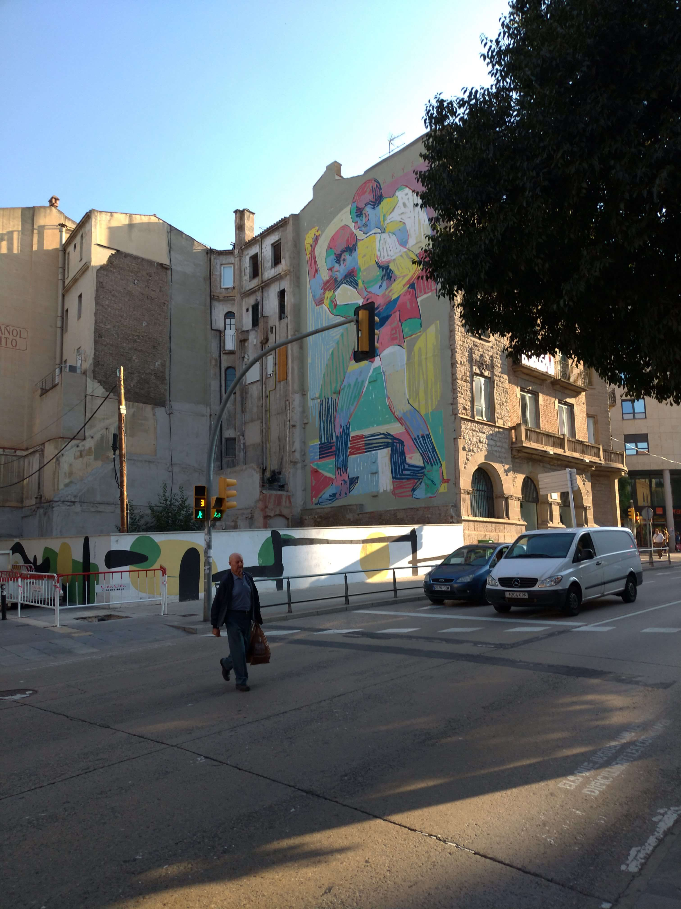

Art at the Passeig Pere III

### Plaça Sant Domènec

At the end of the Passeig, you end up at Plaça Sant Domènec. This place splits the modern part of Manresa from the old part. Around here you find most modern buildings of Manresa.

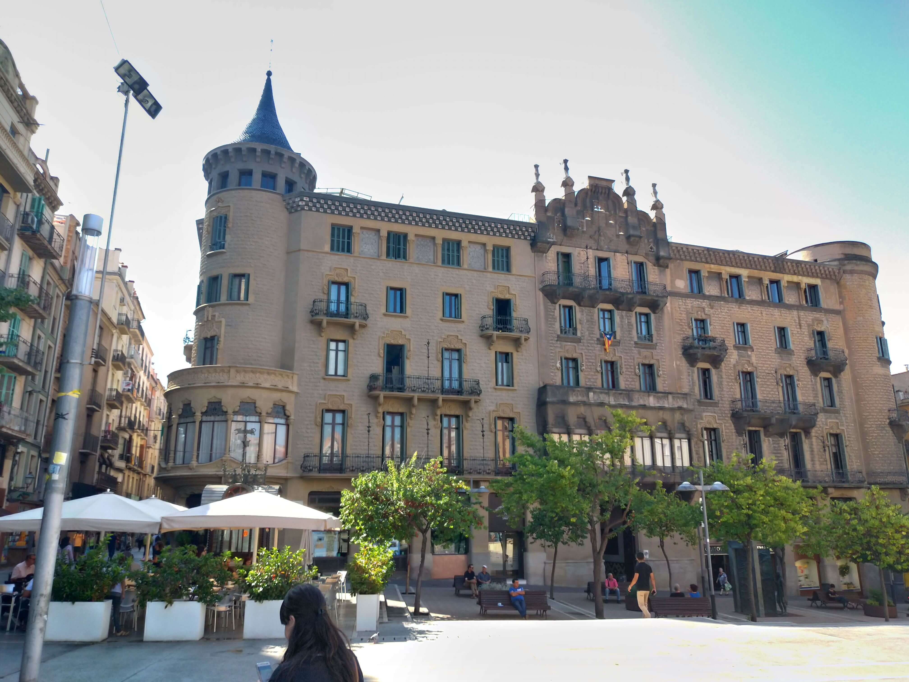

Building at the Placa Sant Domenec

### The Basilica of Santa Maria de la Seu

About 20 Minutes from Sant Domenec comes the Basilica of Santa Maria de la Seu an old gothic church designed by Berenguer de Montagut (he also designed the Santa Maria del Mar in Barcelona). The church was built in 1325 and finished around the end of the 15th century.

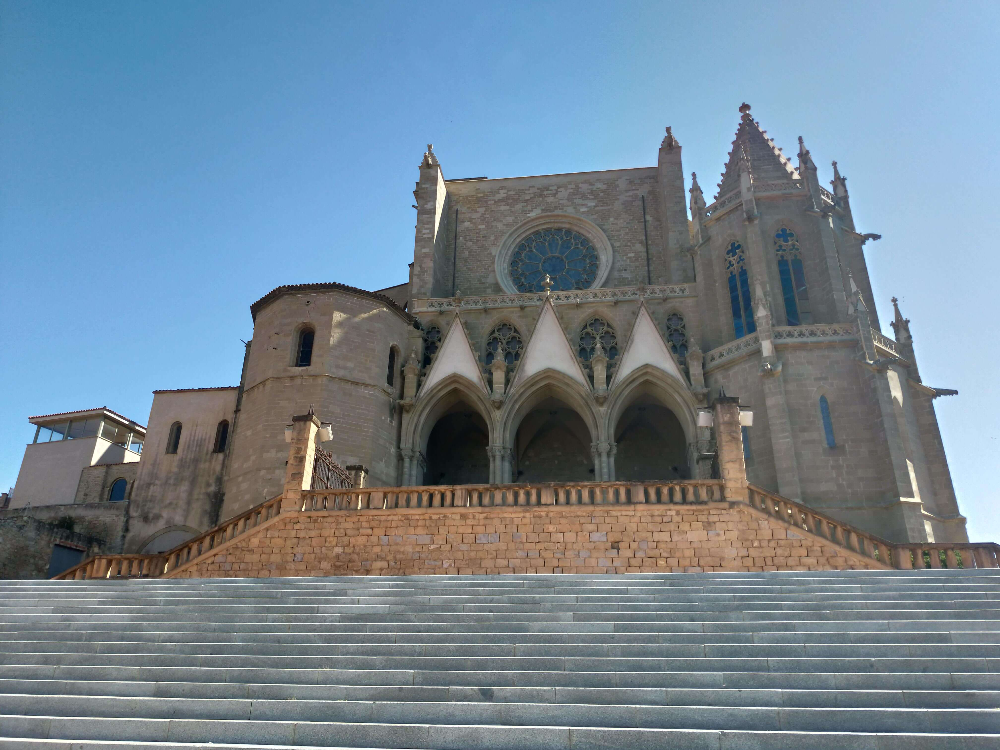

The Basilica of Santa Maria de la Seu

From up there you had a gorgeous view at the city and you could follow the railroad to Barcelona.

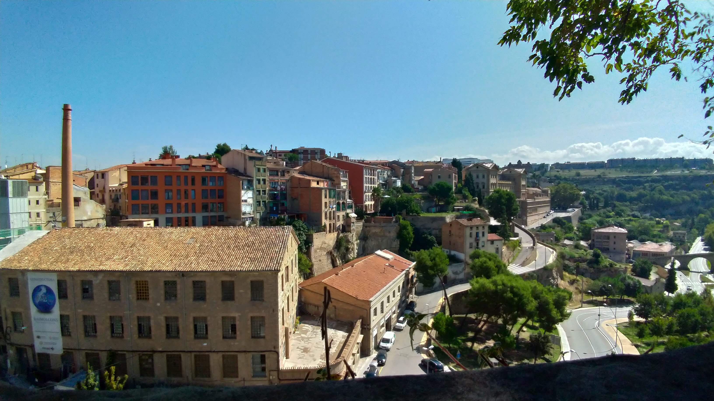

View from The Basilica of Santa Maria de la Seu

### Pont Vell

Next stop on our tour was the Pont Vell, or how locals call it: O-bridge. This is because the cars have to drive beneath the bridge whereas they have to drive through a circle-like shape to enter Manresa.

point vell

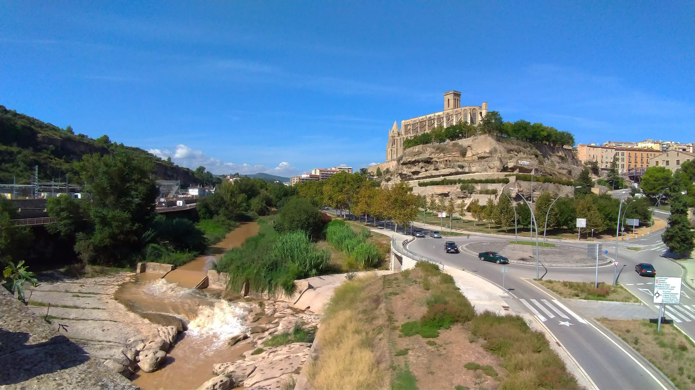

The Basilica of Santa Maria de la Seu from the O-Bridge

### Cova de Sant Ignasi 

Legends say that Saint Ignatius of Loyola retired in this cave for some time by medtitating there and then writing his famous Spritual Exercises. Over the years this little cave became the city's greatest monument. Many tourists who follow the Saint Ignatius Way come across this cave.

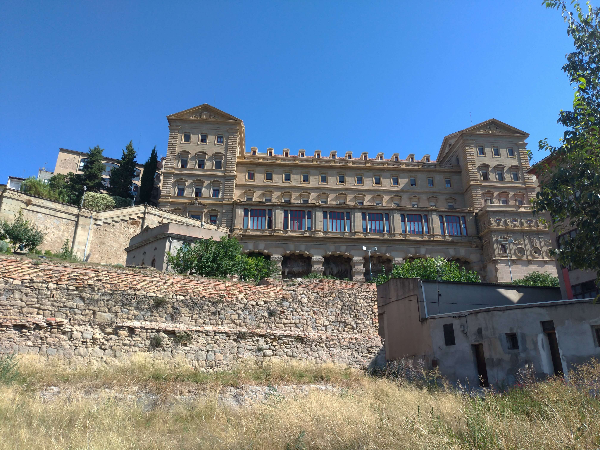

Cova de Saint Ignasi

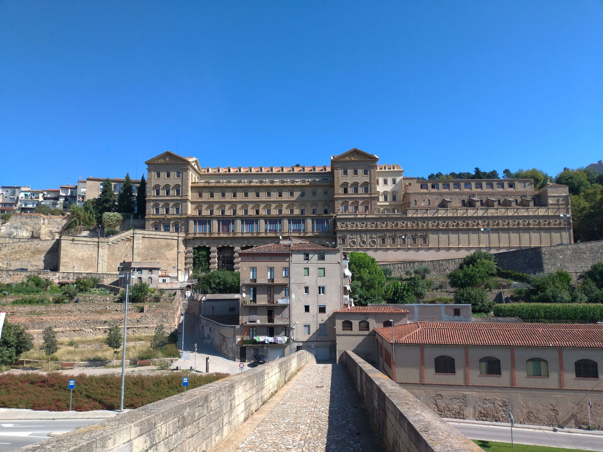

Cova de Saint Ignasi from Point Vell

### Plaça Major (main square)

Walking back to the city we then ended up at the Plaça Major. The Plaça Major (also the city's main square) used to be one of the meeting points of the inhabitants and is where the city council is located nowadays.

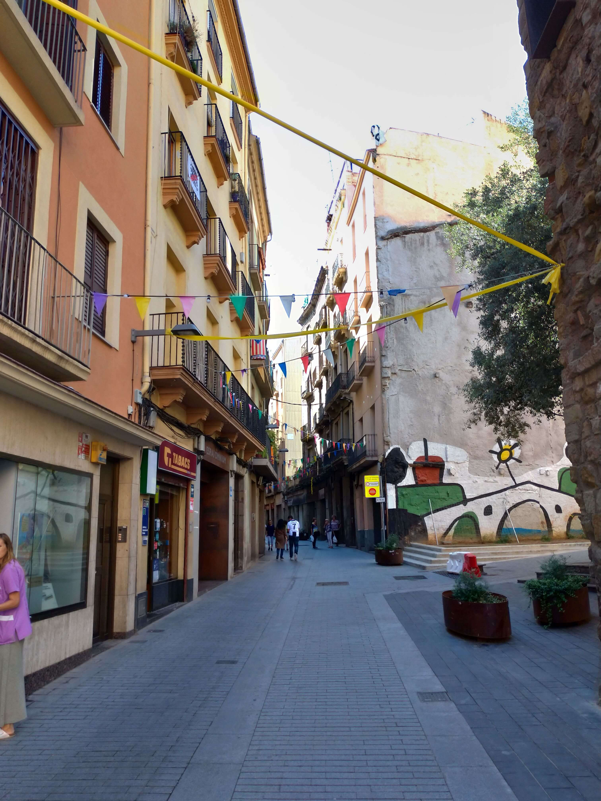

Street from the main square

### Break

After that, we decided to look for some café to take a break because it was 12 o'clock already. We, therefore, chose to walk back to the city centre and ended up at Bar Oscar, right next to the Passeig Pere III. And because we felt adventurous we decided to take something we never ate before. Calamars a l'andalusa (which is just fried octopus) and Croquettes.

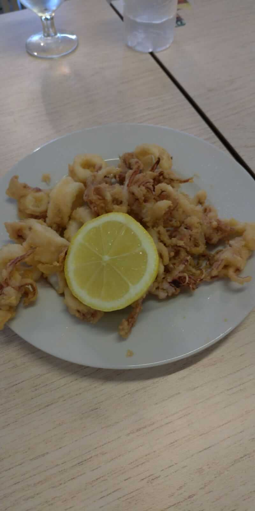

Calamars a l'andalusa

After spending about an hour in the café we then wanted to go back home because it had a stunning 29°C in the city.

## Friday

On Friday morning we had to go to the city council for some documents and after that we went for some coffee at Passeig Pere III, because Anna and I had to attend a meeting with our project coordinator to plan the activities we are going to do with that we are teaching English to. After that we just hung around until Anna asked me if I wanted to join here for a walk.

We then walked up a hill to a local football club called Futbol Club Pirinaica, because you have a great view from up there. There is no big story behind this so just enjoy the pictures:

- 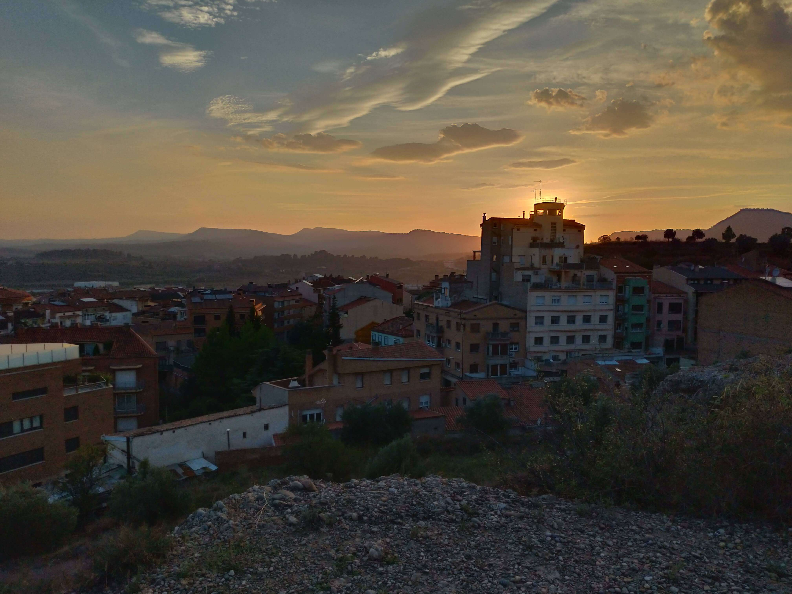
- 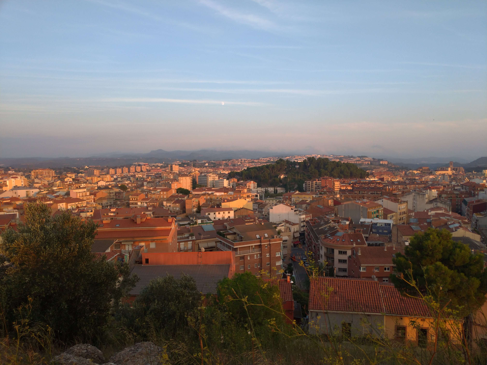
- 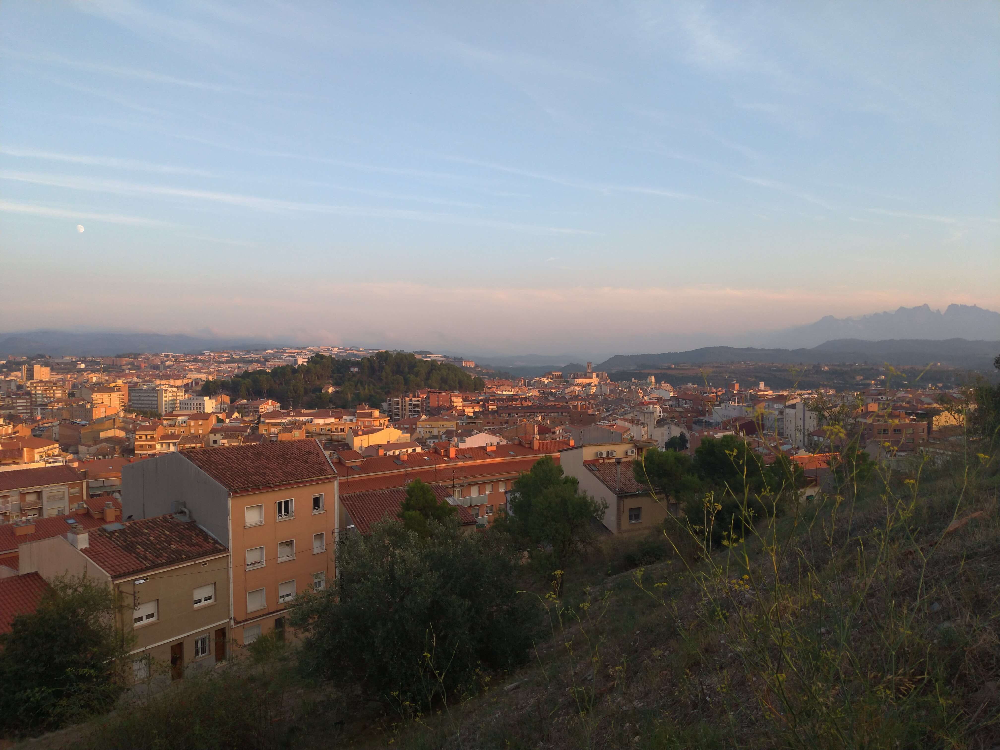
- 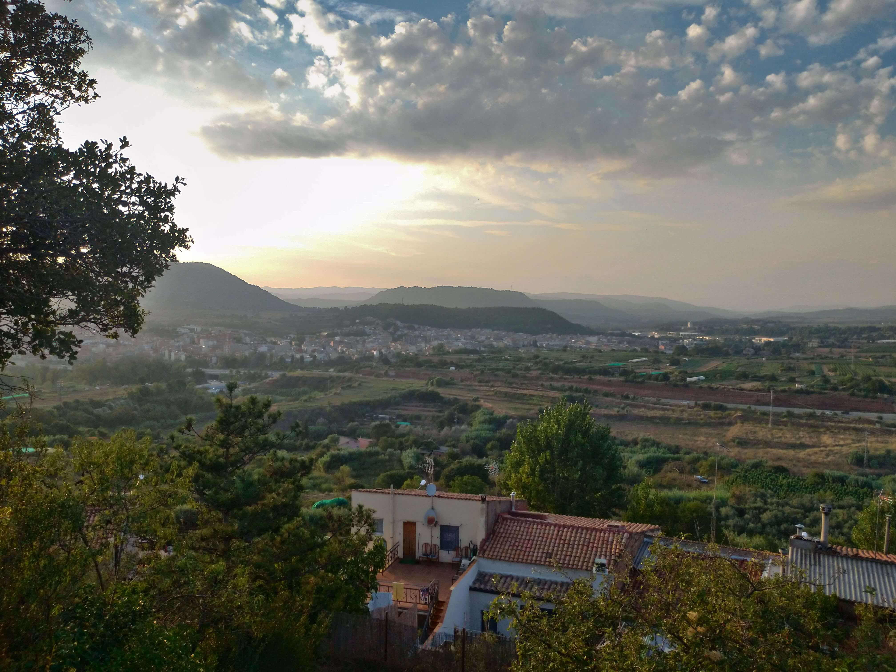
- 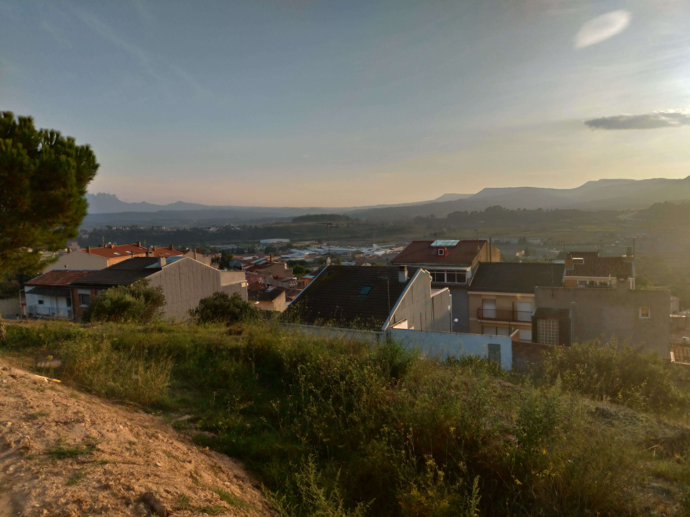
- 

On the weekend we were mostly in Barcelona, but I'll talk about that in another post.   
Until then, have a nice week and see you in my next post <3
