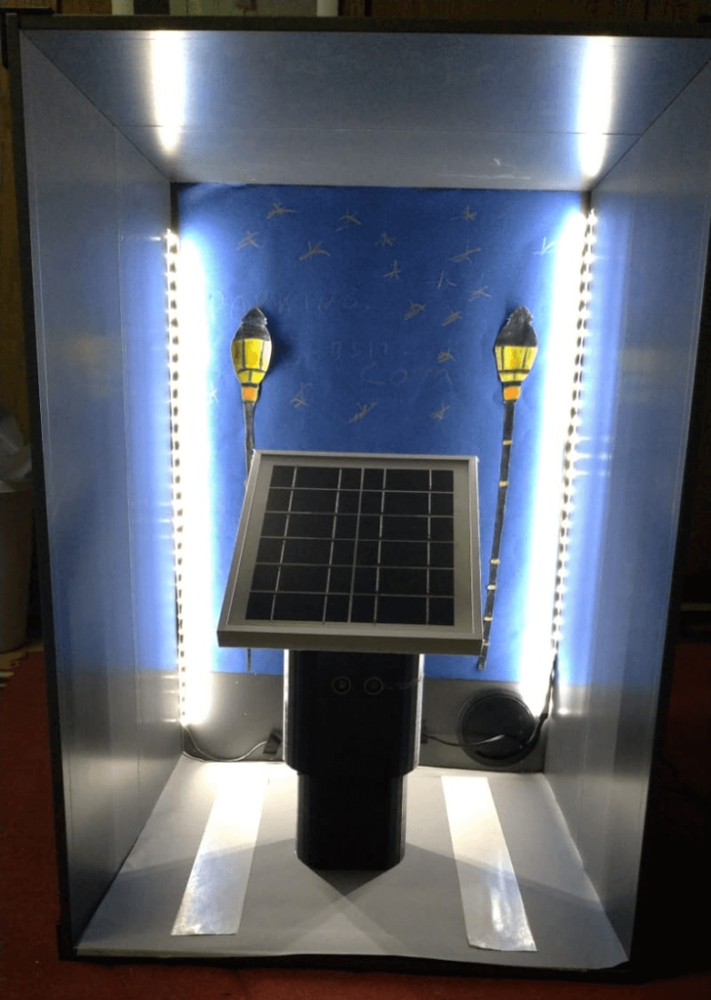

Long time no see, friend! I've been off doing some pretty cool projects that I will now try to get down on paper so you can read about them right here!

Smart City Dornbirn is a contest that is held yearly in my county and that my friends and I wanted to build something for. The general theme of it is to build things that drive the county forwards, increase innovation and spot young entrepreneurial skills.

This year's main topic was sustainability and we were already excited to engineer something for the competition. We had several ideas ranging from street lantern monitoring to structural integrity testing using ultrasonic waves and a public services app, but we finally settled with SmartParking. The main reason we wanted to work on a parking solution is that now all of us (except for Chris) own a drivers license and learnt the hard way that finding a parking spot can be a pain in the ass sometimes.

So our idea was to build a physical device that enables you to track a parking spot. If someone parks on the mentioned spot a signal will be sent to our servers which can be viewed on the website (or the app, which was planned but never finished).

A big plus for the project was that it could easily be split into tasks where each of us could use their skillset to a full extend. The team consisted of:

- Lukas Samir Gabsi, Project Lead and Web Development
- Edonis Berisha, Electronics
- Philip Bato, Design and Video Producer
- Christian Pantuan, the black sheep of the group

As for the electronics part, you might want to read Edo's part of the story on his blog. For the web part you can, for now, check out [parking.gabsii.com](http://parking.gabsii.com)

The web app is pretty simple. It's built on top of React Boilerplate with a Node JS server that takes care of the database stuff and accepts requests from the WebHooks of TheThingsNetwork.

The video Phil cut looks absolutely stunning and for his first video ever he can be pretty proud of this piece of art.

https://www.youtube.com/watch?v=N5Lz0KxbrQ0

The finished product looked hella sexy

In the end, we lost against the BG Dornbirn who won by applying a light to a bus stop?! The grief sits deep, but I recently found out that we were considered one of the finalists and ranked within the Top 20 of the whole competition.

More about Smart City Dornbirn 2020 can be found here:

[SCD2020 Überblick - Smartcity Dornbirn](https://smartcitydornbirn.com/scd2020-ueberblick/)

This was it guys, glad you read along and I hope you enjoyed the bit you just read! The next article will come soon - promised!

See you next time <3
