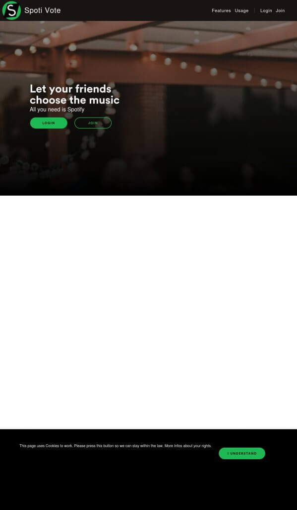
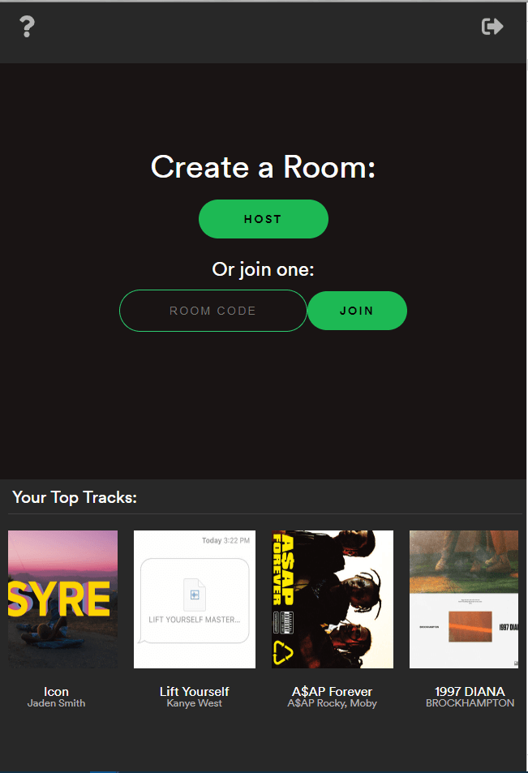
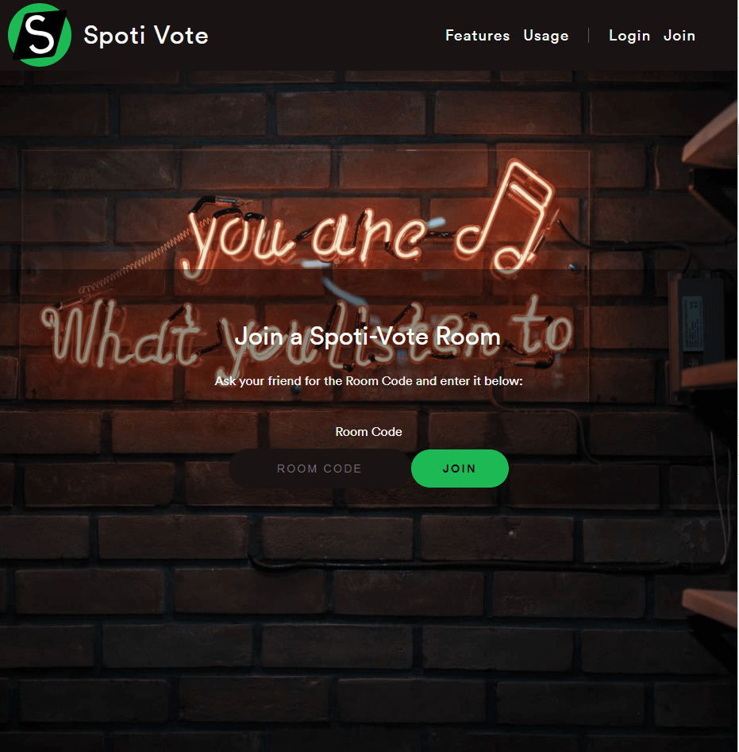
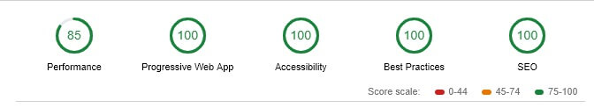

The last month was really quiet and there is a big reason behind this. I worked nearly full-time on developing [Spoti-Vote](https://spoti-vote.com). I'll use the next few paragraphs to explain how I got the idea, what Spoti-Vote is and how it works.

_Short Disclaimer: I will probably need to change the name soon because Spotify's Branding Guidelines do not allow Applications using their API that start with 'Spot'._

## Motivation

In my graduation year, my high school stocked up their classrooms with speakers. Every room that could also be used as a notebook classroom was equipped with one. The great thing about the speakers was that they had AUX-Cords plugged into their sockets so even students could connect themselves to the speakers and play some music. And of course, this was the case for our class. We did not only use it on a nearly daily basis, we even started fighting about which songs to listen to. So I decided to come up with a solution... Spoti-Vote.

It did not take me (and my friend Michi) a long time to build the first prototypes. Within the first 2 weeks of development, we had a running prototype to present to the class. And it went horribly wrong.

The interface was buggy, the server died just after some minutes of queuing songs and the backend sent so many and so big requests that it was impossible to use it with the school network.

## But... what is Spoti-Vote?

After this tension building introduction you might be asking yourself 'BUT WHAT IS SPOTI-VOTE?'. Well you are lucky because now the explanation starts!

Ever heard of Kahoot? Most of you probably have but here is a short introductory video for the ones that never heard of it.

https://www.youtube.com/watch?v=7XzfWHdDS9Q

What is Kahoot?

But instead of focussing on learning, our platform focuses on music and the democracy that should be involved when you're carpooling, being on a house party or even dancing in the club. Who hasn't been at one place where you got forced to listen to boring songs that nobody likes? Spoti-Vote solves this problem.

Why do you need to know about Kahoot? Because we use a kind of similar system for Spoti-Vote. Spoti-Vote also relies on a 'Choose-One-Out-Of-Four"-System, which means you get 4 different songs, presented by their album art and tinted with a unique colour, you can choose between.

Choose one out of four songs

### My favourite song has the most votes. What now?

Hopefully, you started your Spotify beforehand and are already listening to music, because now the fun part starts. You can lean back, enjoy the current song and let the magic happen. Spoti-Vote automatically plays the most voted song after your song finishes.

### Whoops... I forgot to vote... what now?

Well, you might run into this some time, so don't panic because we already thought about that. If you and your friends somehow forgot to vote for a song, Spoti-Vote chooses the next best one for you. Since Spotify equips every song with stats such as Danceability, Energy or Tempo, we can easily interpolate all the stats and get the best followup song based on your current playback.

### How does this all stay private? 

Spoti-Vote is a room-based system, meaning that you can enjoy your music with your friends in one room without anyone else unintentionally interfering you. To identify a unique room each room has an unique room code acting as an ID.

Room code on top

### What is this dice doing?

Sometimes you might run into 4 songs noone likes or really feels like listening to at the moment. So we added an option to re-roll all four songs.

### Requirements:

Now to the important part. What do you need to use Spoti-Vote?

- Spotify Premium

We don't have many requirements but that one is crucial. Unfortunately, Spotify only allows us to manipulate the playback of Premium users. So if you don't have Spotify Premium (why???), we are sorry, but you won't come far with our application.

## How do I get started?

_Please not that the Screenshots can look different depending on your type of device and type of browser._

Well pretty easy. Just go to [spoti-vote.com](https://spoti-vote.com) and you will see a beautiful landing screen where you can press the Login Button. Once you press that button you will be redirected to the Spotify Login Screen where you have to authorize our app to access your Playlists, Playback, etc.

It will look somewhat like this. You are on a site from Spotify, so we can't read your password or your mail/username.

After you authorised us, you'll land on the Dashboard. From here you can create a room, join your friends and check your most played songs! Screw waiting for the end of the year summary of your stats. We can serve them to you any time you want it (although not as precise as Spotify).

Dashboard

Your next step would be to just open a room and invite all your friends. Not that hard. I guess you can do that without me posting a screenshot of it.

### But I only want to join my friend!

You neither need to create a room for that nor do you even have to possess a Spotify account for that. All you need is to ask your friend for the room code that can be seen at the beginning or (depending on your device) on the top bar.

After you know the code, all you have to do is to go to [spoti-vote.com/join](https://spoti-vote.com/join) and enter your code.

Enter your room code here!

## How does it work? (Nerd talk)

For everyone who is not that much into the technical details of our web application you might want to skip this part. For the rest of you, you are gladly welcome!

The frontend of our website runs on the ReactJS. We chose React because of the performance and the simplicity and reusability of its components. All of the frontend design was done by me. Any button you see, any textual appearance and any animation you might run into it was thoughtfully placed there with an insane amount of pixel-perfection. I also did most of our frontend performance optimization which lead to this amazing Lighthouse Audit.

Audit Score is a total 97 on average.

We use [zeit.co](http://zeit.co) as our hosting provider, because they offer a cheap/free versioning oriented solution for Webhosting.

I don't want to spoil too much of our backend and how it works because it's probably pretty unstable and I don't know how much time Michi spent into securing it. So all you need to know is that it runs on a NodeJS server and uses Websockets to communicate with the frontend in real-time.

If you still need more informations or want to help us improving Spoti-Vote you might want to check out our [Github](https://github.com/Gabsii/spoti-vote/).

I hope you liked this post and could get some infos out of it. Some things in this post might change in the next few days so I'll try to keep this one up to date as good as I can.   
See you in my next post! <3
