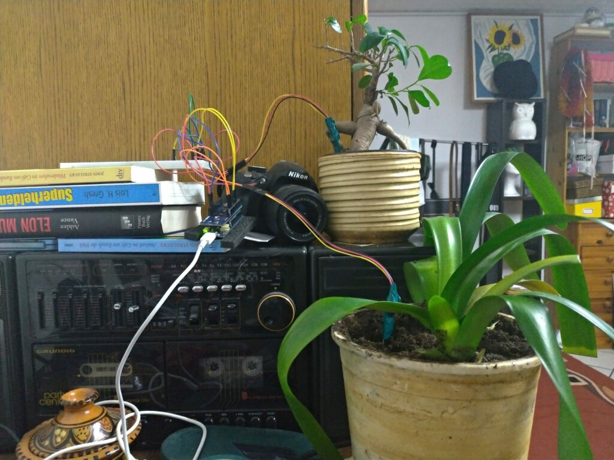
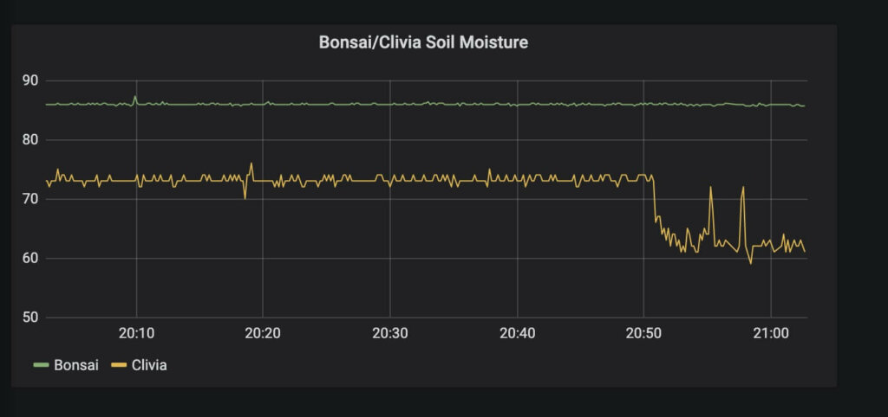
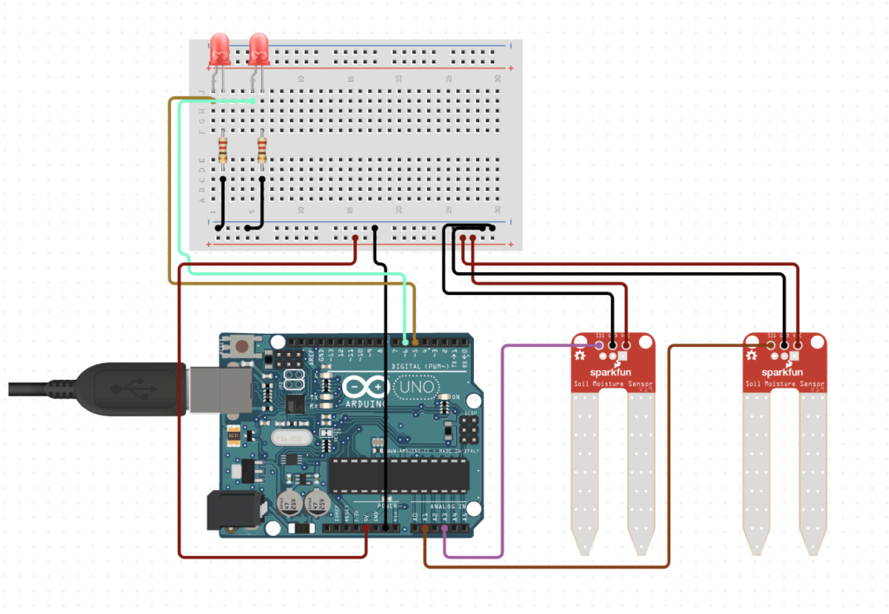

We all have been there... We stood in the aisle of a supermarket or just randomly walked into a flower shop to see some pretty flowers and end up buying a plant just out of impulse. You take your dearest plant home with you and are maybe already thinking about a name for it. Back at home, you choose a nice spot and water it accordingly. Fast forward a few weeks and your plant looks like it is about to die.


My plant in Spain, on the verge of death

We all have been there and we all have felt the pain and guilt of killing a plant. I however was sick of not having a green thumb, so I thought to myself that there must be an easier solution for this problem.

## Plant Tracker

Introducing to you, my semi-final version of _Plant Tracker_ an automated assistant for one of your plant's main nutrition sources. Water. My _Plant Tracker_ project aimed to offer me a way to measure the current moisture in the plant's soil by simply placing a sensor in the soil.



Introducing... Plant Tracker!

I used an Arduino MKR WiFi 1010 to measure the moisture in the plant's soil and send the data to my InfluxDB and then display it on my Grafana Dashboard.

## Dashboard

My dashboard is built using Grafana and InfluxDB as my data source. Both of them are running on a Raspberry Pi 2 in my local network.

There are a few reasons I chose to use InfluxDB as my data source but one of the main selling points is its retention policies.

I send data to my Raspberry about every ~10s and if you keep that data for a year you would have around 3.15 million pieces of data. What InfluxDB's retention policies allow me to do is only use a mere fraction of this.

You can for example tell the database to reduce the data after a week or so to only use a mean value of an hour, which in that case would reduce the data points to ~8k. Meaning I won't have problems with storage on my Raspberry Pi.



My Grafana Dashboard tracking my Bonsai and my Clivia

Here you can see a sneak peek of my dashboard. It is pretty straight forward and just displays the soil's moisture in relation to time. I bought a pack of sensors and am currently tracking my Bonsai and my Clivia.

That was the non-technical part of the post, so if you were only here to get a general overview of what I built this might be the end of your journey already. However, if you are keen to dive deeper into the topic I welcome you to continue ahead! To all the others: thank you for reading and I appreciate you following along!

## Electronics

### Components

- Arduino MKR WiFi 1010 and a Micro USB cable (+ charger)
- Raspberry Pi 2 or higher running Grafana and InfluxDB
- 2x Capacitive Soil Moisture Sensor v1.2
- 2x Red LED
- 2x 220 Ohm resistor
- a breadboard and of course some wires

_Make sure not to buy your stuff from Amazon_ 😄

### Electronic Circuit



The electronic circuit.

The electronic circuit is pretty straight forward. (Yes I know, that is an Arduino Uno and not an Arduino MKR WiFi 1010, but I couldn't find a circuit designer that had the MKR WiFi 1010 as an option ☹️)

I connected the Vcc and GND to my breadboards + and - to supply my components with power.

The Arduino takes two analog inputs from the two sensors and parses the data through the code.

Based on these values the Arduino will output power on one of the two pins and light up the according LED if the soil's humidity drops below a predefined threshold.

Now on to the more difficult part.

## Code

### Constants

At first, we need to include `WiFiNINA.h` to use the Arduino MKR WiFi 1010's onboard antenna. Then we define `ssid` and `pass` for the WiFi WPA connection. Also, make sure to set the `server` value to the address your Raspberry Pi runs on.

Another important part is the `air` and `water` constants for our Arduino, make sure to measure the values in the air and water to have reliable values for normalization later on. Also, set the LEDPins accordingly.

### Setup

The setup is rather boilerplate for a Arduino with a WiFi connection. The only special thing worth mentioning is that we define two pins as outputs using:

```
  //set port to output
  pinMode(LED1Pin, OUTPUT);
  pinMode(LED2Pin, OUTPUT);
```

These pins will later be used to turn on a LED if the humidity measured falls below our threshold.

### Loop

At the beginning of the loop we check if our client has a response available and log it to the Serial Monitor. If there is no response we go ahead and check if it has already been 10s (`postingInterval`) since we sent the last request.

Then the fun part starts. We read the output of our soil moisture sensor, normalize the values and then invert them.

We need to normalize the values to get a value that makes sense for us. Here I use a neat little equation to calculate the humidity in %. Meaning our values can only be numbers between 0 and 100. This can of course vary, depending on how accurate you set your constants early on.

The inversion part is necessary since we otherwise would get the dryness of the soil. To be fair, I am not entirely sure why that is.

Now we are about to get to the part that costed me most of my nerves, sending the actual HTTP Request to my Raspberry Pi and writing the data to InfluxDB.

Fortunately InfluxDB comes with a [built-in HTTP endpoint](https://docs.influxdata.com/influxdb/v1.8/guides/write_data/) for writing data to the database. So all we have to do is assemble the data in the right way. Which, coming from a Web Developers point of view, is actually far more complex than I thought.

My biggest pain point lay in assembling the request correctly since [my curl and code looked similar but somehow still failed](https://stackoverflow.com/questions/62323258/arduinohttpclient-send-post-fails-with-response-3) to work correctly. Turns out I used the wrong library and had to assemble the HTTP Headers in a different order.

At the end of the loop we do a quick check if the sensor values are lower than the threshold and if they are we turn the LED on.

### Full Code

```
/*
 Code based on
 <http://www.arduino.cc/en/Tutorial/WifiWebClientRepeating>
 */

*#*include <WiFiNINA.h>

///////please enter your sensitive data in the Secret tab/arduino_secrets.h
char ssid[] = "my_wifi_ssid";        // your network SSID (name)
char pass[] = "my_wifi_password";    // your network password (use for WPA, or use as key for WEP)
//int keyIndex = 0;                    // your network key Index number (needed only for WEP)

int status = WL_IDLE_STATUS;

// Initialize the Wifi client library
WiFiClient client;

// server address:
char server[] = "172.16.0.3";

unsigned long lastConnectionTime = 0;              // last time you connected to the server, in milliseconds
const unsigned long postingInterval = 10L * 1000L; // delay between updates, in milliseconds (10s)

const int air1 = 875;   // 100%
const int water1 = 450; // 0%
const int air2 = 275;
const int water2 = 175;

const int humidityTreshhold = 50;
const int LED1Pin = 0;
const int LED2Pin = 1;

void setup() {
  //Initialize serial and wait for port to open:
  Serial.begin(9600);

  // check for the WiFi module:
  if (WiFi.status() == WL_NO_MODULE) {
    Serial.println("Communication with WiFi module failed!");
    // don't continue
    while (true);
  }

  String fv = WiFi.firmwareVersion();
  if (fv < WIFI_FIRMWARE_LATEST_VERSION) {
    Serial.println("Please upgrade the firmware");
  }

  // attempt to connect to Wifi network:
  while (status != WL_CONNECTED) {
    Serial.print("Attempting to connect to SSID: ");
    Serial.println(ssid);
    // Connect to WPA/WPA2 network. Change this line if using open or WEP network:
    status = WiFi.begin(ssid, pass);

    // wait 10 seconds for connection:
    delay(10000);
  }
  // you're connected now, so print out the status:
  printWifiStatus();

  //set port to output
  pinMode(LED1Pin, OUTPUT);
  pinMode(LED2Pin, OUTPUT);
}

void loop() {
  // if there's incoming data from the net connection.
  // send it out the serial port.  This is for debugging
  // purposes only:
  while (client.available()) {
    char c = client.read();
    Serial.write(c);
  }

  // if ten seconds have passed since your last connection,
  // then connect again and send data:
  if (millis() - lastConnectionTime > postingInterval) {
    int moistureSensor1 = analogRead(A1);
    float moisture1 = 100 - (float) (moistureSensor1-water1)/(air1 - water1) * 100;
    httpRequest("bonsai", moisture1);

    int moistureSensor2 = analogRead(A2);
    float moisture2 = 100 - (float) (moistureSensor2-water2)/(air2 - water2) * 100;
    httpRequest("clivia", moisture2);

    checkMoistureLevel(moisture1, moisture2);
  }
}

// this method makes a HTTP connection to the server:
void httpRequest(String name, float humidity) {
  // close any connection before send a new request.
  // This will free the socket on the Nina module
  client.stop();

  // if there's a successful connection:
  if (client.connect(server, 8086)) {
    String content = "plant_tracker,host=ArduinoMKRWiFi1010,name=" + name +" humidity=" + humidity + " "+ (String) WiFi.getTime() +"000000000";

    Serial.println("connecting...");
    // send the HTTP POST request:
    client.println("POST /write?db=plant_tracker HTTP/1.1");
    client.println("Host: 172.16.0.3:8086");
    client.println("User-Agent: ArduinoWiFi/1.1");
    client.println("Connection: close");
    client.println("Content-Type: application/x-www-form-urlencoded");
    client.print("Content-Length: ");
    client.println(content.length());
    client.println();
    client.println(content);

    // note the time that the connection was made:
    lastConnectionTime = millis();
  } else {
    // if you couldn't make a connection:
    Serial.println("connection failed");
  }
}

void checkMoistureLevel(float moisture1, float moisture2) {
    //if the value is below or above the treshhold turn LED on else turn LED off
  if(moisture1 <= humidityTreshhold) {
    digitalWrite(LED1Pin, HIGH);
  } else {
    digitalWrite(LED1Pin, LOW);
  }

  if(moisture2 <= humidityTreshhold) {
    digitalWrite(LED2Pin, HIGH);
  } else {
    digitalWrite(LED2Pin, LOW);
  }
}

void printWifiStatus() {
  // print the SSID of the network you're attached to:
  Serial.print("SSID: ");
  Serial.println(WiFi.SSID());

  // print your board's IP address:
  IPAddress ip = WiFi.localIP();
  Serial.print("IP Address: ");
  Serial.println(ip);

  // print the received signal strength:
  long rssi = WiFi.RSSI();
  Serial.print("signal strength (RSSI):");
  Serial.print(rssi);
  Serial.println(" dBm");
}
```

## Conclusion

If you managed to make it this far I am really proud of you! You should now be able to build your own plant tracker for your home!

Thank you a lot for reading this far and I really hope you did enjoy it. If you have any improvements, ideas, tips or just feedback make sure to leave a comment. If you liked the article I encourage you to share it with your friends! And I hope to see you in my next article! <3
